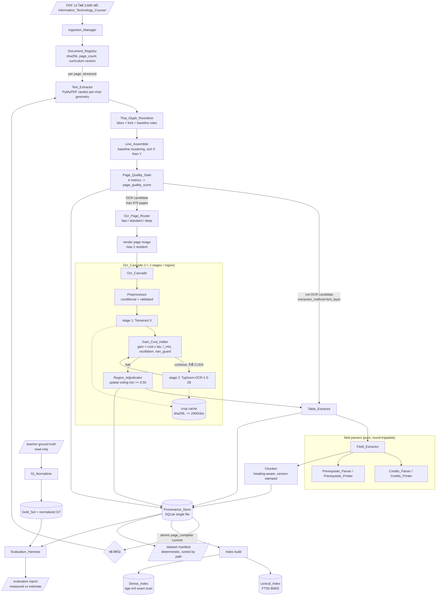
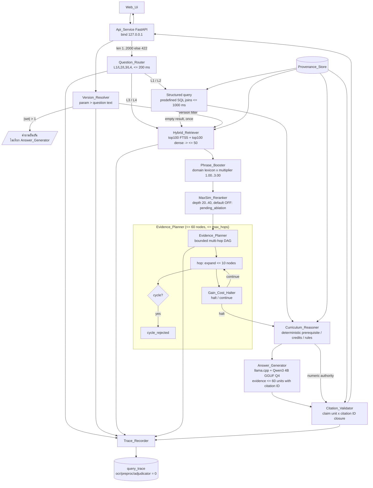
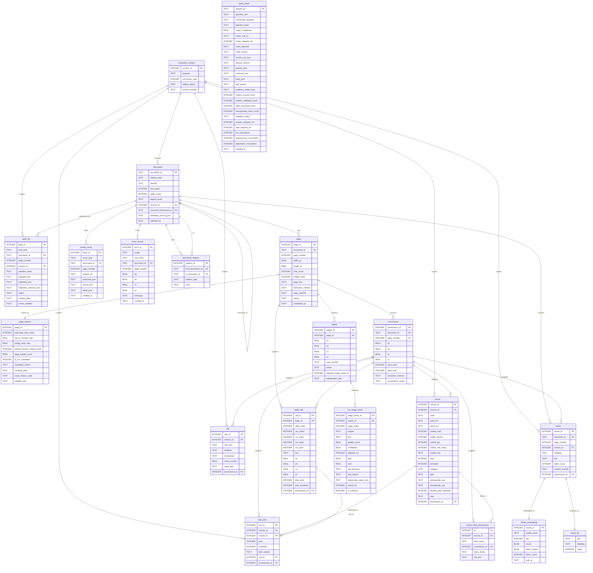

# Design Document: curriculum-ocr-rag (KatRAG-lite)

## Overview

**KatRAG-lite** คือระบบตอบคำถามหลักสูตร (curriculum QA) แบบ offline-first ที่ทำงานบนเครื่องผู้ใช้ทั้งหมด โดยไม่ใช้ paid API ใด ๆ ระบบประกอบด้วยสองระบบย่อยที่แยกกันอย่างเด็ดขาด:

1. **KatOCR Cascade (offline ingestion)** — อ่านเอกสารหลักสูตร PDF 14 ไฟล์ / 3,689 หน้า แบบ *text-first* คือดึง text layer ที่ฝังอยู่ในไฟล์เป็นหลัก แก้ปัญหาการเรียงลำดับ glyph ภาษาไทยด้วย geometry-based reordering แล้ว **ใช้ OCR เฉพาะหน้า/บริเวณที่วัดได้ว่าคุณภาพ text layer ไม่ผ่านเกณฑ์เท่านั้น** (จากการวัดจริง = 26.5% ของหน้า) ผลลัพธ์ถูกเก็บลง SQLite แบบ provenance-first (ทุก field ผูกกับ page + bbox + span)
2. **KatRAG-lite query path (online)** — เส้นทางตอบคำถามที่ **ไม่มี OCR อยู่ในเส้นทางเลย** ใช้ hybrid retrieval (FTS5 BM25 + dense bge-m3) → domain phrase boost → MaxSim late-interaction rerank → bounded multi-hop evidence DAG with gain–cost early halt → deterministic reasoning (prerequisite/credit/graduation) → LLM ท้องถิ่น (llama.cpp + Qwen3 4B GGUF Q4) ที่ถูกบังคับให้อ้างอิงเฉพาะ citation ID ที่ระบบสร้างให้ → citation validator

หลักการออกแบบที่สำคัญที่สุดสามข้อ:

- **ตัวเลขต้องวัดได้** ทุก acceptance gate เป็นตัวเลข และแยกให้ชัดว่าอะไรคือ *measured fact* อะไรคือ *architectural estimate*
- **ความถูกต้องเชิงตรรกะไม่ให้ LLM ทำ** เงื่อนไขวิชาก่อน (prerequisite), การนับหน่วยกิต, เกณฑ์สำเร็จการศึกษา คำนวณด้วย deterministic graph/constraint code เท่านั้น LLM ทำหน้าที่เรียบเรียงภาษาจาก evidence object ที่ประกอบเสร็จแล้ว
- **เวอร์ชันต้องแยกขาด** เอกสาร 14 ไฟล์คือหลักสูตรหลายสาขา หลายปี (old/current) การปนข้ามเวอร์ชันถือเป็น correctness bug ไม่ใช่แค่คุณภาพคำตอบ

### 1.1 Goals

| # | เป้าหมาย | ตัวชี้วัด |
|---|---------|----------|
| G1 | Schema ชัดเจน ความสัมพันธ์ถูกต้อง query ได้จริง | ทุกคำถาม L1/L2 ตอบได้ด้วย SQL เดียวหรือ join ที่กำหนดไว้ล่วงหน้า; ER diagram ครบ; ไม่มี field ที่ไม่มี provenance |
| G2 | อ่านข้อมูลจากภาพ/เอกสารครบทุก field ที่โจทย์กำหนด ด้วยโมเดลฟรี | field macro-F1 ≥ 0.91; ทุก engine เป็น open-source ใช้ฟรี (PyMuPDF / Tesseract 5 / Typhoon-OCR-1.5-2B) |
| G3 | วัดความแม่นยำเป็นตัวเลขด้วย metric ที่นิยามชัด | Precision/Recall/F1 ต่อ field, CER ต่อหน้า, table-cell F1, Recall@k, citation precision/recall |
| G4 | ตอบคำถาม 4 ระดับพร้อมอ้างอิงหน้า/หัวข้อจริง | citation page precision ≥ 0.95, recall ≥ 0.91; unsupported-claim rate < 0.05 |
| G5 | แอปใช้งานได้ + เอกสาร + demo end-to-end | FastAPI + web UI, README, dataset manifest, evaluation report, presentation |

### 1.2 Non-goals

- ไม่ทำ training/fine-tune โมเดล OCR หรือ LLM ใหม่ (ใช้ pre-trained ฟรีเท่านั้น)
- ไม่ทำ multi-user auth, ไม่ deploy cloud, ไม่มี paid API (OpenAI/Google Vision/Azure)
- ไม่รองรับเอกสารนอก scope (มคอ.อื่น, ประกาศแยก) ในเฟสนี้ — schema เตรียมที่ไว้ (`document_relation`) แต่ไม่ ingest
- ไม่ใช้ ANN index (FAISS/HNSW) — corpus เล็กเกินกว่าจะคุ้ม (ดู §4.4)
- ไม่แก้ไขไฟล์ใด ๆ ใน `katgpt-rs/` (read-only) และไม่ import crate จาก katgpt-rs; ถ้าลอกโค้ดต้อง duplicate เข้า `project/` พร้อม MIT notice
- ไม่แก้ไขไฟล์ ground truth ของอาจารย์ในที่เดิม (immutable)

---

## 2. Verified Findings (ข้อเท็จจริงที่วัดแล้ว — ใช้เป็นฐานการออกแบบ)

> ทุกตัวเลขในหัวข้อนี้ **วัดจากไฟล์จริงในเซสชันสำรวจ** ไม่ใช่ประมาณการ ส่วนใดที่เป็นประมาณการจะระบุคำว่า *(estimate)* กำกับไว้เสมอ

### 2.1 Dataset (project/Information_Technology_Course)

- 14 PDFs, **3,689 หน้า** รวม, ขนาดไฟล์ 11–245 MB
- **เป็น born-digital PDF ทั้งหมด** มี embedded subset fonts (THSarabunPSK, THSarabunPSK-Bold, AngsanaNew, CordiaNew, AdobeThai, TimesNewRomanPSMT, Arial-BoldMT) → มี vector text จริง **ไม่ใช่สแกน** ⇒ ข้อสรุปเชิงสถาปัตยกรรม: OCR ต้องเป็น *exception* ไม่ใช่ default

| ไฟล์ | หน้า | median chars/page | หน้า <120 chars |
|------|-----:|------------------:|----------------:|
| AIT2566_current | 346 | 92 | 225 |
| BIT2560_old | 242 | 289 | 0 |
| BIT2565_current | 317 | 235 | 0 |
| DSBA2560_old | 258 | 877 | 0 |
| DSBA2565_current | 403 | 137 | 0 |
| IT2560_old | 327 | 692 | 148 |
| IT2565_current | 429 | 91 | 229 |
| PH_D_AITBA2569_current | 252 | 1112 | 100 |
| PH_D_IT2561_old | 156 | 1122 | 49 |
| PH_D_IT2566_current | 199 | 1671 | 0 |
| M_AITBA2564_old | 147 | 1087 | 0 |
| M_AITBA2569_current | 252 | 1112 | 100 |
| M_IT2563_old | 182 | 1052 | 69 |
| M_IT2568_current | 179 | 1163 | 59 |

- หน้าที่มี text < 120 ตัวอักษร: **979 / 3,689 = 26.5%**; ในจำนวนนี้ **977 หน้ามีภาพอยู่** ⇒ เป็นเซตเดียวที่ *อาจ* ต้อง OCR (upper bound ของงาน OCR ทั้งโปรเจกต์)
- **Duplicate ที่ยืนยันแล้ว**: `M_AITBA2569_current.pdf` และ `PH_D_AITBA2569_current.pdf` มี **SHA-256 เท่ากัน**, 252 หน้าเท่ากัน, สถิติเท่ากัน แต่ถูกวางไว้ในโฟลเดอร์ระดับปริญญาต่างกัน; `readme.txt` เองก็เขียนชื่อ PH_D_AITBA ว่าเป็น "วิทยาศาสตรมหาบัณฑิต" ⇒ ต้องบันทึกเป็น `review_issue` และ **ตัดสินด้วยเนื้อหาในเอกสารเท่านั้น ห้ามตัดสินจากชื่อไฟล์/โฟลเดอร์**

### 2.2 Thai text-layer defect (ปัญหาแกนกลางของงานนี้)

ยืนยันแล้วว่าเป็นข้อบกพร่องเชิงโครงสร้าง ไม่ใช่เรื่องสุ่ม:

1. ข้อความที่ดึงออกมามี **ช่องว่างแปลกปลอมก่อนสระ/วรรณยุกต์** — regex `[\u0e00-\u0e7f]\s+[\u0e30-\u0e4e]` แมตช์ในหลายหน้า
2. `PyMuPDF rawdict` แสดงว่า **combining marks ถูก emit เป็น glyph แยกที่มี bbox กว้างศูนย์** และอยู่ผิดลำดับตรรกะ เช่น `'ี'` bbox `[137.9, 789.8, 137.9, 806.3]`, `'ิ'` bbox `[212.5, …, 212.5, …]`
3. `unicodedata.combining()` **คืนค่า 0** สำหรับ mark เหล่านี้ ⇒ NFC normalization ธรรมดา **แก้ไม่ได้**

⇒ ต้องมี **deterministic glyph-geometry reordering pass** ที่ใช้ per-char bbox + font + baseline จาก rawdict ร่วมกับกฎอักขรวิธีไทย นี่คือ component ที่มีผลต่อคุณภาพข้อความมากที่สุดในระบบ (ดู §5.2)

### 2.3 Teacher Ground Truth (Lab_Week3/ocr_system/data/ground_truth)

ไฟล์: `AIT/AIT_academic_plan.json`; `BIT/BIT_academic_plan_{coop,no_coop}.json`; `DSBA/DSBA_academic_plan_{coop,no_coop}.json`; `IT/IT_academic_plan_{coop,no_coop}.json`; `general_education_ground_truth.json` (266 วิชา ไม่มี year/semester); `rules_ground_truth.json` (IT/DSBA/BIT/AIT × เกณฑ์การสำเร็จการศึกษา / เกณฑ์เกียรตินิยม / เกณฑ์พ้นสภาพนักศึกษา / เกณฑ์ภาคทัณฑ์ / ระบบเกรด — เช่น 129 หน่วยกิต, GPA < 2.00, honors < 3.75/3.50/3.25); `example_ground_truth.json` (template เปล่า ไม่ใช่ข้อมูลจริง)

Schema แถววิชา: `code, name_th, name_en, credits ("3(3-0-6)"), year, semester, category, type, prerequisite, flexible_year_semester, note` (ที่มา: GT_Template-2.xlsx)

จำนวนแถว / รหัสไม่ซ้ำ: AIT 58/55; BIT_coop 63/60; BIT_no_coop 63/60; DSBA_coop 91/86; DSBA_no_coop 92/85; IT_coop 107/104; IT_no_coop 109/104

**GT → PDF version mapping (วัดด้วย course-code containment):**

| GT | PDF ที่ตรง | อัตราตรง |
|----|-----------|---------:|
| IT | IT2565_current | 102/104 = 98.1% |
| BIT | BIT2565_current | 59/60 = 98.3% |
| DSBA | DSBA2565_current | 83/86 = 96.5% |
| AIT | AIT2566_current | 52/55 = 94.5% |
| — | ฉบับเก่า 2560/2561 | 0–1% |

⇒ **GT ใช้ได้กับฉบับ current เท่านั้น และต้อง version-stamp ก่อนใช้วัดผล**

**GT defects ที่ยืนยันแล้ว** (ต้องมี normalization/adjudication layer และ **ห้ามแก้ไฟล์ต้นฉบับ**):

| id | defect | การจัดการ |
|----|--------|-----------|
| (a) | แถวคำแนะนำจาก spreadsheet หลุดเข้า `courses` โดย `code` เป็นข้อความ `หมายเหตุ: คอลัมน์ "ตัวเลือกปี/เทอม (flexible)"…` (พบใน IT, DSBA, AIT) | filter ออกด้วย code-shape rule |
| (b) | เซลล์รหัสทางเลือกหลายค่า เช่น `06016481 หรือ 06016482`, `06026259 หรือ 06026260`, `06036147 หรือ 06036148`, `06046443 หรือ 06046444` | split เป็น alternative group |
| (c) | รหัส `06016401` ถูกอ้างใน DSBA GT และ AIT GT แต่ **ไม่พบ** ใน DSBA2565_current / AIT2566_current | discrepancy จริง → manual adjudication |
| (d) | year/semester ชนิดผสม (`"1"` vs `1`) | coerce เป็น int |
| (e) | `year=0 / semester=0` = bucket วิชาเลือก/ยืดหยุ่น (16–54 แถว/ไฟล์) | ตัดออกจากการให้คะแนน slot ปี/เทอม |
| (f) | AIT ใช้ `หมวดวิชาเสรี` ขณะไฟล์อื่นใช้ `หมวดวิชาเลือกเสรี` | synonym map |
| (g) | prerequisite ใช้ทั้ง `ไม่มี` และ `null` | normalize เป็น empty set |
| (h) | รหัสซ้ำภายในไฟล์เดียว (วิชาปรากฏหลาย slot) | การจับคู่ต้องเป็น **multiset** ไม่ใช่ set |
| (i) | `credits` เป็น string | parse เป็น total/lecture/lab/self_study |

**ขอบเขตที่ GT วัดไม่ได้ (สำคัญมาก):** GT ครอบคลุมเพียง **4 จาก 14 เอกสาร** (ป.ตรีฉบับ current) และเฉพาะส่วนแผนการศึกษา; **ไม่มีเลขหน้า, ไม่มี field ปี/เวอร์ชันหลักสูตร, ไม่มี raw page text** ⇒ GT ของอาจารย์ **ไม่สามารถ** วัด: Thai CER, citation page accuracy, version-selection accuracy, table-cell F1, หลักสูตรบัณฑิตศึกษา, ฉบับเก่า, Recall@k/NDCG, ความถูกต้องคำตอบ QA — ทั้งหมดนี้ต้องมี **gold set ของเราเอง** (§8.2)

### 2.4 บทเรียนจาก Lab_Week3 ที่การออกแบบนี้ต้องหลีกเลี่ยง (อ่านโค้ดยืนยันแล้ว)

| ปัญหาที่พบในโค้ดเดิม | ผลกระทบ | สิ่งที่ออกแบบใหม่ต้องทำ |
|---------------------|---------|------------------------|
| `document_loader.pdf_to_images` ฮาร์ดโค้ด `first_page=19, last_page=19` และใช้ `pdf2image.convert_from_path` ที่คืน **ทุกหน้าเป็น list** | ถ้าถอด bound ออก จะ materialize ทุกหน้าใน RAM (A4 300 DPI RGB ≈ 25 MB/หน้า × 429 หน้า > 10 GB) | stream หน้าต่อหน้า, bounded queue 1–2 หน้า, reusable buffer (§5.4) |
| `pipeline.py` ต่อบรรทัดด้วย `"\n".join(line.text …)` | ตัดคำไทยขาด token แตก | ประกอบบรรทัดใหม่จาก bbox + baseline clustering แล้วเรียง X/Y (§5.2, §5.6) |
| preprocessing หนัก (denoise + CLAHE + adaptive threshold) ใช้ทุกภาพ | ทำลายสระ/วรรณยุกต์ไทย; no-preprocess ให้ผลดีกว่า | preprocessing ต้องเป็น **conditional + validated** ห้ามใช้แบบไม่มีเงื่อนไข |
| ensemble = concat + exact dedup เรียงตาม Y เท่านั้น | ไม่ใช่ spatial voting จริง | spatial voting ต่อ region + adjudicator (§5.5) |
| ประเมินผลโดยเทียบข้อความ ~1,895–2,053 ตัวอักษรจาก **หน้าเดียว** กับ reference 11,616 ตัวอักษร **หลายหน้า** → CER 0.896–0.930 (ไร้ความหมาย) | ตัวเลขใช้ตัดสินใจไม่ได้ | การประเมินต้อง **page/field aligned** เสมอ (§8) |

### 2.5 สรุปสิ่งที่ katgpt-rs ให้ได้และให้ไม่ได้

katgpt-rs (MIT) ให้ **แนวคิด/อัลกอริทึม** ที่นำมาปรับ:

| primitive | ที่มา | นำมาใช้เป็น |
|-----------|------|-------------|
| Packed MaxSim late-interaction | `crates/katgpt-types/src/simd/maxsim.rs` (`maxsim_score`, `maxsim_score_packed`) | rerank chunk 20–40 อันดับแรก (§5.8) |
| Gain–cost early halt | `crates/katgpt-core/src/gain_cost_halt.rs` (`GainCostLoopHalter::halt_decision`, gain < cost×tau, oscillation patience, l_min floor, NaN-safe) | ใช้สองที่: OCR escalation halt (§5.5) และ multi-hop retrieval halt (§5.10) |
| Three-path compute routing | `crates/katgpt-pruners/src/percept_router.rs` (`ComputePath` Fast/Standard/Deep) | `OcrPageRouter` (§5.3) + question-level router แยกอีกตัว (§5.9) |
| Zero-allocation caller-owned scratch | `product_key_memory/kernel.rs` (`PkmScratch`), `channel_simd.rs` (`matvec_into`), quant (`encode_vector_into`) | `OcrPageWorkspace` / retrieval scratch (§5.4) |
| Phrase/domain lexicon boosting | `crates/katgpt-pruners/src/phrase_boost.rs` | lexical boost สำหรับรหัสวิชา/ชื่อวิชา/หน่วยกิต/วิชาบังคับ/วิชาก่อน/ปี-เทอม-เวอร์ชัน (§5.7) |
| Decision trace | `crates/katgpt-pruners/src/decision_trace.rs` | `query_trace` เต็มรูปแบบ (§5.12, §4.3) |
| Content addressing (SHA-256/BLAKE3) | ทั่วทั้ง repo | identity ของ document/version/chunk/page/crop + exact cache (§5.5.3) |

**ข้อควรระวังด้านหลักฐาน:** benchmark 014 (`maxsim_rerank_ndcg`) ของ katgpt-rs เป็น **synthetic** (50 docs, Lq=8, Ld=16, dim=64, Apple Silicon) และสถานะ NDCG gate ยังเป็น *Pending* ⇒ **MaxSim จะถูกเลื่อนขั้นเป็นค่า default ได้เฉพาะเมื่อผ่าน ablation บนข้อมูลหลักสูตรของเราเอง** และ **ไม่มี benchmark ใดใน katgpt-rs ที่อ้างเป็น OCR benchmark หรือ Thai-language benchmark ได้**

**สิ่งที่ตัดออกอย่างชัดเจน พร้อมเหตุผล:**

| ตัดออก | เหตุผล |
|--------|--------|
| PKM เป็น primary index | ต้องมี product-key codebook, ไม่มี metadata/version filtering, ไม่มี persistence/update lifecycle, value table ≈ 512 MB ที่ D_V=128 ขณะ corpus เรามีเพียงพันถึงหมื่น chunk |
| KV-cache quantization (`iso_quant`, `hybrid_oct_pq`, `octopus`) | บีบอัด transformer KV vector ไม่ใช่ OCR weights หรือรูปภาพ |
| GPU/ANE backends | `gpu.rs` เป็น `metal::DeviceRef`, `ane.rs` เป็น CoreML → Apple-only ใช้กับ RTX 2050 ไม่ได้ |
| Approximate LSH cache สำหรับคำตอบสุดท้าย | เสี่ยง version cross-contamination |
| katgpt-percepta | symbolic graph evaluation ไม่ใช่ document perception |
| transformer internals / game arenas / sleep-time runtime | ไม่เกี่ยวกับงานนี้ |

**และต้องระบุให้ชัดว่า katgpt-rs ไม่มี:** OCR engine, โมเดลรู้จำภาษาไทย, PDF renderer, OpenCV preprocessing, table/layout OCR — งานเหล่านี้ต้องสร้าง/ใช้ไลบรารีภายนอกทั้งหมด

---
## Architecture

> หัวข้อนี้คือ **§3** ของเอกสาร (ต่อเนื่องจาก §2)

### 3.1 หลักการแยกระบบย่อยแบบเด็ดขาด (§3 core invariant)

ระบบมีสองระบบย่อยที่ **ไม่แชร์ runtime path กันเลย**:

| มิติ | KatOCR Cascade (offline ingestion) | KatRAG-lite query path (online) |
|------|-----------------------------------|---------------------------------|
| trigger | คำสั่ง CLI `katrag ingest` | HTTP request ที่ `Api_Service` |
| ทรัพยากรหนัก | PyMuPDF render, Tesseract, Typhoon-OCR-1.5-2B (GPU), bge-m3 encode | bge-m3 encode (query 1 ตัว), llama.cpp decode |
| เขียนอะไร | `document`…`chunk_embedding` (ข้อมูลหลักสูตร) | `query_trace` เท่านั้น |
| อ่านอะไร | ไฟล์ PDF + `katgpt-rs` (read-only, เชิงอ้างอิงเอกสารเท่านั้น) | `Provenance_Store` + index |
| OCR ในเส้นทาง | มี | **ไม่มี** — บังคับด้วย R4.10 (`ocr_invocations = preprocessor_invocations = adjudicator_invocations = 0` ต่อทุก `query_trace`) |

ข้อบังคับนี้ถูกทำให้ตรวจสอบได้ด้วยโครงสร้างโค้ด: โมดูลใต้ `katrag/query/` **ห้าม import** โมดูลใต้ `katrag/ingest/ocr/` และมี import-boundary test บังคับ (§8.3) ส่วน counter ทั้งสามใน `query_trace` มี `CHECK (... = 0)` ระดับ schema (§5.2)

**ข้อจำกัดที่ผูกกับสถาปัตยกรรมทั้งฉบับ** (อ้าง R20):

- **offline only** — ทุก engine เป็น local process; ไม่มี paid API; outbound request ที่ไม่ใช่ loopback = 0 (R20.1, R20.3, R20.9) บังคับด้วย `katrag/common/net_guard.py` ที่ monkey-patch `socket.socket.connect` ให้ปฏิเสธ address นอก loopback ตลอด lifetime ของ process ทั้ง ingestion และ query
- **engine closed list** — PyMuPDF, Tesseract 5, Typhoon-OCR-1.5-2B (GPU-gated), bge-m3, llama.cpp + Qwen3 4B GGUF Q4 เท่านั้น (R20.2) ประกาศใน `config/engines.toml` พร้อมชื่อ license และ SHA-256 ของ weight ทุกไฟล์ ตรวจตอน preflight (R20.6, R20.8) — PaddleOCR ถอดออกเพราะเวอร์ชันที่รองรับไทยต้องดาวน์โหลด weight ที่ runtime (ดู §4.9)
- **`katgpt-rs/` read-only** — จำนวน import ของโมดูล/crate ใต้ `katgpt-rs/` ในซอร์ส `project/` ต้องเท่ากับ 0 และจำนวนการเขียน/ลบไฟล์ใน `katgpt-rs/` ต้องเท่ากับ 0 (R20.4) อัลกอริทึมที่นำมาใช้ซ้ำ (Gain–Cost halt, packed MaxSim, three-path routing, phrase boost, caller-owned scratch) ถูก **duplicate เป็น Python ใต้ `project/katrag/common/` และ `project/third_party/`** พร้อม MIT notice ครบฉบับ (R20.5)
- **teacher ground truth immutable** — `Gt_Normalizer` เปิดไฟล์ด้วย `open(path, "rb")` เท่านั้น และเขียนผลลงใต้ `project/artifacts/gt_normalized/` (R11.1)
- **Windows 10+ / Python 3.11.x / CPU-only ยกเว้น Typhoon stage** — ห้ามพึ่ง CUDA, MPS, CoreML ทั้งระบบ (R20.7) ยกเว้น stage 2 ของ `Ocr_Cascade` (Typhoon-OCR-1.5-2B) ที่อนุญาตใช้ CUDA เพราะ throughput บน CPU ไม่พอใช้งานจริง (วัดได้ ~126 s/หน้าบน GPU 4bit; ไม่มี GPU → ข้าม stage นี้เสมอ ไม่ถือเป็น error); llama.cpp build CPU (AVX2), bge-m3 รันผ่าน `onnxruntime` CPU provider
- **ไม่ใช้ ANN index** — dense retrieval เป็น exact full scan (R13.4)
- **curriculum version isolation คือ correctness requirement** ไม่ใช่ quality knob (R10)

### 3.2 Subsystem A — KatOCR Cascade (offline ingestion)



**ลำดับที่บังคับ (R2.1):** `Text_Extractor` ต้องดึง per-char record ของหน้าเสร็จ **ก่อน** เรียก `Thai_Glyph_Reorderer`, `Page_Quality_Gate` หรือ `Ocr_Cascade` ของหน้านั้น — บังคับด้วย type: ทุก stage หลังจากนี้รับ `PageCharSet` (frozen dataclass) เป็น argument จึงประกอบขึ้นไม่ได้ถ้ายังไม่ extract เสร็จ

### 3.3 Subsystem B — KatRAG-lite query path (online, zero OCR)



**คุณสมบัติเชิงสถาปัตยกรรมที่ต้องรักษาในเส้นทางนี้:**

1. `Version_Resolver` ทำงาน **ก่อน** retrieval ทุกครั้ง และ version filter ถูก push ลงเป็น `WHERE version_id IN (...)` ทั้งใน FTS5 query และใน dense scan — ไม่ใช่ post-filter (R10.5 ต้องได้ศูนย์ chunk นอกเวอร์ชัน ณ ทุกจุดส่งต่อ)
2. `Curriculum_Reasoner` เป็น **แหล่งความจริงเดียวของตัวเลข** — `Answer_Generator` ได้รับตัวเลขเป็น string ที่คำนวณเสร็จแล้วใน evidence object และ `Citation_Validator` เทียบตัวเลขในคำตอบกับค่าที่ reasoner ส่งมา (R15.5, R15.6)
3. citation ID ถูกออกโดยระบบก่อนประกอบ prompt เท่านั้น — เป็น **closed set** ต่อคำขอ (R17.2, R17.3)
4. ทุก request มี `request_id` และ `query_trace` หนึ่งแถวที่ replay ได้เท่าเดิมทุกครั้ง (R19.6, R19.7)

### 3.4 Python package layout (implementation root = `project/`)

```
project/
├─ pyproject.toml                 # Python 3.11, deps + license ของทุก dependency (R20.2)
├─ README.md                      # 4 ส่วนตาม R21.1
├─ config/
│  ├─ katrag.toml                 # ค่าตั้งทั้งหมด (§3.6)
│  ├─ engines.toml                # closed engine list + license + weight sha256
│  ├─ domain_lexicon.toml         # phrase boost lexicon + charset ที่ประกาศไว้
│  └─ value_sets.toml             # category / type / extraction_method / synonym map
├─ katrag/
│  ├─ __init__.py
│  ├─ config.py                   # KatragConfig (frozen dataclass) + loader + validation
│  ├─ errors.py                   # error taxonomy (§7)
│  ├─ common/
│  │  ├─ halter.py                # Gain_Cost_Halter (duplicated algorithm, MIT notice)
│  │  ├─ maxsim.py                # packed MaxSim (duplicated algorithm, MIT notice)
│  │  ├─ phrase_boost.py          # domain lexicon boost (duplicated algorithm)
│  │  ├─ compute_path.py          # ComputePath enum (fast/standard/deep)
│  │  ├─ scratch.py               # caller-owned reusable buffers
│  │  ├─ hashing.py               # sha256_hex(), content addressing
│  │  ├─ normalize.py             # NFC, whitespace squeeze, combining-mark order
│  │  └─ net_guard.py             # offline enforcement (R20.1, R20.9)
│  ├─ ingest/
│  │  ├─ manager.py               # Ingestion_Manager (streaming, resume, memory gate)
│  │  ├─ registry.py              # Document_Registry
│  │  ├─ text_extractor.py        # Text_Extractor (PyMuPDF rawdict)
│  │  ├─ thai_reorder.py          # Thai_Glyph_Reorderer
│  │  ├─ line_assembler.py        # Line_Assembler
│  │  ├─ quality_gate.py          # Page_Quality_Gate
│  │  ├─ page_router.py           # Ocr_Page_Router
│  │  ├─ workspace.py             # OcrPageWorkspace (max 2 page images resident)
│  │  ├─ ocr/
│  │  │  ├─ cascade.py            # Ocr_Cascade
│  │  │  ├─ stage_paddle.py       # stage 1 PP-OCRv5
│  │  │  ├─ stage_tesseract.py    # stage 2 Tesseract 5
│  │  │  ├─ preprocessor.py       # Preprocessor (conditional + validated)
│  │  │  ├─ adjudicator.py        # Region_Adjudicator (spatial voting)
│  │  │  └─ crop_cache.py         # sha256-keyed exact cache, <= 2000/doc
│  │  ├─ table_extractor.py       # Table_Extractor
│  │  ├─ fields/
│  │  │  ├─ extractor.py          # Field_Extractor (11 fields)
│  │  │  ├─ credits.py            # Credits_Parser / Credits_Printer
│  │  │  └─ prerequisite.py       # Prerequisite_Parser / Prerequisite_Printer
│  │  └─ chunker.py               # heading-aware chunk + version stamp
│  ├─ store/
│  │  ├─ schema.sql               # DDL ทั้งหมด (§5.2)
│  │  ├─ provenance_store.py      # Provenance_Store (transactional API)
│  │  ├─ queries.py               # predefined L1/L2 SQL (§5.5)
│  │  └─ integrity.py             # PRAGMA foreign_keys, integrity_check
│  ├─ index/
│  │  ├─ lexical.py               # Lexical_Index (FTS5 BM25)
│  │  ├─ embedder.py              # bge-m3 local (onnxruntime CPU)
│  │  └─ dense.py                 # Dense_Index (exact scan, no ANN)
│  ├─ query/
│  │  ├─ question_router.py       # Question_Router
│  │  ├─ version_resolver.py      # Version_Resolver
│  │  ├─ hybrid_retriever.py      # Hybrid_Retriever
│  │  ├─ evidence_planner.py      # Evidence_Planner
│  │  ├─ reasoner.py              # Curriculum_Reasoner
│  │  ├─ answer_generator.py      # Answer_Generator (llama.cpp)
│  │  ├─ citation.py              # citation ID issuance + Citation_Validator
│  │  ├─ answer_cache.py          # exact-key cache (R10.10)
│  │  └─ trace.py                 # Trace_Recorder
│  ├─ eval/
│  │  ├─ gt_normalizer.py         # Gt_Normalizer (read-only source)
│  │  ├─ gold_set.py              # Gold_Set loader/validator
│  │  ├─ metrics.py               # CER, F1, Recall@k, citation metrics
│  │  └─ harness.py               # Evaluation_Harness
│  ├─ api/
│  │  ├─ service.py               # Api_Service (FastAPI, 4 endpoints)
│  │  └─ schemas.py               # pydantic request/response models
│  └─ cli/
│     ├─ __main__.py              # katrag <ingest|index|evaluate|serve|demo|preflight>
│     └─ demo.py                  # สคริปต์สาธิต one-command (R21.4–R21.8)
├─ web/                           # Web_Ui (static + page image viewer with bbox overlay)
├─ third_party/
│  └─ katgpt-rs-MIT-NOTICE.md     # MIT license ครบฉบับ + repo + commit/date + copyright holder
├─ artifacts/                     # katrag.sqlite3, dataset_manifest.json, evaluation_report.json,
│                                 # gt_normalized/, er_diagram.md, slides/
└─ tests/
   ├─ conftest.py
   ├─ fixtures/                   # page subset fixtures (§8.2)
   ├─ unit/  property/  integration/  eval/
```

### 3.5 Streaming และกลยุทธ์หน่วยความจำ (R6)

บทเรียนจาก Lab_Week3 (§2.4) คือ `pdf2image.convert_from_path` materialize ทุกหน้า การออกแบบใหม่จึงเป็น **per-page pull pipeline** ไม่มี list ของหน้าใด ๆ:

```
for document in registry.documents_in_scope():          # 14 docs
    with fitz.open(document.path) as pdf:               # PyMuPDF, lazy
        for page_number in range(1, document.page_count + 1):
            if store.is_page_complete(document.document_id, page_number):
                continue                                # resume, ไม่เรียก OCR ซ้ำ (R6.8)
            with workspace.page_slot() as slot:         # <= 2 slots ทั้งกระบวนการ (R6.1)
                result = process_page(pdf, page_number, slot)
            store.commit_page_complete(result)          # atomic (R6.7)
            rss = memory.resident_bytes()               # วัดทุกหน้า (R6.5)
            if rss > config.memory_limit_bytes:         # 6 GB
                store.record_review_issue("memory_limit_exceeded", ...)
                return IngestionOutcome.halted(...)     # คงผลหน้าที่เสร็จแล้วไว้ (R6.6)
```

**กลไกที่รองรับเกณฑ์ตัวเลข:**

| กลไก | รายละเอียด | เกณฑ์ที่รองรับ |
|------|-----------|----------------|
| `OcrPageWorkspace` | pool ขนาดคงที่ 2 slot; แต่ละ slot ถือ `bytearray` สำหรับ RGB raster + `numpy` view ที่ reshape ซ้ำได้; slot ถูก `release()` ใน `finally` | R6.1, R6.2 |
| caller-owned buffers | ทุกฟังก์ชันหนักมีรูปแบบ `*_into(src, out)` — `preprocess_into`, `crop_into`, `encode_vector_into` — ไม่จัดสรร buffer ใหม่ต่อหน้า | R6.3 |
| RSS drift gate | เทียบ RSS หลังทุกหน้ากับค่า baseline ที่วัดหลังหน้าที่ 50; ต้องไม่เกิน baseline + 5% | R6.3 |
| page range from metadata | ช่วงหน้ามาจาก `document.page_count` เท่านั้น ไม่มีการฮาร์ดโค้ดหน้า | R6.4 |
| atomic `page_complete` | หนึ่ง transaction ต่อหน้า ครอบ `page`, `page_metrics`, `region`, `ocr_stage_result`, `table_cell`, `course`, `chunk`, `provenance` แล้วจึง `UPDATE page SET status='page_complete'` เป็น statement สุดท้าย | R6.7 |
| resume | `is_page_complete()` อ่าน index `(document_id, status)`; หน้าที่ complete แล้วมีจำนวนเรียก `Ocr_Cascade` = 0 | R6.8 |
| crop cache bound | `crop_cache` เป็น LRU ≤ 2,000 รายการ **ต่อเอกสาร** และถูกล้างเมื่อเปลี่ยนเอกสาร | R5.11 |

หน่วยความจำที่คาดไว้ *(architectural estimate)*: A4 @ 300 DPI RGB ≈ 25 MB/หน้า × 2 slot = 50 MB + Tesseract session ≈ 0.1 GB (RAM) + Typhoon-OCR-1.5-2B 4-bit NF4 ≈ 1.5 GB (VRAM, วัดจริง) + bge-m3 ONNX ≈ 2.3 GB + llama.cpp Qwen3 4B Q4 ≈ 2.6 GB (โหลดเฉพาะ query path) ⇒ ingestion อยู่ราว 3 GB, query path อยู่ราว 3 GB โดยไม่โหลดพร้อมกัน จึงยังต่ำกว่าเกณฑ์ 6 GB — ตัวเลขนี้มีสถานะ `estimate` จนกว่า `Evaluation_Harness` จะรายงาน peak RSS ที่วัดได้ (R6.5)

### 3.6 ไฟล์ตั้งค่า (`config/katrag.toml`)

ทุกค่าที่ requirements ระบุว่า "อ่านจากไฟล์ตั้งค่า" อยู่ที่นี่ทั้งหมด และถูกโหลดเป็น `KatragConfig` (frozen) ครั้งเดียวต่อ process:

```toml
[halt]                      # ใช้ร่วมกันสองที่: OCR escalation (R5.2-5.4) และ evidence hops (R14.5-14.8)
tau = 1.0                   # halt เมื่อ gain < cost * tau
l_min = 1                   # จำนวนรอบขั้นต่ำก่อนอนุญาตให้ halt
oscillation_patience = 2    # สลับทิศทางครบ 2 ครั้ง -> halt reason = oscillation

[ocr]
max_stages_per_region = 2
per_page_time_budget_seconds = 120.0
crop_cache_max_entries_per_document = 2000
stage_order = ["tesseract5", "typhoon_ocr1_5_2b"]
adjudicate_iou_threshold = 0.50
confidence_tie_epsilon = 0.01

[ocr.stage_timeout]             # per-engine hard wall-clock deadline ต่อ region (R5.6 revised)
tesseract5 = 15.0
typhoon_ocr1_5_2b = 300.0

[ocr.escalation]                # selective escalation budget + circuit breaker
max_typhoon_seconds_per_run = 14400.0
max_consecutive_typhoon_failures = 3
min_stage1_quality_for_skip = 0.85

[preprocess]                # เงื่อนไขเปิดใช้ (R5.9)
skew_degrees_threshold = 1.0
min_dpi = 300
contrast_score_threshold = 0.30

[page_quality]              # น้ำหนักของ page_quality_score (R4.1)
weight_extracted_char_count = 0.45
weight_out_of_charset_ratio = 0.20
weight_image_area_ratio = 0.20
weight_domain_lexicon_match_count = 0.15
low_text_char_threshold = 120
ocr_candidate_budget_pages = 979

[route.page]                # R4.7
fast_max_image_area_ratio = 0.30
deep_min_image_area_ratio = 0.60

[thai]
zero_width_max_points = 0.5
baseline_tolerance_ratio = 0.20      # 20% ของ font size
horizontal_window_ratio = 1.50       # 1.5 x font size
line_baseline_tolerance_ratio = 0.30 # R3.6

[retrieval]
lexical_top_k = 100
dense_top_k = 100
fusion_output_max = 50
fusion_lexical_weight = 0.5
fusion_dense_weight = 0.5
dense_p95_latency_budget_seconds = 3.0
phrase_boost_multiplier = 1.35       # ช่วงที่ยอมรับ 1.00-3.00 (R13.5)
rerank_depth = 20                    # ช่วงที่ยอมรับ 20-40 (R13.6)
maxsim_enabled = false               # R13.8 -> status = "pending_ablation"

[evidence]
max_hops = 3                         # ช่วงที่ยอมรับ 1-5 (R14.3)
max_nodes_per_request = 60
max_nodes_per_hop = 10
evidence_time_budget_seconds = 10.0

[answer]
answer_time_budget_seconds = 60      # ช่วงที่ยอมรับ 10-180 (R17.1)
max_evidence_units = 60
model_path = "models/qwen3-4b-instruct-q4_k_m.gguf"
request_timeout_seconds = 120        # R19.9

[router.question]
max_question_chars = 500             # R16.1/R16.6
api_max_question_chars = 2000        # R19.1/R19.3
retriever_max_question_chars = 1000  # R13.10
min_confidence = 0.50                # R16.4
classification_budget_ms = 200

[memory]
limit_bytes = 6_442_450_944          # 6 GB (R6.5)
max_resident_page_images = 2
rss_drift_tolerance = 0.05

[evaluation]
min_samples_for_measured = 30        # R18.4/R18.8
```

`config/value_sets.toml` ถือ **ชุดค่าปิด** ที่ requirements อ้างถึง:

```toml
course_category = ["หมวดวิชาศึกษาทั่วไป", "หมวดวิชาเฉพาะ", "หมวดวิชาเลือกเสรี"]
course_type = ["บังคับ", "เลือก", "สหกิจศึกษา", "โครงงาน", "ฝึกงาน"]
extraction_method = ["text_layer", "ocr_paddle", "ocr_tesseract", "ocr_adjudicated", "table_cell", "derived"]
provenance_source = ["document_text", "filename"]
edition_status = ["old", "current"]
degree_level = ["bachelor", "master", "doctoral"]

[category_synonym]                   # R11.9
"หมวดวิชาเสรี" = "หมวดวิชาเลือกเสรี"
```

---

## Components and Interfaces

> หัวข้อนี้คือ **§4** ของเอกสาร — หนึ่งหัวข้อย่อยต่อหนึ่งระบบย่อยใน Glossary ของ requirements ทุก signature เป็น Python 3.11 พร้อม type hint และใช้ `Protocol` เมื่อต้องการให้สลับ implementation ได้ในการทดสอบ

### 4.1 ชนิดข้อมูลร่วม (`katrag/common/types.py`)

```python
from __future__ import annotations
from dataclasses import dataclass
from enum import StrEnum
from typing import Protocol, Sequence, Mapping, Iterator, Literal

EditionStatus = Literal["old", "current"]
DegreeLevel = Literal["bachelor", "master", "doctoral"]
ExtractionMethod = Literal["text_layer", "ocr_paddle", "ocr_tesseract",
                           "ocr_adjudicated", "table_cell", "derived"]
QuestionLevel = Literal["L1", "L2", "L3", "L4"]

@dataclass(frozen=True, slots=True)
class BBox:
    x0: float; y0: float; x1: float; y1: float
    def is_valid(self) -> bool: return self.x1 > self.x0 and self.y1 > self.y0
    def iou(self, other: BBox) -> float: ...

@dataclass(frozen=True, slots=True)
class CurriculumVersion:
    program: str            # "IT" | "BIT" | "DSBA" | "AIT" | ...
    curriculum_year: int    # พ.ศ. สี่หลัก
    edition_status: EditionStatus
    def key(self) -> tuple[str, int, str]: return (self.program, self.curriculum_year, self.edition_status)

@dataclass(frozen=True, slots=True)
class Provenance:
    document_id: str
    page: int                       # >= 1
    bbox: BBox
    span: tuple[int, int]           # (start, end) นับจาก 0
    extraction_method: ExtractionMethod
    def is_complete(self) -> bool: ...

@dataclass(frozen=True, slots=True)
class CharRecord:                   # หนึ่ง glyph จาก PyMuPDF rawdict
    codepoint: str                  # หนึ่ง unicode scalar
    bbox: BBox
    font_name: str
    font_size: float
    baseline: float
    order: int                      # ลำดับที่ปรากฏใน input (tie-break ทุกที่)

@dataclass(frozen=True, slots=True)
class PageCharSet:                  # gate ที่บังคับลำดับตาม R2.1
    document_id: str
    page: int
    width_pt: float
    height_pt: float
    chars: tuple[CharRecord, ...]
    image_count: int
    image_area_ratio: float

@dataclass(frozen=True, slots=True)
class Credits:
    total: int; lecture: int; lab: int; self_study: int   # 0..30 ทุกค่า

@dataclass(frozen=True, slots=True)
class PrereqLeaf: code: str
@dataclass(frozen=True, slots=True)
class PrereqAnd: children: tuple["PrereqNode", ...]
@dataclass(frozen=True, slots=True)
class PrereqOr: children: tuple["PrereqNode", ...]
@dataclass(frozen=True, slots=True)
class PrereqEmpty: pass
PrereqNode = PrereqLeaf | PrereqAnd | PrereqOr | PrereqEmpty

class ParseError(Exception):
    def __init__(self, message: str, error_index: int) -> None: ...   # index นับจาก 0
```

### 4.2 `Ingestion_Manager` — `katrag/ingest/manager.py`

```python
@dataclass(frozen=True, slots=True)
class IngestionOutcome:
    status: Literal["success", "failed", "halted"]
    documents_registered: int
    pages_completed: int
    ocr_candidate_pages: int
    ocr_invoked_pages: int
    pages_by_compute_path: Mapping[str, int]
    peak_resident_bytes: int
    review_issue_ids: tuple[int, ...]

class IngestionManager:
    def __init__(self, config: KatragConfig, store: ProvenanceStore) -> None: ...
    def run(self, corpus_root: Path, *, resume: bool = True) -> IngestionOutcome: ...
    def process_document(self, doc: DocumentRecord) -> Iterator[PageResult]: ...
    def process_page(self, pdf: fitz.Document, page_number: int,
                     slot: PageSlot) -> PageResult: ...
    def build_manifest(self, out_path: Path) -> Path: ...   # R1.9
```

- **input**: `corpus_root` = `project/Information_Technology_Course/`
- **output**: `IngestionOutcome`, dataset manifest, ทุกแถวใน `Provenance_Store`
- **config**: `memory.*`, `page_quality.*`, `ocr.*`, `halt.*`
- **satisfies**: R1.1–R1.3, R1.9, R2.3, R2.5, R4.9, R6.1–R6.8, R13.12, R15.2

### 4.3 `Document_Registry` — `katrag/ingest/registry.py`

```python
@dataclass(frozen=True, slots=True)
class DocumentRecord:
    document_id: str
    relative_path: str
    sha256: str                     # 64 lowercase hex
    size_bytes: int
    page_count: int                 # >= 1
    degree_level: DegreeLevel
    version: CurriculumVersion
    metadata_sources: Mapping[str, Provenance | Literal["filename"]]
    canonical_document_id: str      # ตัวเองถ้าไม่ใช่ duplicate

class DocumentRegistry:
    def scan(self, corpus_root: Path) -> tuple[DocumentRecord, ...]: ...
    def resolve_metadata(self, pdf: fitz.Document, path: Path) -> MetadataResolution: ...
    def group_duplicates(self, records: Sequence[DocumentRecord]
                         ) -> Mapping[str, tuple[str, ...]]: ...   # canonical -> group
    def verify_scope(self, records: Sequence[DocumentRecord]) -> ScopeVerdict: ...
```

- canonical document ของกลุ่ม duplicate = `min(relative_path)` แบบเรียงตามรหัสอักขระ (R1.4); ผลที่สกัดได้ถูกผูกกับทุก `document_id` ในกลุ่มผ่าน `document_relation`
- ค่า metadata ตัดสินจาก **เนื้อหาเอกสารก่อนชื่อไฟล์เสมอ**; ขัดกัน → `metadata_conflict`, หาในเอกสารไม่ได้ → `filename` + `metadata_unresolved` (R1.7, R1.8)
- **satisfies**: R1.1–R1.8, R9.5, R10.1

### 4.4 `Text_Extractor` — `katrag/ingest/text_extractor.py`

```python
class TextExtractor:
    def extract(self, pdf: fitz.Document, page_number: int,
                document_id: str) -> PageCharSet: ...             # R2.1
    def page_counters(self, chars: PageCharSet) -> tuple[int, int]: ...  # (char_count, image_count)
```

ใช้ `page.get_text("rawdict")` แล้วเดินลง `blocks → lines → spans → chars` เก็บ `bbox`, `c`, `font`, `size`, `origin[1]` เป็น baseline ครบทุก glyph โดยไม่ทิ้ง glyph ที่ bbox กว้างศูนย์ (ซึ่งคือ combining mark ตาม §2.2)

- `char_count = 0` ไม่ใช่ error (R2.6); อ่านหน้าไม่ได้ → `error_record` ระดับหน้าแล้วไปหน้าถัดไป (R2.4); เปิดไฟล์ไม่ได้ → `error_record` ระดับเอกสารแล้วไปเอกสารถัดไป (R2.5)
- **satisfies**: R2.1–R2.6

### 4.5 `Thai_Glyph_Reorderer` — `katrag/ingest/thai_reorder.py`

```python
class ThaiClass(StrEnum):
    BASE = "base"; BELOW = "below"; ABOVE = "above"; TONE = "tone"; SIGN = "sign"

def classify(codepoint: str) -> ThaiClass: ...
    # BELOW: U+0E38..U+0E3A
    # ABOVE: U+0E31, U+0E34..U+0E37, U+0E47
    # TONE : U+0E48..U+0E4B
    # SIGN : U+0E4C..U+0E4E

@dataclass(frozen=True, slots=True)
class ReorderResult:
    chars: tuple[CharRecord, ...]      # ลำดับใหม่
    unresolved: tuple[CharRecord, ...] # ไป review_issue thai_reorder_unresolved

class ThaiGlyphReorderer:
    def __init__(self, config: ThaiConfig) -> None: ...
    def reorder(self, page: PageCharSet) -> ReorderResult: ...          # R3.1, R3.2, R3.9
    def strip_intraword_whitespace(self, text: str) -> str: ...         # R3.3, R3.4
    def reorder_text(self, page: PageCharSet) -> str: ...               # deterministic + idempotent (R3.5)
```

อัลกอริทึม: (1) เลือก glyph ที่ `bbox.width <= thai.zero_width_max_points` และ codepoint ∈ U+0E30..U+0E4E เป็น mark; (2) หา base consonant ที่ `|baseline_mark − baseline_base| <= 0.20 × font_size` และ `|center_x| ระยะ <= 1.50 × font_size` โดยเลือกระยะแนวนอนน้อยสุด เสมอกันเลือกตัวซ้าย; (3) จัดลำดับใน cluster เป็น BASE → BELOW → ABOVE → TONE → SIGN โดย tie-break ด้วย `CharRecord.order`; (4) ลบ whitespace (U+0020, U+00A0, U+0009) เฉพาะระหว่างอักขระ U+0E00..U+0E7F กับ combining mark U+0E30..U+0E4E ที่ตามมา ตำแหน่งอื่นไม่แตะ

- **config**: `thai.zero_width_max_points`, `thai.baseline_tolerance_ratio`, `thai.horizontal_window_ratio`
- **satisfies**: R3.1–R3.5, R3.9

### 4.6 `Line_Assembler` — `katrag/ingest/line_assembler.py`

```python
@dataclass(frozen=True, slots=True)
class AssembledLine:
    text: str; bbox: BBox; baseline: float; char_orders: tuple[int, ...]

class LineAssembler:
    def assemble(self, chars: Sequence[CharRecord]) -> tuple[AssembledLine, ...]: ...
    def page_text(self, lines: Sequence[AssembledLine]) -> str: ...
    def verify_multiset(self, before: Sequence[CharRecord], after: str
                        ) -> MultisetVerdict: ...      # R3.7, R3.10
```

จัดกลุ่มบรรทัดเมื่อผลต่าง baseline `<= 0.30 × max(font_size ในกลุ่ม)`; เรียงในบรรทัดตาม `bbox.x0` แล้วเรียงบรรทัดตาม Y จากบนลงล่าง; tie-break ด้วย `CharRecord.order` ทุกจุด

- **satisfies**: R3.6, R3.7, R3.10

### 4.7 `Page_Quality_Gate` — `katrag/ingest/quality_gate.py`

```python
@dataclass(frozen=True, slots=True)
class PageMetrics:
    extracted_char_count: int
    out_of_charset_ratio: float          # 0.00..1.00
    image_area_ratio: float              # 0.00..1.00
    domain_lexicon_match_count: int
    page_quality_score: float            # 0.00..1.00
    is_ocr_candidate: bool
    candidate_reason: str | None          # "low_text_with_image" | None

class PageQualityGate:
    def __init__(self, config: PageQualityConfig, lexicon: DomainLexicon,
                 declared_charset: frozenset[str]) -> None: ...
    def score(self, page: PageCharSet, text: str) -> PageMetrics: ...
    def mark(self, metrics: PageMetrics, candidates_so_far: int) -> GateDecision: ...
```

- `extracted_char_count < 120` **และ** มีภาพ ≥ 1 → OCR candidate เหตุผล `low_text_with_image` (R4.3); `< 120` และไม่มีภาพ → ไม่เป็น candidate + `low_content_page` (R4.4); candidate สะสมถึง 979 → หยุด mark + `ocr_budget_exhausted` (R4.5, R4.6)
- **config**: `page_quality.weight_*`, `page_quality.low_text_char_threshold`, `page_quality.ocr_candidate_budget_pages`
- **satisfies**: R4.1–R4.6

### 4.8 `Ocr_Page_Router` — `katrag/ingest/page_router.py`

```python
class ComputePath(StrEnum):
    FAST = "fast"; STANDARD = "standard"; DEEP = "deep"

@dataclass(frozen=True, slots=True)
class RouteDecision:
    compute_path: ComputePath
    reason_code: str          # "low_image_area" | "no_text" | "high_image_area" | "default_standard"
    metrics_used: Mapping[str, float]

class OcrPageRouter:
    def route(self, metrics: PageMetrics) -> RouteDecision: ...
```

ฟังก์ชันนี้เป็น **total function** ที่ให้ค่าเดียวต่อหน้า: `deep` เมื่อ `extracted_char_count == 0` หรือ `image_area_ratio >= 0.60`; `fast` เมื่อ `image_area_ratio <= 0.30`; อื่น ๆ `standard` (ลำดับตรวจ deep ก่อน fast เพื่อไม่ให้ทับซ้อนกัน)

- **config**: `route.page.fast_max_image_area_ratio`, `route.page.deep_min_image_area_ratio`
- **satisfies**: R4.7, R4.8

### 4.9 `Ocr_Cascade` — `katrag/ingest/ocr/cascade.py`

```python
class OcrStage(Protocol):
    name: str                                  # "tesseract5" | "typhoon_ocr1_5_2b"
    def recognize(self, image: np.ndarray, region: BBox,
                  timeout_s: float) -> StageResult: ...

@dataclass(frozen=True, slots=True)
class StageResult:
    engine: str; stage_index: int; text: str
    quality_score: float                       # 0.00..1.00
    confidence: float; elapsed_ms: int
    boxes: tuple[tuple[BBox, str, float], ...]
    cache_hit: bool

class OcrCascade:
    def __init__(self, stages: Sequence[OcrStage], halter: GainCostHalter,
                 preprocessor: Preprocessor, adjudicator: RegionAdjudicator,
                 cache: CropCache, config: OcrConfig) -> None: ...
    def run_region(self, image: np.ndarray, region: BBox,
                   path: ComputePath, slot: PageSlot) -> RegionOutcome: ...
    def run_page(self, page_image: np.ndarray, regions: Sequence[BBox],
                 path: ComputePath, slot: PageSlot) -> tuple[RegionOutcome, ...]: ...
```

**การเปลี่ยนแปลงจาก design เดิม (บันทึกไว้เพื่อความโปร่งใส):** stage 1 เดิมกำหนดเป็น PaddleOCR PP-OCRv5 แต่ทดสอบจริงบนเครื่องเป้าหมายแล้วพบว่า `paddleocr==2.8.1` (เวอร์ชันที่ pin ไว้) **ไม่รองรับภาษาไทย** เลย (`PaddleOCR(lang='th')` โยน `AssertionError` ทันที เพราะ PP-OCRv5 ที่มีโมเดลไทยเปิดตัวใน PaddleOCR 3.x ซึ่งดาวน์โหลด weight เองตอน runtime ขัดกับ offline policy) จึงถอด PaddleOCR ออกจาก cascade ทั้งหมด แล้วแทนที่ stage 2 (Tesseract 5 เดิม) ขึ้นเป็น stage 1 และเพิ่ม **Typhoon-OCR-1.5-2B** (Qwen3-VL 2B fine-tune, Apache-2.0 + OpenTyphoon T&C, GPU-gated) เป็น stage 2

ลำดับคงที่ 2 stage ไม่มี engine อื่น (stage 1 = `tesseract5`, stage 2 = `typhoon_ocr1_5_2b` — ข้ามเมื่อไม่มี CUDA); หลังทุก stage เรียก `Gain_Cost_Halter`; `halt` → เลือกผลคะแนนสูงสุดจาก stage ที่สำเร็จ; per-engine timeout (Tesseract 15s, Typhoon 300s จากไฟล์ตั้งค่า `[ocr.stage_timeout]`) หรือ error → `error_record` + ใช้ผลที่สำเร็จ หรือ mark region เป็น `ocr_failed` แล้วไป region ถัดไป; selective escalation ผ่าน `EscalationTracker` — ข้าม stage 2 เมื่อ stage 1 คุณภาพ ≥ `min_stage1_quality_for_skip` หรือ budget หมด หรือ circuit-breaker เปิด (R5.6.1-6.3); cache key = `(crop_sha256, engine, preprocess_step_sequence)` และ hit ต้องคืนผลเหมือนเดิมทุกฟิลด์; ข้อความจาก Typhoon ที่มีชื่อสถาบันไม่ตรงกับ KMITL (ชื่อเดียวที่ปรากฏจริงในคลัง) → คะแนนคุณภาพ = 0.00 + `error_record: hallucinated_institution_name` (ยืนยันแล้วว่าเกิดขึ้นจริงกับโมเดลนี้บนหน้าที่มีโลโก้/ตราสัญลักษณ์)

- **config**: `ocr.*`, `ocr.stage_timeout.*`, `ocr.escalation.*`, `halt.*`, `ocr.typhoon.*` (max_new_tokens, repetition_penalty, no_repeat_ngram_size)
- **satisfies**: R5.1, R5.1.1, R5.1.2, R5.1.3, R5.5, R5.6, R5.6.1, R5.6.2, R5.6.3, R5.8, R5.11

### 4.10 `Preprocessor` — `katrag/ingest/ocr/preprocessor.py`

```python
@dataclass(frozen=True, slots=True)
class PreprocessOutcome:
    applied_steps: tuple[str, ...]     # รายการว่างเมื่อไม่ปรับ (R5.7)
    image: np.ndarray                  # เขียนลง buffer ของผู้เรียก

class Preprocessor:
    def should_apply(self, image: np.ndarray, region: BBox) -> tuple[bool, Mapping[str, float]]: ...
    def apply_into(self, src: np.ndarray, out: np.ndarray) -> PreprocessOutcome: ...
```

ปรับภาพ **เฉพาะเมื่อ** skew > 1.0°, DPI < 300 หรือ contrast < 0.30 (R5.9) — ตรงข้ามกับ Lab_Week3 ที่ปรับทุกภาพและทำลายสระ/วรรณยุกต์ (§2.4) ผลก่อน/หลังปรับถูกให้คะแนนแล้วเลือกค่าสูงกว่า **เสมอกันเลือกก่อนปรับ** (R5.8)

- **config**: `preprocess.*`
- **satisfies**: R5.7–R5.9

### 4.11 `Region_Adjudicator` — `katrag/ingest/ocr/adjudicator.py`

```python
class RegionAdjudicator:
    def adjudicate(self, results: Sequence[StageResult],
                   iou_threshold: float, tie_epsilon: float) -> Adjudication: ...
```

จับกลุ่มผลที่ `IoU >= 0.50` แล้ว vote ด้วย confidence เป็นเกณฑ์หลัก; ต่างกัน ≤ 0.01 เลือก stage ลำดับต้นกว่า; บันทึกผลของ **ทุก engine** พร้อมผลที่เลือกลง `ocr_stage_result`

- **config**: `ocr.adjudicate_iou_threshold`, `ocr.confidence_tie_epsilon`
- **satisfies**: R5.10

### 4.12 `Gain_Cost_Halter` — `katrag/common/halter.py`

อัลกอริทึมนี้ถูก **duplicate เป็น Python** จากแนวคิดใน `katgpt-rs` (MIT notice ที่ `third_party/katgpt-rs-MIT-NOTICE.md`) ไม่มีการ import ข้าม repo

```python
class HaltDecision(StrEnum):
    HALT = "halt"; CONTINUE = "continue"

class HaltReason(StrEnum):
    OSCILLATION = "oscillation"; NAN_GUARD = "nan_guard"
    GAIN_BELOW_COST = "gain_below_cost"
    MAX_HOPS_REACHED = "max_hops_reached"; NO_NEW_EVIDENCE = "no_new_evidence"
    TIME_BUDGET_EXCEEDED = "time_budget_exceeded"

@dataclass(frozen=True, slots=True)
class HaltVerdict:
    decision: HaltDecision
    reason: HaltReason | None
    gain: float; cost: float; iterations_done: int

class GainCostHalter:
    def __init__(self, tau: float = 1.0, l_min: int = 1,
                 oscillation_patience: int = 2) -> None: ...
    def observe(self, score: float, elapsed_s: float, budget_s: float) -> HaltVerdict: ...
    def reset(self) -> None: ...
```

`gain = score_latest − best_score_before`; `cost = elapsed_s / budget_s`; `halt` เมื่อ `gain < cost × tau` **และ** `iterations_done >= l_min`; ทิศทางคะแนนสลับครบ `oscillation_patience` ครั้ง → `halt` เหตุผล `oscillation`; `gain` หรือ `cost` เป็น NaN/±inf → ถือ `gain = 0.00` แล้ว `halt` เหตุผล `nan_guard` โดยคงผลของรอบที่สำเร็จไว้

- **ใช้สองที่**: OCR escalation (R5.2–R5.5) และ evidence hops (R14.5–R14.8)
- **satisfies**: R5.2, R5.3, R5.4, R14.5, R14.7, R14.8

### 4.13 `Table_Extractor` — `katrag/ingest/table_extractor.py`

```python
@dataclass(frozen=True, slots=True)
class TableCell:
    table_index: int
    row_index: int          # เริ่มที่ 1
    col_index: int          # เริ่มที่ 1
    row_span: int           # >= 1
    col_span: int           # >= 1
    text: str               # "" ได้ (R7.2)
    bbox: BBox
    document_id: str
    page: int

@dataclass(frozen=True, slots=True)
class DetectedTable:
    table_index: int
    header_rows: int                     # >= 1
    column_count: int                    # >= 2
    cells: tuple[TableCell, ...]
    plan_year: int | None                # 1..8
    plan_semester: int | None            # 1..3
    context_provenance: Provenance | None

class TableExtractor:
    def extract(self, page: PageCharSet, lines: Sequence[AssembledLine],
                ocr: Sequence[RegionOutcome]) -> tuple[DetectedTable, ...]: ...
    def resolve_plan_context(self, table: DetectedTable,
                             lines: Sequence[AssembledLine]) -> ContextResolution: ...
```

เซลล์ว่างถูกบันทึกเป็นแถวจริง ไม่ข้าม; span บันทึกที่ตำแหน่ง `(min row, min col)` เท่านั้น; หา year/semester ไม่ได้หรือขัดแย้ง → คง cell ทั้งตาราง + `table_context_unresolved`; จำนวน cell ต่อแถวไม่ตรง header → `table_shape_mismatch` แต่ **คงทุกแถวไว้**

- **satisfies**: R7.1–R7.6

### 4.14 `Field_Extractor` — `katrag/ingest/fields/extractor.py`

```python
COURSE_FIELDS: tuple[str, ...] = ("code", "name_th", "name_en", "credits", "year",
    "semester", "category", "type", "prerequisite", "flexible_year_semester", "note")

@dataclass(frozen=True, slots=True)
class CourseRecord:
    code: str                       # 1..20 chars
    name_th: str                    # 0..255
    name_en: str                    # 0..255
    credits: Credits | None
    credits_raw: str
    year: int | None                # 1..8
    semester: int | None            # 1..3
    category: str | None            # ค่าจาก value_sets.course_category
    type: str | None                # ค่าจาก value_sets.course_type
    prerequisite: PrereqNode | None
    prerequisite_raw: str
    flexible_year_semester: bool
    note: str                       # 0..500
    field_provenance: Mapping[str, Provenance]      # ครบทั้ง 11 field

class FieldExtractor:
    def extract_courses(self, tables: Sequence[DetectedTable],
                        lines: Sequence[AssembledLine],
                        version: CurriculumVersion) -> tuple[CourseRecord, ...]: ...
    def extract_rules(self, lines: Sequence[AssembledLine],
                      version: CurriculumVersion) -> tuple[RuleRecord, ...]: ...
    def extract_plan_slots(self, tables: Sequence[DetectedTable]
                           ) -> tuple[PlanSlotRecord, ...]: ...
```

field ที่หาแหล่งไม่ได้หรือขัดแย้ง → บันทึกเป็นค่าว่าง + คง record + `field_unresolved` (R8.10) ทุก field ที่บันทึกต้องมี provenance ครบ (document_id, page, bbox, span, extraction_method) มิฉะนั้น `Provenance_Store` ปฏิเสธ transaction (R8.7 + R9.3)

- **config**: `value_sets.course_category`, `value_sets.course_type`, `value_sets.extraction_method`
- **satisfies**: R8.1, R8.7, R8.10

### 4.15 `Credits_Parser` / `Credits_Printer` — `katrag/ingest/fields/credits.py`

```python
def parse_credits(text: str) -> Credits: ...      # raises ParseError(error_index)
def print_credits(c: Credits) -> str: ...         # "3(3-0-6)"
```

ไวยากรณ์: `total "(" lecture "-" lab "-" self_study ")"` ทุกค่าเป็นจำนวนเต็ม 0..30 นอกช่วงหรือผิดรูปแบบ → `ParseError` ที่ระบุ index ของอักขระแรกที่ผิด (นับจาก 0) และ `Field_Extractor` บันทึก `credits` เป็นค่าว่างพร้อมสตริงต้นฉบับ **ห้ามบันทึกตัวเลขบางส่วน** + `credits_parse_error`

- **satisfies**: R8.2, R8.3, R8.4

### 4.16 `Prerequisite_Parser` / `Prerequisite_Printer` — `katrag/ingest/fields/prerequisite.py`

```python
def parse_prerequisite(text: str) -> PrereqNode: ...   # raises ParseError(error_index)
def print_prerequisite(node: PrereqNode) -> str: ...   # canonical form
```

ขอบเขต: ข้อความ ≤ 500 อักขระ, รหัสวิชา ≤ 20 รายการต่อ expression, ซ้อน and/or ≤ 3 ระดับ; สตริงว่าง/ช่องว่างล้วน → `PrereqEmpty`; canonical form ใช้ `" และ "` สำหรับ and, `" หรือ "` สำหรับ or และวงเล็บเฉพาะเมื่อจำเป็นตามลำดับความสำคัญ เพื่อให้ `parse(print(x)) == x` ทุก node และทุกลำดับ

- **satisfies**: R8.5, R8.6, R8.9

### 4.17 `Provenance_Store` — `katrag/store/provenance_store.py`

```python
class ProvenanceStore:
    def __init__(self, db_path: Path) -> None: ...       # PRAGMA foreign_keys=ON ทุก connection
    def __enter__(self) -> ProvenanceStore: ...
    def transaction(self) -> AbstractContextManager[sqlite3.Connection]: ...
    def insert_provenance(self, p: Provenance) -> int: ...            # raises ProvenanceIncompleteError
    def commit_page_complete(self, result: PageResult) -> None: ...   # atomic (R6.7)
    def is_page_complete(self, document_id: str, page: int) -> bool: ...
    def record_review_issue(self, issue_type: str, **fields: object) -> int: ...
    def record_error(self, scope: str, **fields: object) -> int: ...
    def provenance_of_field(self, course_id: int, field_name: str) -> ProvenanceView: ...
    def integrity_check(self) -> IntegrityReport: ...
```

- SQLite ไฟล์เดียวใน `project/artifacts/katrag.sqlite3` ไม่มี data store อื่น (R9.1)
- การเขียนแถวข้อมูลหลักสูตรที่ provenance ไม่ครบ หรือ curriculum version ไม่ครบสามค่า → **rollback ทั้ง transaction** และคืน error ที่ระบุชื่อตาราง ชื่อ field และ attribute ที่ขาด (R9.3, R10.2)
- **satisfies**: R9.1–R9.8, R10.1, R10.2

### 4.18 `Version_Resolver` — `katrag/query/version_resolver.py`

```python
@dataclass(frozen=True, slots=True)
class VersionResolution:
    versions: tuple[CurriculumVersion, ...]     # >= 1
    source: Literal["request_parameter", "question_text", "default_all"]
    evidence: Mapping[str, str]

class VersionResolver:
    def resolve(self, question: str,
                requested: Sequence[CurriculumVersion] | None) -> VersionResolution: ...
```

พารามิเตอร์ผู้ใช้ชนะข้อความคำถามเมื่อขัดกัน; deterministic; ผลลัพธ์ > 1 ค่า → `Api_Service` คืนคำถามยืนยันและ **ไม่เรียก** `Answer_Generator` (R10.4)

- **satisfies**: R10.3, R10.4, R10.9

### 4.19 `Gt_Normalizer` — `katrag/eval/gt_normalizer.py`

```python
@dataclass(frozen=True, slots=True)
class GtNormalizationReport:
    file_name: str
    rows_before: int
    rows_after: int
    excluded_by_reason: Mapping[str, int]       # sum + rows_after == rows_before (R11.13)
    unknown_category_values: int
    bound_version: CurriculumVersion | None

class GtNormalizer:
    def __init__(self, source_root: Path, out_root: Path,
                 synonym_map: Mapping[str, str]) -> None: ...
    def normalize_all(self) -> tuple[GtNormalizationReport, ...]: ...
    def bind_version(self, program: str) -> CurriculumVersion | None: ...   # edition_status="current"
    def split_alternatives(self, code_cell: str) -> tuple[str, ...]: ...    # 2..10 codes, "หรือ"
    def source_hashes(self) -> Mapping[str, str]: ...                       # ตรวจ immutability (R11.1)
```

จัดการ GT defect (a)–(i) ตาม §2.3: code ต้องเป็นเลขอารบิก 8 หลัก, `year`/`semester` coerce เป็น int (0..8 / 0..3), `year==0` หรือ `semester==0` ตัดออกจากการให้คะแนน slot แต่คงในการให้คะแนนระดับรายวิชา, `หมวดวิชาเสรี` ↔ `หมวดวิชาเลือกเสรี`, prerequisite `ไม่มี`/`-`/ว่าง/null → เซตว่าง

- **satisfies**: R11.1–R11.13

### 4.20 `Gold_Set` — `katrag/eval/gold_set.py`

```python
class GoldItemKind(StrEnum):
    PAGE_TEXT = "page_text"; TABLE_CELL = "table_cell"; QUESTION = "question"

@dataclass(frozen=True, slots=True)
class GoldItem:
    gold_id: int; kind: GoldItemKind
    document_id: str | None; page: int | None
    version: CurriculumVersion | None
    question_level: QuestionLevel | None
    payload: Mapping[str, object]              # ข้อความอ้างอิง / cell / คำถาม
    expected: Mapping[str, object]             # คำตอบอ้างอิง
    expected_citations: tuple[tuple[str, int], ...]   # (document_id, page)
    author: str; created_date: str; review_method: str

class GoldSet:
    def load(self, path: Path) -> tuple[GoldItem, ...]: ...
    def validate_references(self, store: ProvenanceStore) -> tuple[ValidationIssue, ...]: ...
```

ต้องครอบคลุมทั้ง 14 เอกสาร (รวมบัณฑิตศึกษาและฉบับเก่า) มีคำถามครบ L1–L4 และมีคู่คำถามที่คำตอบต่างกันระหว่าง `old`/`current` ของโปรแกรมเดียวกัน (R12.5) — เพราะ GT ของอาจารย์ครอบคลุมเพียง 4/14 เอกสาร (§2.3)

- **satisfies**: R12.1–R12.7

### 4.21 `Evaluation_Harness` — `katrag/eval/harness.py`

```python
class MetricStatus(StrEnum):
    MEASURED = "measured"; ESTIMATE = "estimate"

@dataclass(frozen=True, slots=True)
class MetricResult:
    name: str
    value: float                       # ปัดทศนิยม 4 ตำแหน่ง
    sample_count: int
    reference_kind: Literal["teacher_ground_truth", "gold_set"]
    status: MetricStatus
    threshold: float | None
    comparison: Literal["pass", "fail"] | None
    promotion_requirement: str | None   # R18.5

class EvaluationHarness:
    def __init__(self, store: ProvenanceStore, gold: GoldSet,
                 gt: Sequence[GtNormalizationReport], config: KatragConfig) -> None: ...
    def run(self, out_path: Path) -> EvaluationReport: ...
    def page_cer(self) -> MetricResult: ...
    def field_metrics(self) -> tuple[MetricResult, ...]: ...    # 11 fields + macro-F1
    def table_cell_f1(self) -> MetricResult: ...
    def recall_at_k(self, k: int) -> MetricResult: ...
    def citation_metrics(self) -> tuple[MetricResult, ...]: ...
    def version_selection_accuracy(self) -> MetricResult: ...
    def routing_and_answer_accuracy(self) -> tuple[MetricResult, ...]: ...
```

กุญแจจับคู่คือ `(document_id, page)` หรือ `(document_id, page, field_name)` เท่านั้น เทียบหลัง NFC + trim — นี่คือการแก้ข้อผิดพลาดของ Lab_Week3 ที่เทียบข้อความหน้าเดียวกับ reference หลายหน้า (§2.4) ตัวอย่าง < 30 → `estimate` + `metric_sample_insufficient` และห้ามรายงาน `pass`

- **config**: `evaluation.min_samples_for_measured`
- **satisfies**: R3.8, R7.7, R8.8, R11.11, R11.12, R13.9, R16.5, R17.7, R18.1–R18.9

### 4.22 `Lexical_Index` — `katrag/index/lexical.py`

```python
@dataclass(frozen=True, slots=True)
class LexicalHit:
    chunk_id: int; bm25: float; version_id: int

class LexicalIndex:
    def build(self, store: ProvenanceStore) -> BuildReport: ...     # 1 entry ต่อ 1 chunk (R13.1)
    def search(self, query: str, version_ids: Sequence[int],
               top_k: int) -> tuple[LexicalHit, ...]: ...
```

FTS5 virtual table `chunk_fts` (external content = `chunk`) พร้อม tokenizer `unicode61 remove_diacritics 0` เพื่อไม่ทำลายวรรณยุกต์ไทย version filter ถูก push เข้า `WHERE version_id IN (...)` ใน SQL เดียวกับการค้น

- **config**: `retrieval.lexical_top_k`
- **satisfies**: R13.1, R13.12

### 4.23 `Dense_Index` — `katrag/index/dense.py` + `katrag/index/embedder.py`

```python
class Embedder(Protocol):
    dim: int
    def encode_into(self, texts: Sequence[str], out: np.ndarray) -> None: ...
    def encode_query(self, text: str) -> np.ndarray: ...

@dataclass(frozen=True, slots=True)
class DenseHit:
    chunk_id: int; cosine: float; version_id: int

class DenseIndex:
    def build(self, store: ProvenanceStore, embedder: Embedder) -> BuildReport: ...
    def search(self, query_vector: np.ndarray, version_ids: Sequence[int],
               top_k: int) -> tuple[DenseHit, ...]: ...        # exact full scan (R13.4)
```

**exact scan โดยเจตนา ไม่มี ANN** (R13.4, §1.2): corpus ระดับพันถึงหมื่น chunk × 1024 มิติ float32 = ไม่กี่สิบ MB ทำ matvec ครั้งเดียวด้วย numpy ก็ได้ p95 < 3.0 s บน CPU *(estimate)* และได้ประโยชน์สำคัญกว่าคือ **metadata/version filtering ที่แม่นยำ 100%** ซึ่ง ANN index ให้ไม่ได้

- **config**: `retrieval.dense_top_k`, `retrieval.dense_p95_latency_budget_seconds`
- **satisfies**: R13.2, R13.4, R13.12

### 4.24 `Hybrid_Retriever` — `katrag/query/hybrid_retriever.py`

```python
@dataclass(frozen=True, slots=True)
class RetrievedChunk:
    chunk_id: int; document_id: str; page: int
    version: CurriculumVersion
    heading: str; text: str; content_sha256: str
    lexical_score: float; dense_score: float; fused_score: float

@dataclass(frozen=True, slots=True)
class RetrievalOutcome:
    chunks: tuple[RetrievedChunk, ...]      # <= 50
    status: Literal["ok", "no_evidence"]

class HybridRetriever:
    def retrieve(self, question: str,
                 versions: Sequence[CurriculumVersion]) -> RetrievalOutcome: ...
```

รวม top-100 lexical กับ top-100 dense ด้วยสูตรถ่วงน้ำหนักที่อ่านจากไฟล์ตั้งค่า คืนไม่เกิน 50 รายการ เรียงคะแนนมากไปน้อย **tie-break ด้วย `chunk_id` น้อยไปมาก** เพื่อให้ลำดับเดิมทุกครั้ง; คำถามว่างหลัง trim หรือ > 1,000 อักขระ → คืน error โดย **ไม่เรียก** index ใด (R13.10); ไม่พบ chunk → รายการว่างสถานะ `no_evidence` ไม่ใช่ error (R13.11)

- **config**: `retrieval.lexical_top_k`, `retrieval.dense_top_k`, `retrieval.fusion_*`, `router.question.retriever_max_question_chars`
- **satisfies**: R13.3, R13.10, R13.11, R10.5

### 4.25 `Phrase_Booster` — `katrag/common/phrase_boost.py`

```python
class DomainLexiconKind(StrEnum):
    COURSE_CODE = "course_code"; COURSE_NAME = "course_name"; CREDITS = "credits"
    REQUIRED_COURSE = "required_course"; PREREQUISITE = "prerequisite"
    YEAR = "year"; SEMESTER = "semester"; CURRICULUM_VERSION = "curriculum_version"

class PhraseBooster:
    def __init__(self, lexicon: DomainLexicon, multiplier: float) -> None: ...
    def boost(self, chunks: Sequence[RetrievedChunk],
              question: str) -> tuple[RetrievedChunk, ...]: ...
```

คูณคะแนนรวมของ chunk ที่มีคำตรงกับ lexicon (เทียบตรงทุกอักขระหลัง normalize ช่องว่างซ้อนและลำดับ combining mark) ด้วยตัวคูณในช่วง 1.00–3.00 และ **ต้องไม่เพิ่มหรือลบ chunk** ออกจากชุดที่รับเข้ามา — เป็น permutation ของ input เท่านั้น

- **config**: `retrieval.phrase_boost_multiplier`, `config/domain_lexicon.toml`
- **satisfies**: R13.5

### 4.26 `MaxSim_Reranker` — `katrag/common/maxsim.py` + `katrag/query/hybrid_retriever.py`

```python
class MaxSimReranker:
    def __init__(self, enabled: bool, rerank_depth: int, embedder: Embedder) -> None: ...
    def rerank(self, chunks: Sequence[RetrievedChunk],
               question: str) -> tuple[RetrievedChunk, ...]: ...
    @staticmethod
    def ablation_status(store: ProvenanceStore) -> Literal["enabled", "pending_ablation"]: ...
```

จัดอันดับใหม่เฉพาะอันดับ 1..`rerank_depth` (20–40, ค่าตั้งต้น 20) และ **คงลำดับเดิมของ chunk ที่อยู่ต่ำกว่า `rerank_depth` ต่อท้ายทั้งหมด** ⇒ ผลลัพธ์คือ permutation ของ prefix บวก suffix เดิม

ค่าตั้งต้นเป็น **ปิด** พร้อมสถานะ `pending_ablation` (R13.8) เพราะหลักฐานที่มีอยู่ (benchmark 014 ของ katgpt-rs) เป็น synthetic และ NDCG gate ยัง *Pending* (§2.5) จะเปิดเป็นค่าตั้งต้นได้เมื่อ ablation บน Gold_Set แสดง Recall@10 สูงขึ้น ≥ 0.01 บนชุดคำถามเดียวกัน แล้วบันทึกค่าทั้งสองกรณีพร้อมวันที่ทดสอบ (R13.7)

- **config**: `retrieval.rerank_depth`, `retrieval.maxsim_enabled`
- **satisfies**: R13.6, R13.7, R13.8

### 4.27 `Evidence_Planner` — `katrag/query/evidence_planner.py`

```python
@dataclass(frozen=True, slots=True)
class EvidenceNode:
    node_id: str
    kind: Literal["chunk", "field"]
    ref_id: int
    provenance: Provenance
    version: CurriculumVersion
    citation_id: str | None

@dataclass(frozen=True, slots=True)
class EvidenceGraph:
    nodes: tuple[EvidenceNode, ...]                 # <= 60
    edges: tuple[tuple[str, str], ...]              # DAG
    hops_done: int
    halt_reason: HaltReason | Literal["cycle_rejected", "missing_provenance",
                                      "version_filtered"] | None

class EvidencePlanner:
    def __init__(self, retriever: HybridRetriever, halter: GainCostHalter,
                 store: ProvenanceStore, trace: TraceRecorder,
                 config: EvidenceConfig) -> None: ...
    def plan(self, question: str, versions: Sequence[CurriculumVersion],
             seed: RetrievalOutcome) -> EvidenceGraph: ...
    def coverage_score(self, graph: EvidenceGraph, question: str) -> float: ...  # 0.00..1.00
```

ขอบเขต: ≤ 60 node/คำขอ, ≤ `max_hops` (ค่าตั้งต้น 3, ช่วง 1–5), ≤ 10 node/hop; node ที่ provenance ไม่ครบ → ไม่เพิ่ม + เหตุผล `missing_provenance`; edge ที่ทำให้เกิด cycle → ปฏิเสธ edge คงกราฟเดิม + `cycle_rejected`; node ต่างเวอร์ชัน → กรองออก + `version_filtered` พร้อมจำนวนที่กรอง; ทุก hop บันทึก hop index, คำค้น, node_id ที่เพิ่ม, gain, cost, คำตัดสิน, เหตุผล และเวลาเป็น ms ลง `query_trace`

- **config**: `evidence.*`, `halt.*`
- **satisfies**: R14.1–R14.12

### 4.28 `Curriculum_Reasoner` — `katrag/query/reasoner.py`

```python
@dataclass(frozen=True, slots=True)
class PrerequisiteChain:
    course_code: str
    layers: tuple[tuple[str, ...], ...]         # topological layers, deterministic order
    citation_ids: tuple[str, ...]

@dataclass(frozen=True, slots=True)
class CreditSummary:
    by_category: Mapping[str, int]
    total: int
    citation_ids: tuple[str, ...]

@dataclass(frozen=True, slots=True)
class RuleEvaluation:
    rule_kind: str
    verdict: str
    numeric_values: Mapping[str, float]
    citation_ids: tuple[str, ...]

class CurriculumReasoner:
    def prerequisite_chain(self, code: str,
                           version: CurriculumVersion) -> PrerequisiteChain: ...
    def credit_summary(self, version: CurriculumVersion) -> CreditSummary: ...
    def evaluate_rules(self, version: CurriculumVersion,
                       rule_kind: str) -> tuple[RuleEvaluation, ...]: ...
```

ใช้ Kahn topological sort บนกราฟ prerequisite โดยเรียง node ตามรหัสวิชาเพื่อให้ผลเดิมทุกครั้ง; พบ cycle → คืน error ที่ระบุรายวิชาใน cycle และ `Ingestion_Manager` บันทึก `prerequisite_cycle`; ผลรวมหน่วยกิตคำนวณจาก `Credits.total` เท่านั้น

**ตัวเลขทุกตัวที่คำตอบอ้างต้องมาจากที่นี่** — `Answer_Generator` ห้ามคำนวณใหม่ (R15.5) และถ้าตัวเลขในคำตอบต่างจากที่ reasoner ส่งมา `Citation_Validator` mark เป็น unsupported แล้ว `Api_Service` คืนค่าของ reasoner แทน (R15.6)

- **satisfies**: R15.1–R15.6

### 4.29 `Question_Router` — `katrag/query/question_router.py`

```python
@dataclass(frozen=True, slots=True)
class RoutingDecision:
    level: QuestionLevel
    confidence: float                   # 0.00..1.00
    rule_id: str
    route: Literal["structured", "evidence"]
    elapsed_ms: int
    fallback_reason: Literal["router_fallback", "route_escalated"] | None

class QuestionRouter:
    def classify(self, question: str) -> RoutingDecision: ...        # <= 200 ms
    def escalate(self, decision: RoutingDecision) -> RoutingDecision: ...  # <= 1 ครั้ง/คำขอ
```

ตัวจำแนกเป็น rule + feature-based (ไม่เรียก LLM) เพื่ออยู่ในงบ 200 ms: ตรวจ pattern รหัสวิชา, คำบ่งชี้การรวมค่า ("ทั้งหมด", "รวม", "กี่หน่วยกิต"), คำบ่งชี้ multi-hop ("วิชาก่อน", "ต้องเรียนอะไรก่อน"), คำบ่งชี้เปรียบเทียบ ("ต่างกัน", "เทียบ", ชื่อสองเวอร์ชัน)

- L1/L2 → เส้นทาง structured เท่านั้น ไม่เรียก `Evidence_Planner` และคืนผลภายใน 1,000 ms; L3/L4 → เรียก `Evidence_Planner` หนึ่งครั้งต่อเวอร์ชัน ไม่เกิน 2 เวอร์ชันต่อคำขอ; confidence < 0.50 หรือเกิน 200 ms → เส้นทาง L3 + `router_fallback`; structured คืนผลว่าง → escalate เป็น L3 ได้ไม่เกิน 1 ครั้ง + `route_escalated` โดยคงระดับที่จำแนกครั้งแรกไว้ใน trace
- **config**: `router.question.*`
- **satisfies**: R16.1–R16.7

### 4.30 `Answer_Generator` — `katrag/query/answer_generator.py`

```python
@dataclass(frozen=True, slots=True)
class EvidenceUnit:
    citation_id: str
    text: str
    version: CurriculumVersion

@dataclass(frozen=True, slots=True)
class GeneratedAnswer:
    text: str
    elapsed_ms: int
    evidence_unit_count: int

class AnswerGenerator:
    def __init__(self, model_path: Path, time_budget_s: float,
                 max_units: int) -> None: ...
    def generate(self, question: str, units: Sequence[EvidenceUnit],
                 reasoner_values: Mapping[str, str],
                 level: QuestionLevel) -> GeneratedAnswer: ...
```

เรียก Qwen3 4B GGUF Q4 ผ่าน `llama_cpp` ที่เป็น local process ห้ามส่งคำถามหรือ evidence ออกนอกเครื่อง; prompt ใส่เฉพาะ evidence unit ที่ **มี citation ID แล้ว** ≤ 60 รายการ แต่ละรายการกำกับ citation ID + ข้อความ + curriculum version ครบ; L4 → คำตอบแยกเป็นส่วนต่อหนึ่ง curriculum version และแต่ละส่วนอ้างได้เฉพาะ citation ของเวอร์ชันนั้น (R10.7); เกิน `answer_time_budget` หรือ error → ยกเลิก ไม่คืนคำตอบบางส่วน คืน error (R17.9)

- **config**: `answer.*`
- **satisfies**: R10.7, R15.5, R17.1, R17.2, R17.9, R20.3

### 4.31 `Citation_Validator` — `katrag/query/citation.py`

```python
def issue_citation_id(document_id: str, page: int, bbox: BBox,
                      chunk_sha256: str) -> str: ...    # "C-" + sha256(...)[:12]

@dataclass(frozen=True, slots=True)
class ClaimUnit:
    text: str
    citation_ids: tuple[str, ...]
    is_factual: bool
    status: Literal["validated", "unsupported", "removed"]

@dataclass(frozen=True, slots=True)
class ValidationOutcome:
    answer_text: str
    claims: tuple[ClaimUnit, ...]
    removed_count: int
    unsupported_count: int
    status: Literal["validated", "unsupported", "rejected"]
    citations: tuple[CitationView, ...]     # document_id, page, heading ครบทุกฟิลด์

class CitationValidator:
    def validate(self, answer: GeneratedAnswer, issued: Sequence[EvidenceUnit],
                 versions: Sequence[CurriculumVersion],
                 reasoner_values: Mapping[str, str]) -> ValidationOutcome: ...
```

แยกคำตอบเป็น claim unit ตามเครื่องหมายจบประโยคหรือรายการหัวข้อย่อย; citation ID ที่ไม่อยู่ในชุดที่ส่งเข้า prompt → **ลบ claim unit นั้น** โดยไม่แก้ไขข้อความของ unit อื่น (R17.4); claim เชิงข้อเท็จจริงที่ไม่มี citation ที่ผ่านการตรวจ → mark `unsupported` (R17.5); citation ที่อ้าง chunk นอกชุดเวอร์ชัน → **ปฏิเสธคำตอบทั้งฉบับ** สถานะ `rejected` (R10.8)

- **satisfies**: R10.8, R15.6, R17.3–R17.6

### 4.32 `Trace_Recorder` — `katrag/query/trace.py`

```python
class TraceRecorder:
    def begin(self, request_id: str, question: str) -> None: ...
    def record_router(self, decision: RoutingDecision) -> None: ...
    def record_versions(self, resolution: VersionResolution) -> None: ...
    def record_retrieval(self, outcome: RetrievalOutcome) -> None: ...
    def record_hop(self, hop_index: int, query: str, added: Sequence[str],
                   verdict: HaltVerdict, elapsed_ms: int) -> None: ...
    def record_reason(self, reason: str, detail: Mapping[str, object]) -> None: ...
    def record_validation(self, outcome: ValidationOutcome, answer_ms: int) -> None: ...
    def finish(self, status: str) -> None: ...        # เขียน query_trace หนึ่งแถว
```

บังคับให้ `ocr_invocations`, `preprocessor_invocations`, `adjudicator_invocations` เท่ากับ 0 ทุกแถว (R4.10) และทุก field ที่ R19.6 ระบุไม่เป็น null; ค่าที่อ่านซ้ำด้วย `request_id` เดิมต้องเท่าเดิมทุกครั้ง (R19.7)

- **satisfies**: R4.10, R10.3, R14.12, R16.1, R17.10, R19.6, R19.7

### 4.33 `Api_Service` — `katrag/api/service.py`

| endpoint | method | รับ | คืน | requirements |
|----------|--------|-----|-----|--------------|
| `/ask` | POST | `question` 1–2,000 อักขระ, `versions?`, `request_id?` | คำตอบ + citations + version + validator status + removed/unsupported counts | R19.1, R19.3, R19.4, R17.6 |
| `/documents` | GET | `limit <= 500` | document + curriculum version (program, curriculum_year, edition_status) ครบทุกค่า | R19.1 |
| `/citation/{citation_id}` | GET | citation ID | ภาพหน้าเอกสาร + bbox ของหลักฐาน | R19.1, R19.5, R19.8 |
| `/trace/{request_id}` | GET | request_id | query_trace เต็มรูปแบบ | R19.1, R19.7, R19.8 |

- bind `127.0.0.1` เป็นค่าตั้งต้น; connection จาก address นอก loopback = 0 (R19.2) — ระบบไม่มี authentication เพราะออกแบบเป็น local-only service; หากผู้ใช้เปลี่ยน bind address ไปเป็น `0.0.0.0` service จะไม่มีการควบคุมการเข้าถึงใด ๆ จึงมี preflight ที่ปฏิเสธ bind นอก loopback เว้นแต่ตั้งค่า `--allow-non-loopback` อย่างชัดแจ้ง
- ผิด schema / คำถามว่าง / > 2,000 อักขระ → HTTP 422 พร้อมรายชื่อ field ที่ผิดทุก field และเหตุผลต่อ field โดยไม่เรียก `Question_Router` หรือ `Answer_Generator` (R19.3)
- คำขอเกิน 120 s → ยุติ คืน error พร้อม `request_id` ไม่คืนคำตอบบางส่วน และยังบันทึก `query_trace` (R19.9)
- **satisfies**: R4.10, R9.7, R10.4, R10.6, R17.4–R17.6, R17.8, R19.1–R19.3, R19.8, R19.9

### 4.34 `Web_Ui` — `project/web/`

หน้าเดียว (static HTML + vanilla JS, ไม่มี build step, ไม่มี CDN เพราะต้องรัน offline) แสดงในหน้าผลลัพธ์เดียวกัน: ข้อความคำตอบ, รายการ citation ทุกรายการ (ชื่อเอกสาร + เลขหน้า + citation ID), curriculum version ที่ใช้ตอบ (program, curriculum_year, edition_status) และสถานะ `validated` / `unsupported` / `rejected` พร้อมจำนวนข้อความที่ถูกลบหรือถูก mark; คลิก citation → แสดงภาพหน้าต้นทางพร้อมกรอบ bbox ภายใน 3 s; ระหว่างรอผลแสดงตัวบ่งชี้สถานะและ **ปิดปุ่มส่ง** ไม่ให้ส่งคำถามเดิมซ้ำ

- **satisfies**: R19.4, R19.5, R19.10

### 4.35 `KatRAG_System` (composition root) — `katrag/cli/__main__.py`

```python
def preflight(config: KatragConfig) -> PreflightReport: ...   # <= 10 s, R20.8
def main(argv: Sequence[str]) -> int: ...
# katrag preflight | ingest | index | evaluate | serve | demo
```

`preflight` ตรวจ: dependency ครบ, weight ทุกไฟล์มี SHA-256 ตรงกับ `config/engines.toml`, Tesseract binary + Thai traineddata, ไฟล์ deliverable ทั้งห้ารายการ (README, ER diagram, dataset manifest, evaluation report, สไลด์) — ขาดหรือไม่ตรง → หยุดภายใน 10 s แสดงรายการที่ขาด **ห้ามดาวน์โหลดอะไร**; `demo` รันครบทุกขั้นในคำสั่งเดียวภายใน 30 นาที และแสดงคำถามตัวอย่าง ≥ 1 ข้อต่อระดับ L1–L4 ที่ผ่าน `Citation_Validator` ทุกข้อ พร้อมผลซ้ำได้เท่าเดิมเมื่อรันครั้งที่สอง

- **satisfies**: R20.1–R20.9, R21.1–R21.8

### 4.36 ตารางสรุปการครอบคลุมความต้องการ

| Requirement | ระบบย่อยหลักที่รับผิดชอบ |
|-------------|-------------------------|
| R1 ตัวตนเอกสาร/manifest | §4.2 Ingestion_Manager, §4.3 Document_Registry |
| R2 text-first extraction | §4.4 Text_Extractor |
| R3 Thai glyph ordering | §4.5 Thai_Glyph_Reorderer, §4.6 Line_Assembler, §4.21 Evaluation_Harness |
| R4 page gate / OCR routing | §4.7 Page_Quality_Gate, §4.8 Ocr_Page_Router, §4.32 Trace_Recorder |
| R5 OCR cascade | §4.9 Ocr_Cascade, §4.10 Preprocessor, §4.11 Region_Adjudicator, §4.12 Gain_Cost_Halter |
| R6 memory / streaming | §4.2 Ingestion_Manager (+ §3.5) |
| R7 tables | §4.13 Table_Extractor |
| R8 fields + parsers | §4.14–§4.16 |
| R9 provenance-first store | §4.17 Provenance_Store (+ §5) |
| R10 version isolation | §4.18 Version_Resolver, §4.24 Hybrid_Retriever, §4.31 Citation_Validator, §4.33 Api_Service |
| R11 teacher GT | §4.19 Gt_Normalizer |
| R12 gold set | §4.20 Gold_Set |
| R13 hybrid retrieval | §4.22–§4.26 |
| R14 bounded multi-hop | §4.27 Evidence_Planner, §4.12 Gain_Cost_Halter |
| R15 deterministic reasoning | §4.28 Curriculum_Reasoner |
| R16 question routing | §4.29 Question_Router |
| R17 answer + citation | §4.30 Answer_Generator, §4.31 Citation_Validator |
| R18 evaluation | §4.21 Evaluation_Harness |
| R19 API + UI | §4.33 Api_Service, §4.34 Web_Ui, §4.32 Trace_Recorder |
| R20 offline + license | §3.1, §4.35 KatRAG_System |
| R21 deliverables + demo | §4.35 KatRAG_System, §5.4 ER diagram |

---

## Data Models

> หัวข้อนี้คือ **§5** ของเอกสาร — schema ของ `Provenance_Store` (SQLite ไฟล์เดียว `project/artifacts/katrag.sqlite3`)

### 5.1 หลักการของ schema

1. **provenance-first** — ไม่มีแถวข้อมูลหลักสูตรใดอยู่ได้โดยไม่มี `provenance_id` ที่ NOT NULL ชี้ไป `provenance` ซึ่งบังคับ `document_id` + `page` + `bbox` + `extraction_method` ครบทุกฟิลด์ (R9.2)
2. **version-stamped** — `course`, `plan_slot`, `rule`, `chunk` ทุกแถวมี `version_id` NOT NULL ที่ชี้ไป `curriculum_version` ซึ่งมี `program`, `curriculum_year`, `edition_status` NOT NULL ทั้งสามค่า (R10.1, R10.2)
3. **content-addressed** — `sha256` ทุกช่องเป็น hex ตัวพิมพ์เล็ก 64 อักขระ บังคับด้วย `CHECK` (R1.1, R9.6)
4. **atomic page unit** — `page.status = 'page_complete'` เป็น statement สุดท้ายของ transaction ต่อหน้า (R6.7)
5. **19 ตารางฐาน + 1 virtual table** — จำนวนและชื่อในเอกสาร ER diagram ต้องตรงกับ schema นี้ทุกรายการ (R21.2)

### 5.2 DDL (`katrag/store/schema.sql`)

```sql
PRAGMA foreign_keys = ON;      -- บังคับทุกครั้งที่เปิด connection (R9.1)
PRAGMA journal_mode = WAL;

-- 1 --------------------------------------------------------------- curriculum_version
CREATE TABLE curriculum_version (
  version_id       INTEGER PRIMARY KEY,
  program          TEXT    NOT NULL,
  curriculum_year  INTEGER NOT NULL CHECK (curriculum_year BETWEEN 2500 AND 2699),
  edition_status   TEXT    NOT NULL CHECK (edition_status IN ('old','current')),
  version_sha256   TEXT    NOT NULL CHECK (length(version_sha256) = 64
                                      AND version_sha256 = lower(version_sha256)
                                      AND version_sha256 GLOB '[0-9a-f]*'),
  UNIQUE (program, curriculum_year, edition_status)
);

-- 2 --------------------------------------------------------------- document
CREATE TABLE document (
  document_id      TEXT    PRIMARY KEY,
  relative_path    TEXT    NOT NULL UNIQUE,          -- เทียบ Information_Technology_Course/
  sha256           TEXT    NOT NULL CHECK (length(sha256) = 64
                                      AND sha256 = lower(sha256)
                                      AND sha256 GLOB '[0-9a-f]*'),
  size_bytes       INTEGER NOT NULL CHECK (size_bytes >= 0),
  page_count       INTEGER NOT NULL CHECK (page_count >= 1),
  degree_level     TEXT    NOT NULL CHECK (degree_level IN ('bachelor','master','doctoral')),
  version_id       INTEGER NOT NULL REFERENCES curriculum_version(version_id),
  canonical_document_id TEXT NOT NULL REFERENCES document(document_id),
  metadata_source_json  TEXT NOT NULL,   -- {field: {source:'document_text'|'filename', page, bbox}}
  ingested_at      TEXT    NOT NULL
);
CREATE INDEX ix_document_sha256 ON document(sha256);

-- 3 --------------------------------------------------------------- page
CREATE TABLE page (
  page_id          INTEGER PRIMARY KEY,
  document_id      TEXT    NOT NULL REFERENCES document(document_id),
  page_number      INTEGER NOT NULL CHECK (page_number >= 1),
  width_pt         REAL    NOT NULL CHECK (width_pt  > 0),
  height_pt        REAL    NOT NULL CHECK (height_pt > 0),
  char_count       INTEGER NOT NULL CHECK (char_count  >= 0),
  image_count      INTEGER NOT NULL CHECK (image_count >= 0),
  page_text        TEXT    NOT NULL,
  extraction_method TEXT   NOT NULL,
  page_sha256      TEXT    NOT NULL CHECK (length(page_sha256) = 64),
  status           TEXT    NOT NULL CHECK (status IN ('in_progress','page_complete')),
  completed_at     TEXT,
  UNIQUE (document_id, page_number)
);
CREATE INDEX ix_page_status ON page(document_id, status);

-- 4 --------------------------------------------------------------- page_metrics
CREATE TABLE page_metrics (
  page_id                   INTEGER PRIMARY KEY REFERENCES page(page_id) ON DELETE CASCADE,
  extracted_char_count      INTEGER NOT NULL CHECK (extracted_char_count >= 0),
  out_of_charset_ratio      REAL    NOT NULL CHECK (out_of_charset_ratio BETWEEN 0.0 AND 1.0),
  image_area_ratio          REAL    NOT NULL CHECK (image_area_ratio     BETWEEN 0.0 AND 1.0),
  domain_lexicon_match_count INTEGER NOT NULL CHECK (domain_lexicon_match_count >= 0),
  page_quality_score        REAL    NOT NULL CHECK (page_quality_score   BETWEEN 0.0 AND 1.0),
  is_ocr_candidate          INTEGER NOT NULL CHECK (is_ocr_candidate IN (0,1)),
  candidate_reason          TEXT,
  compute_path              TEXT    CHECK (compute_path IN ('fast','standard','deep')),
  route_reason_code         TEXT,
  weights_json              TEXT    NOT NULL       -- น้ำหนักที่ใช้ตอนคำนวณ (reproducibility)
);

-- 5 --------------------------------------------------------------- provenance
CREATE TABLE provenance (
  provenance_id     INTEGER PRIMARY KEY,
  document_id       TEXT    NOT NULL,
  page_number       INTEGER NOT NULL CHECK (page_number >= 1),
  x0 REAL NOT NULL, y0 REAL NOT NULL, x1 REAL NOT NULL, y1 REAL NOT NULL,
  span_start        INTEGER NOT NULL CHECK (span_start >= 0),
  span_end          INTEGER NOT NULL CHECK (span_end   >= span_start),
  extraction_method TEXT    NOT NULL CHECK (length(trim(extraction_method)) > 0),
  provenance_source TEXT    NOT NULL CHECK (provenance_source IN ('document_text','filename')),
  CHECK (x1 > x0 AND y1 > y0),
  FOREIGN KEY (document_id, page_number) REFERENCES page(document_id, page_number)
);
CREATE INDEX ix_provenance_page ON provenance(document_id, page_number);

-- bbox ต้องอยู่ในขอบเขตพิกัดของหน้า (R9.2) — ต้องใช้ trigger เพราะต้องอ่าน page dimension
CREATE TRIGGER trg_provenance_bbox_in_page BEFORE INSERT ON provenance
BEGIN
  SELECT CASE WHEN NOT EXISTS (
      SELECT 1 FROM page p
       WHERE p.document_id = NEW.document_id AND p.page_number = NEW.page_number
         AND NEW.x0 >= 0 AND NEW.y0 >= 0
         AND NEW.x1 <= p.width_pt + 0.5 AND NEW.y1 <= p.height_pt + 0.5)
    THEN RAISE(ABORT, 'provenance.bbox outside page bounds') END;
END;

-- 6 --------------------------------------------------------------- region
CREATE TABLE region (
  region_id       INTEGER PRIMARY KEY,
  page_id         INTEGER NOT NULL REFERENCES page(page_id) ON DELETE CASCADE,
  x0 REAL NOT NULL, y0 REAL NOT NULL, x1 REAL NOT NULL, y1 REAL NOT NULL,
  crop_sha256     TEXT    NOT NULL CHECK (length(crop_sha256) = 64),
  status          TEXT    NOT NULL CHECK (status IN ('ok','ocr_failed')),
  selected_stage_result_id INTEGER,
  adjudication_json TEXT  NOT NULL,        -- ผลของทุก engine + ผลที่เลือก (R5.10)
  CHECK (x1 > x0 AND y1 > y0)
);

-- 7 --------------------------------------------------------------- ocr_stage_result
CREATE TABLE ocr_stage_result (
  stage_result_id  INTEGER PRIMARY KEY,
  region_id        INTEGER NOT NULL REFERENCES region(region_id) ON DELETE CASCADE,
  stage_index      INTEGER NOT NULL CHECK (stage_index IN (1,2)),
  engine           TEXT    NOT NULL CHECK (engine IN ('tesseract5','typhoon_ocr1_5_2b')),
  text             TEXT    NOT NULL,
  quality_score    REAL    NOT NULL CHECK (quality_score BETWEEN 0.0 AND 1.0),
  confidence       REAL    NOT NULL CHECK (confidence    BETWEEN 0.0 AND 1.0),
  elapsed_ms       INTEGER NOT NULL CHECK (elapsed_ms >= 0),
  gain             REAL,
  cost             REAL,
  halt_decision    TEXT    CHECK (halt_decision IN ('halt','continue')),
  halt_reason      TEXT    CHECK (halt_reason IN ('oscillation','nan_guard','gain_below_cost')),
  preprocess_steps_json TEXT NOT NULL,     -- '[]' เมื่อไม่ปรับภาพ (R5.7)
  cache_hit        INTEGER NOT NULL CHECK (cache_hit IN (0,1)),
  is_selected      INTEGER NOT NULL CHECK (is_selected IN (0,1)),
  UNIQUE (region_id, stage_index, engine)
);

-- 8 --------------------------------------------------------------- table_cell
CREATE TABLE table_cell (
  cell_id       INTEGER PRIMARY KEY,
  page_id       INTEGER NOT NULL REFERENCES page(page_id) ON DELETE CASCADE,
  table_index   INTEGER NOT NULL CHECK (table_index >= 1),
  row_index     INTEGER NOT NULL CHECK (row_index   >= 1),
  col_index     INTEGER NOT NULL CHECK (col_index   >= 1),
  row_span      INTEGER NOT NULL DEFAULT 1 CHECK (row_span >= 1),
  col_span      INTEGER NOT NULL DEFAULT 1 CHECK (col_span >= 1),
  text          TEXT    NOT NULL,                 -- '' ได้ (R7.2)
  x0 REAL NOT NULL, y0 REAL NOT NULL, x1 REAL NOT NULL, y1 REAL NOT NULL,
  plan_year     INTEGER CHECK (plan_year     BETWEEN 1 AND 8),
  plan_semester INTEGER CHECK (plan_semester BETWEEN 1 AND 3),
  provenance_id INTEGER NOT NULL REFERENCES provenance(provenance_id),
  UNIQUE (page_id, table_index, row_index, col_index)
);

-- 9 --------------------------------------------------------------- course
CREATE TABLE course (
  course_id     INTEGER PRIMARY KEY,
  version_id    INTEGER NOT NULL REFERENCES curriculum_version(version_id),
  code          TEXT    NOT NULL CHECK (length(code) BETWEEN 1 AND 20),
  name_th       TEXT    NOT NULL CHECK (length(name_th) <= 255),
  name_en       TEXT    NOT NULL CHECK (length(name_en) <= 255),
  credits_total      INTEGER CHECK (credits_total      BETWEEN 0 AND 30),
  credits_lecture    INTEGER CHECK (credits_lecture    BETWEEN 0 AND 30),
  credits_lab        INTEGER CHECK (credits_lab        BETWEEN 0 AND 30),
  credits_self_study INTEGER CHECK (credits_self_study BETWEEN 0 AND 30),
  credits_raw   TEXT    NOT NULL,
  year          INTEGER CHECK (year     BETWEEN 1 AND 8),
  semester      INTEGER CHECK (semester BETWEEN 1 AND 3),
  category      TEXT,                      -- ค่าจาก value_sets.course_category
  type          TEXT,                      -- ค่าจาก value_sets.course_type
  prerequisite_json TEXT NOT NULL,         -- serialized PrereqNode; '{"kind":"empty"}' เมื่อว่าง
  prerequisite_raw  TEXT NOT NULL,
  flexible_year_semester INTEGER NOT NULL CHECK (flexible_year_semester IN (0,1)),
  note          TEXT    NOT NULL CHECK (length(note) <= 500),
  provenance_id INTEGER NOT NULL REFERENCES provenance(provenance_id),
  UNIQUE (version_id, code, year, semester)
);
CREATE INDEX ix_course_code ON course(code);
CREATE INDEX ix_course_version ON course(version_id);

-- 10 -------------------------------------------------------------- course_field_provenance
CREATE TABLE course_field_provenance (
  id            INTEGER PRIMARY KEY,
  course_id     INTEGER NOT NULL REFERENCES course(course_id) ON DELETE CASCADE,
  field_name    TEXT    NOT NULL CHECK (field_name IN
                  ('code','name_th','name_en','credits','year','semester',
                   'category','type','prerequisite','flexible_year_semester','note')),
  provenance_id INTEGER NOT NULL REFERENCES provenance(provenance_id),
  value_status  TEXT    NOT NULL CHECK (value_status IN ('resolved','empty')),
  raw_text      TEXT    NOT NULL,
  UNIQUE (course_id, field_name)
);

-- 11 -------------------------------------------------------------- plan_slot
CREATE TABLE plan_slot (
  slot_id       INTEGER PRIMARY KEY,
  version_id    INTEGER NOT NULL REFERENCES curriculum_version(version_id),
  course_id     INTEGER NOT NULL REFERENCES course(course_id) ON DELETE CASCADE,
  year          INTEGER NOT NULL CHECK (year     BETWEEN 1 AND 8),
  semester      INTEGER NOT NULL CHECK (semester BETWEEN 1 AND 3),
  plan_variant  TEXT    NOT NULL DEFAULT 'default',   -- 'coop' | 'no_coop' | 'default'
  cell_id       INTEGER REFERENCES table_cell(cell_id),
  provenance_id INTEGER NOT NULL REFERENCES provenance(provenance_id),
  UNIQUE (version_id, course_id, year, semester, plan_variant)
);

-- 12 -------------------------------------------------------------- rule
CREATE TABLE rule (
  rule_id       INTEGER PRIMARY KEY,
  version_id    INTEGER NOT NULL REFERENCES curriculum_version(version_id),
  rule_kind     TEXT    NOT NULL CHECK (rule_kind IN
                  ('graduation','honors','dismissal','probation','grading')),
  attribute     TEXT    NOT NULL,          -- 'min_total_credits' | 'min_gpa' | ...
  comparator    TEXT    NOT NULL CHECK (comparator IN ('>=','>','<=','<','=','in')),
  value_numeric REAL,
  value_text    TEXT,
  provenance_id INTEGER NOT NULL REFERENCES provenance(provenance_id),
  UNIQUE (version_id, rule_kind, attribute)
);

-- 13 -------------------------------------------------------------- chunk
CREATE TABLE chunk (
  chunk_id      INTEGER PRIMARY KEY,
  document_id   TEXT    NOT NULL REFERENCES document(document_id),
  page_number   INTEGER NOT NULL CHECK (page_number >= 1),
  version_id    INTEGER NOT NULL REFERENCES curriculum_version(version_id),
  heading       TEXT    NOT NULL,
  text          TEXT    NOT NULL,
  token_count   INTEGER NOT NULL CHECK (token_count > 0),
  content_sha256 TEXT   NOT NULL CHECK (length(content_sha256) = 64
                                   AND content_sha256 = lower(content_sha256)),
  provenance_id INTEGER NOT NULL REFERENCES provenance(provenance_id),
  UNIQUE (content_sha256, version_id)
);
CREATE INDEX ix_chunk_version ON chunk(version_id);
CREATE INDEX ix_chunk_page ON chunk(document_id, page_number);

-- 14 -------------------------------------------------------------- chunk_embedding
CREATE TABLE chunk_embedding (
  chunk_id    INTEGER PRIMARY KEY REFERENCES chunk(chunk_id) ON DELETE CASCADE,
  model_name  TEXT    NOT NULL,            -- 'bge-m3'
  dim         INTEGER NOT NULL CHECK (dim > 0),
  vector      BLOB    NOT NULL,            -- float32 little-endian, length = dim*4
  token_vectors BLOB,                      -- สำหรับ MaxSim rerank (nullable)
  token_count INTEGER,
  built_at    TEXT    NOT NULL
);

-- 15 -------------------------------------------------------------- review_issue
CREATE TABLE review_issue (
  issue_id     INTEGER PRIMARY KEY,
  issue_type   TEXT    NOT NULL CHECK (issue_type IN (
                 'dataset_scope_mismatch','duplicate_content','metadata_unresolved',
                 'metadata_conflict','low_content_page','ocr_budget_exhausted',
                 'thai_reorder_unresolved','glyph_count_mismatch',
                 'table_context_unresolved','table_shape_mismatch',
                 'credits_parse_error','prerequisite_parse_error','field_unresolved',
                 'prerequisite_cycle','memory_limit_exceeded','index_build_incomplete',
                 'metric_sample_insufficient','gold_set_invalid_reference')),
  document_id  TEXT    REFERENCES document(document_id),
  page_number  INTEGER,
  subject_ref  TEXT,                        -- course code / chunk_id / metric name / field name
  expected_json TEXT,
  actual_json   TEXT,
  detail_json   TEXT NOT NULL,
  created_at   TEXT   NOT NULL
);
CREATE INDEX ix_review_issue_type ON review_issue(issue_type);

-- 16 -------------------------------------------------------------- error_record
CREATE TABLE error_record (
  error_id    INTEGER PRIMARY KEY,
  scope       TEXT    NOT NULL CHECK (scope IN ('document','page','region','engine','database')),
  error_kind  TEXT    NOT NULL,             -- 'pdf_page_unreadable' | 'ocr_failed' | ...
  document_id TEXT    REFERENCES document(document_id),
  page_number INTEGER,
  x0 REAL, y0 REAL, x1 REAL, y1 REAL,
  message     TEXT    NOT NULL,
  created_at  TEXT    NOT NULL
);

-- 17 -------------------------------------------------------------- document_relation
CREATE TABLE document_relation (
  relation_id      INTEGER PRIMARY KEY,
  from_document_id TEXT NOT NULL REFERENCES document(document_id),
  to_document_id   TEXT NOT NULL REFERENCES document(document_id),
  relation_type    TEXT NOT NULL CHECK (relation_type IN
                     ('duplicate_content','supersedes','superseded_by','same_program')),
  note             TEXT NOT NULL,
  UNIQUE (from_document_id, to_document_id, relation_type)
);

-- 18 -------------------------------------------------------------- query_trace
CREATE TABLE query_trace (
  request_id        TEXT PRIMARY KEY,
  question_text     TEXT NOT NULL,
  normalized_question TEXT NOT NULL,
  question_level    TEXT NOT NULL CHECK (question_level IN ('L1','L2','L3','L4')),
  router_confidence REAL NOT NULL CHECK (router_confidence BETWEEN 0.0 AND 1.0),
  router_rule_id    TEXT NOT NULL,
  router_elapsed_ms INTEGER NOT NULL,
  route_selected    TEXT NOT NULL,
  route_reason      TEXT,                    -- router_fallback | route_escalated | question_input_invalid
  version_set_json  TEXT NOT NULL,
  version_source    TEXT NOT NULL,
  queries_json      TEXT NOT NULL,           -- คำค้นทุกครั้งเรียงตามลำดับการเรียก
  retrieved_json    TEXT NOT NULL,           -- chunk + คะแนนทุกตัว
  hops_json         TEXT NOT NULL,           -- hop index, added nodes, gain, cost, decision, ms
  halt_reason       TEXT,
  evidence_nodes_json TEXT NOT NULL,
  citation_issued_count   INTEGER NOT NULL CHECK (citation_issued_count   >= 0),
  citation_validated_count INTEGER NOT NULL CHECK (citation_validated_count >= 0),
  claim_removed_count     INTEGER NOT NULL CHECK (claim_removed_count     >= 0),
  unsupported_claim_count INTEGER NOT NULL CHECK (unsupported_claim_count >= 0),
  validator_status  TEXT NOT NULL CHECK (validator_status IN ('validated','unsupported','rejected')),
  answer_elapsed_ms INTEGER NOT NULL,
  total_elapsed_ms  INTEGER NOT NULL,
  ocr_invocations          INTEGER NOT NULL CHECK (ocr_invocations          = 0),
  preprocessor_invocations INTEGER NOT NULL CHECK (preprocessor_invocations = 0),
  adjudicator_invocations  INTEGER NOT NULL CHECK (adjudicator_invocations  = 0),
  created_at        TEXT NOT NULL
);

-- 19 -------------------------------------------------------------- gold_set
CREATE TABLE gold_set (
  gold_id        INTEGER PRIMARY KEY,
  item_kind      TEXT NOT NULL CHECK (item_kind IN ('page_text','table_cell','question')),
  document_id    TEXT REFERENCES document(document_id),
  page_number    INTEGER,
  version_id     INTEGER REFERENCES curriculum_version(version_id),
  question_level TEXT CHECK (question_level IN ('L1','L2','L3','L4')),
  payload_json   TEXT NOT NULL,            -- ข้อความอ้างอิง / cell / ข้อความคำถาม
  expected_json  TEXT NOT NULL,            -- คำตอบอ้างอิง / ค่าอ้างอิง
  expected_citations_json TEXT NOT NULL,   -- [[document_id, page], ...]
  author         TEXT NOT NULL,
  created_date   TEXT NOT NULL,
  review_method  TEXT NOT NULL
);

-- 20 (virtual) ---------------------------------------------------- chunk_fts
CREATE VIRTUAL TABLE chunk_fts USING fts5(
  text, heading,
  content='chunk', content_rowid='chunk_id',
  tokenize='unicode61 remove_diacritics 0'      -- ห้ามตัดวรรณยุกต์ไทย
);
```

### 5.3 การบังคับ provenance ระดับ transaction

`CHECK`/`FOREIGN KEY` ครอบได้เกือบทั้งหมด แต่กฎ "field ที่บันทึกแล้วต้องมี provenance ครบ" ต้องบังคับที่ชั้น API ด้วยเพราะเป็นกฎข้ามตาราง `ProvenanceStore.transaction()` จึงตรวจก่อน commit:

```python
CURRICULUM_TABLES = ("course", "course_field_provenance", "plan_slot",
                     "rule", "chunk", "table_cell")

def _assert_provenance_closure(conn: sqlite3.Connection) -> None:
    for table in CURRICULUM_TABLES:
        row = conn.execute(f"""
            SELECT COUNT(*) FROM {table} t
             LEFT JOIN provenance p ON p.provenance_id = t.provenance_id
             WHERE p.provenance_id IS NULL
                OR p.extraction_method IS NULL OR trim(p.extraction_method) = ''
                OR NOT (p.x1 > p.x0 AND p.y1 > p.y0)
        """).fetchone()
        if row[0] != 0:
            raise ProvenanceIncompleteError(table=table, offending_rows=row[0])
    # ทุก course ต้องมี provenance ครบทั้ง 11 field
    row = conn.execute("""
        SELECT c.course_id FROM course c
         LEFT JOIN course_field_provenance f ON f.course_id = c.course_id
         GROUP BY c.course_id HAVING COUNT(f.field_name) <> 11 LIMIT 1
    """).fetchone()
    if row is not None:
        raise ProvenanceIncompleteError(table="course_field_provenance", course_id=row[0])
```

การละเมิดทำให้ `ROLLBACK` ทั้ง transaction — **ไม่มี partial commit** และ error ระบุชื่อตาราง ชื่อ field และ provenance attribute ที่ขาด (R9.3)

### 5.4 ER diagram



`query_trace` และ `gold_set` ไม่มี FK เข้า `provenance` เพราะไม่ใช่ตารางข้อมูลหลักสูตร — แต่ `gold_set.document_id` และ `gold_set.version_id` ต้องมีอยู่จริง มิฉะนั้น `GoldSet.validate_references()` สร้าง `gold_set_invalid_reference`

### 5.5 Predefined queries — ตอบ L1/L2 ได้ด้วย statement เดียว (R9.4, R16.2)

ทุก query อยู่ใน `katrag/store/queries.py` เป็น named constant มี parameter binding ทั้งหมด (ไม่มี string interpolation) และมี index รองรับให้คืนผลภายใน 1,000 ms

```python
Q_L1_COURSE_CREDITS = """
SELECT c.code, c.name_th, c.credits_raw,
       c.credits_total, c.credits_lecture, c.credits_lab, c.credits_self_study,
       p.document_id, p.page_number, p.x0, p.y0, p.x1, p.y1, p.extraction_method,
       d.relative_path, ch.content_sha256
  FROM course c
  JOIN course_field_provenance f ON f.course_id = c.course_id AND f.field_name = 'credits'
  JOIN provenance p ON p.provenance_id = f.provenance_id
  JOIN document d ON d.document_id = p.document_id
  JOIN curriculum_version v ON v.version_id = c.version_id
  LEFT JOIN chunk ch ON ch.document_id = p.document_id AND ch.page_number = p.page_number
                    AND ch.version_id = c.version_id
 WHERE c.code = :code
   AND v.program = :program AND v.curriculum_year = :year AND v.edition_status = :edition
 ORDER BY p.page_number, p.y0, p.x0;
"""

Q_L1_COURSE_FIELD = """                     -- ค่าใด ๆ ของ 11 field + provenance (R9.7)
SELECT f.field_name, f.raw_text, f.value_status,
       p.document_id, d.relative_path, p.page_number,
       p.x0, p.y0, p.x1, p.y1, p.extraction_method
  FROM course c
  JOIN course_field_provenance f ON f.course_id = c.course_id
  JOIN provenance p ON p.provenance_id = f.provenance_id
  JOIN document d ON d.document_id = p.document_id
 WHERE c.code = :code AND c.version_id = :version_id
   AND (:field_name IS NULL OR f.field_name = :field_name);
"""

Q_L2_COURSES_IN_PLAN_SLOT = """             -- "รายวิชาในปี 2 ภาค 1 ของหลักสูตร X"
SELECT c.code, c.name_th, c.name_en, c.credits_raw, c.category, c.type,
       s.year, s.semester, s.plan_variant,
       p.document_id, p.page_number, p.x0, p.y0, p.x1, p.y1
  FROM plan_slot s
  JOIN course c ON c.course_id = s.course_id
  JOIN provenance p ON p.provenance_id = s.provenance_id
  JOIN curriculum_version v ON v.version_id = s.version_id
 WHERE v.program = :program AND v.curriculum_year = :year AND v.edition_status = :edition
   AND s.year = :plan_year AND s.semester = :plan_semester
   AND (:plan_variant IS NULL OR s.plan_variant = :plan_variant)
 ORDER BY c.code;
"""

Q_L2_CREDIT_TOTALS_BY_CATEGORY = """        -- "หลักสูตรนี้กี่หน่วยกิต / แต่ละหมวดกี่หน่วยกิต"
SELECT c.category,
       COUNT(DISTINCT c.code) AS course_count,
       SUM(c.credits_total)   AS credits_sum,
       GROUP_CONCAT(DISTINCT p.page_number) AS evidence_pages
  FROM course c
  JOIN provenance p ON p.provenance_id = c.provenance_id
  JOIN curriculum_version v ON v.version_id = c.version_id
 WHERE v.program = :program AND v.curriculum_year = :year AND v.edition_status = :edition
   AND c.credits_total IS NOT NULL
 GROUP BY c.category
 ORDER BY c.category;
"""

Q_L2_RULES_OF_VERSION = """                 -- เกณฑ์สำเร็จการศึกษา / เกียรตินิยม / พ้นสภาพ
SELECT r.rule_kind, r.attribute, r.comparator, r.value_numeric, r.value_text,
       p.document_id, d.relative_path, p.page_number, p.x0, p.y0, p.x1, p.y1
  FROM rule r
  JOIN provenance p ON p.provenance_id = r.provenance_id
  JOIN document d ON d.document_id = p.document_id
  JOIN curriculum_version v ON v.version_id = r.version_id
 WHERE v.program = :program AND v.curriculum_year = :year AND v.edition_status = :edition
   AND (:rule_kind IS NULL OR r.rule_kind = :rule_kind)
 ORDER BY r.rule_kind, r.attribute;
"""

Q_L3_PREREQUISITE_EDGES = """               -- ป้อนกราฟให้ Curriculum_Reasoner (ไม่ตอบเองใน SQL)
SELECT c.code, c.prerequisite_json, c.prerequisite_raw,
       p.document_id, p.page_number, p.x0, p.y0, p.x1, p.y1
  FROM course c
  JOIN provenance p ON p.provenance_id = c.provenance_id
 WHERE c.version_id = :version_id;
"""

Q_L4_VERSION_DIFF_RULES = """               -- เปรียบเทียบเกณฑ์ระหว่างสองเวอร์ชัน (คำตอบแยกส่วนต่อเวอร์ชัน)
SELECT v.program, v.curriculum_year, v.edition_status,
       r.rule_kind, r.attribute, r.comparator, r.value_numeric, r.value_text,
       p.document_id, p.page_number
  FROM rule r
  JOIN curriculum_version v ON v.version_id = r.version_id
  JOIN provenance p ON p.provenance_id = r.provenance_id
 WHERE r.version_id IN (:version_a, :version_b)
 ORDER BY r.rule_kind, r.attribute, v.version_id;
"""

Q_PROVENANCE_OF_CITATION = """              -- R9.7, R19.1 endpoint /citation/{id}
SELECT ch.chunk_id, ch.content_sha256, ch.heading,
       d.document_id, d.relative_path, p.page_number,
       p.x0, p.y0, p.x1, p.y1
  FROM chunk ch
  JOIN provenance p ON p.provenance_id = ch.provenance_id
  JOIN document d ON d.document_id = ch.document_id
 WHERE ch.content_sha256 = :chunk_sha256;
"""

Q_RETRIEVE_LEXICAL = """                    -- version filter push-down (R10.5)
SELECT ch.chunk_id, bm25(chunk_fts) AS score, ch.version_id
  FROM chunk_fts
  JOIN chunk ch ON ch.chunk_id = chunk_fts.rowid
 WHERE chunk_fts MATCH :match_query
   AND ch.version_id IN (SELECT value FROM json_each(:version_ids))
 ORDER BY score, ch.chunk_id
 LIMIT :top_k;
"""
```

**ตารางแมป L1/L2 → query:** หน่วยกิตของวิชา → `Q_L1_COURSE_CREDITS`; ค่าของ field ใด ๆ ของวิชา → `Q_L1_COURSE_FIELD`; รายวิชาในปี/ภาค → `Q_L2_COURSES_IN_PLAN_SLOT`; หน่วยกิตรวม/ต่อหมวด → `Q_L2_CREDIT_TOTALS_BY_CATEGORY`; เกณฑ์ของหลักสูตร → `Q_L2_RULES_OF_VERSION` ⇒ ครอบคลุมคำถาม L1/L2 ทั้งหมดใน Gold_Set ด้วย statement เดียวต่อคำถาม (R9.4)

### 5.6 dataset manifest (artifact, ไม่ใช่ตาราง)

`artifacts/dataset_manifest.json` เป็น JSON array เรียงตาม `relative_path` แต่ละ entry มี `document_id`, `relative_path`, `sha256`, `page_count`, `curriculum_version` (program / curriculum_year / edition_status), `degree_level`, `review_issues[]` ทุกค่าอ่านจาก `Provenance_Store` โดยตรง เขียนด้วย `json.dumps(..., ensure_ascii=False, sort_keys=True, indent=2)` และ **ไม่มี timestamp ใน manifest** เพื่อให้ byte-identical เมื่อผลิตซ้ำจากชุดไฟล์เดิม (R1.9)

---

## Error Handling

> หัวข้อนี้คือ **§6** ของเอกสาร — หลักการเดียวคือ **ทุกความล้มเหลวต้องกลายเป็นข้อมูลที่ตรวจสอบได้** (`review_issue`, `error_record` หรือ field ใน `query_trace`) ห้ามมี silent fallback ที่เปลี่ยนความหมายของผลลัพธ์ และห้าม commit ผลบางส่วนของหน่วยงานที่ล้มเหลว

### 6.1 ระดับ ingestion (R1–R8)

| # | สถานการณ์ | เงื่อนไขตรวจจับ | การตอบสนอง | ผลต่อความคืบหน้า | อ้างอิง |
|---|-----------|----------------|-----------|------------------|--------|
| E1 | เปิดไฟล์ PDF ไม่ได้ | PyMuPDF raise ตอน `open` | `error_record` ระดับเอกสาร (document_id + ข้อความ error) | ไป **เอกสารถัดไป** ไม่ยุติ dataset | R2.5 |
| E2 | อ่านหน้าไม่ได้ | PyMuPDF raise ตอนอ่านหน้า | `error_record` (document_id, page, เหตุผล) และ **ไม่บันทึกข้อความบางส่วนของหน้านั้น** | ไป **หน้าถัดไป** | R2.4 |
| E3 | จำนวนเอกสาร/หน้ารวมไม่ตรงขอบเขต | นับได้ ≠ 14 เอกสาร หรือ ≠ 3,689 หน้า | `review_issue: dataset_scope_mismatch` (ค่าที่นับได้ + ค่าที่คาด + path ที่อ่านไม่สำเร็จ) แล้ว **จบ ingestion ด้วยสถานะไม่สำเร็จ** | คง document record ที่บันทึกแล้ว | R1.3 |
| E4 | SHA-256 ซ้ำระหว่างเอกสาร | hash group ขนาด ≥ 2 | `review_issue: duplicate_content`; เลือก canonical ตาม relative path น้อยสุด; ประมวลผลเนื้อหา **ครั้งเดียว** แล้วผูกผลกับทุก document_id ในกลุ่ม | ไม่ประมวลผลซ้ำ | R1.4, R1.5 |
| E5 | หา metadata ในเนื้อหาไม่ได้ | ไม่พบข้อความระบุ program/ปี/degree/edition | ใช้ค่าจากชื่อไฟล์ ตั้ง `provenance source = filename` + `review_issue: metadata_unresolved` | เดินต่อ | R1.7 |
| E6 | metadata เนื้อหาขัดกับชื่อไฟล์ | ค่าต่างกัน | **ใช้ค่าจากเนื้อหา** + `review_issue: metadata_conflict` (บันทึกทั้งสองค่า + page + bbox) | เดินต่อ | R1.8 |
| E7 | combining mark หา base ไม่ได้ | ไม่มี base ที่เข้าเงื่อนไข baseline/ระยะแนวนอน | **คงตำแหน่งเดิม ไม่ลบ glyph** + `review_issue: thai_reorder_unresolved` | เดินต่อ | R3.9 |
| E8 | จำนวน glyph หลังประกอบบรรทัดไม่ตรง | multiset codepoint ไม่ตรงกับ input | `review_issue: glyph_count_mismatch` + **คงข้อความของหน้านั้นไว้** ไม่ยกเลิกหน้าอื่น | เดินต่อ | R3.10 |
| E9 | หน้ามีข้อความน้อยและไม่มีภาพ | `char_count < 120` และไม่มีภาพ | **ไม่ทำเครื่องหมาย OCR candidate** + `review_issue: low_content_page` | เดินต่อ | R4.4 |
| E10 | โควตา OCR หมด | OCR candidate ครบ 979 หน้า | หยุดทำเครื่องหมายเพิ่ม + `review_issue: ocr_budget_exhausted` (จำนวนหน้าที่เข้าเกณฑ์แต่ไม่ได้เข้าคิว) | ผลที่บันทึกแล้วไม่ถูกลบ | R4.6 |
| E11 | OCR engine error หรือเกิน 10 s/region | timeout หรือ exception | ยกเลิก stage นั้น + `error_record` (document_id, page, bbox, engine timeout/error); ใช้ผลคะแนนสูงสุดจาก stage ที่สำเร็จ หรือทำเครื่องหมาย `ocr_failed` เมื่อไม่มี stage สำเร็จ | ไป **region ถัดไป** | R5.6 |
| E12 | gain/cost เป็น NaN หรือ infinity | ตรวจก่อนเปรียบเทียบ | `halt` โดยถือ `gain = 0.00` เหตุผล `nan_guard` | คงผลของ stage/hop ที่สำเร็จ | R5.4, R14.8 |
| E13 | คะแนนคุณภาพแกว่ง | ทิศทางสลับครบ 2 ครั้ง | `halt` เหตุผล `oscillation` | ใช้ผลที่ดีที่สุด | R5.3 |
| E14 | ระบุปี/ภาคของตารางไม่ได้ หรือขัดแย้ง | ไม่พบ หรือพบ > 1 ค่า | คง cell record **ทุกรายการ** โดยไม่กำหนดปี/ภาค + `review_issue: table_context_unresolved` | เดินต่อ | R7.4 |
| E15 | รูปร่างตารางไม่ตรง header | จำนวน cell ต่อแถว ≠ จำนวนคอลัมน์ (นับ span) | `review_issue: table_shape_mismatch` + **คง cell record ทั้งตาราง** | เดินต่อ | R7.5 |
| E16 | parse หน่วยกิตไม่ผ่าน | ไวยากรณ์ไม่ตรง หรือค่านอกช่วง 0–30 | `credits` = ค่าว่าง + เก็บสตริงต้นฉบับ + **ห้ามบันทึกตัวเลขบางส่วน** + `review_issue: credits_parse_error` (มี index อักขระแรกที่ผิด) | เดินต่อ | R8.3 |
| E17 | parse วิชาก่อนไม่ผ่าน | ไวยากรณ์/ความยาว/จำนวนรหัส/ระดับซ้อนเกิน | `prerequisite` = ค่าว่าง + เก็บข้อความต้นฉบับ + `review_issue: prerequisite_parse_error` | เดินต่อ | R8.9 |
| E18 | หา field ไม่ได้ หรือได้ค่าขัดกัน | ไม่พบต้นทาง หรือ > 1 ค่า | คง course record + บันทึก field นั้นเป็นค่าว่าง + `review_issue: field_unresolved` (ค่าที่พบทั้งหมด) | เดินต่อ | R8.10 |
| E19 | กราฟวิชาก่อนมี cycle | ตรวจพบ cycle | `Curriculum_Reasoner` คืน error ระบุรายวิชาใน cycle + `review_issue: prerequisite_cycle` | ไม่ loop ไม่ crash | R15.2 |
| E20 | สร้างดัชนีบาง chunk ไม่สำเร็จ | lexical หรือ embedding ล้มเหลว | `review_issue: index_build_incomplete` (chunk_id, ชนิดดัชนี, เหตุผล) + ทำเครื่องหมายดัชนีไม่สมบูรณ์ | **คงดัชนีของ chunk ที่สำเร็จไว้ทั้งหมด** | R13.12 |

### 6.2 ระดับหน่วยความจำและการทำงานต่อเนื่อง (R6)

| # | สถานการณ์ | การตอบสนอง | อ้างอิง |
|---|-----------|-----------|--------|
| E21 | resident memory เกิน 6 GB | บันทึกผลของหน้าที่กำลังทำ **ให้เสร็จ** → หยุด → `review_issue: memory_limit_exceeded` (document_id, page, ค่าที่วัดได้) | R6.6 |
| E22 | ถูกขัดจังหวะ (ผู้ใช้หยุด / process ตาย / หยุดจากเกณฑ์หน่วยความจำ) | เริ่มใหม่แล้วประมวลผล **เฉพาะหน้าที่ยังไม่มีสถานะ `page_complete`**; หน้าที่เสร็จแล้วต้องมีจำนวนการเรียก `Ocr_Cascade` เท่ากับศูนย์ | R6.8 |
| E23 | เขียน page record ไม่ครบ | `page_complete` เป็น statement สุดท้ายของ transaction ต่อหน้า → transaction ที่ล้มเหลวไม่ทิ้งสถานะครึ่งทาง | R6.7 |

### 6.3 ระดับ store (R9)

| # | สถานการณ์ | การตอบสนอง | อ้างอิง |
|---|-----------|-----------|--------|
| E24 | เขียนแถวที่ provenance ไม่ครบ/ไม่มีจริง | **ปฏิเสธทั้ง transaction**, ไม่คงแถวใดไว้, คืน error ที่ระบุชื่อตาราง + ชื่อ field + provenance attribute ที่ขาด | R9.3 |
| E25 | เขียน chunk/field ที่ curriculum version ไม่ครบสามค่า | ปฏิเสธแถวนั้นทั้งแถว, ไม่บันทึกค่าบางส่วน, คืน error ระบุ field และค่าที่ขาด | R10.2 |
| E26 | เปิด/เขียนไฟล์ SQLite ล้มเหลว หรือ integrity check ไม่ผ่าน | หยุดงานเขียน, **ไม่ commit ข้อมูลบางส่วน**, คืน error ที่แยกได้ว่าเป็นปัญหาการเข้าถึงไฟล์หรือ integrity | R9.8 |

### 6.4 ระดับ query path (R10, R13–R19)

| # | สถานการณ์ | การตอบสนอง | อ้างอิง |
|---|-----------|-----------|--------|
| E27 | คำถามยาว 0 อักขระ หรือเกินขอบเขต | `Api_Service` คืน 422 พร้อมรายชื่อ field ที่ผิดทุก field; **ไม่เรียก** `Question_Router` และ `Answer_Generator`; `query_trace` บันทึก `question_input_invalid` | R16.6, R19.3, R13.10 |
| E28 | resolve เวอร์ชันได้มากกว่าหนึ่งค่า | คืน **คำถามยืนยัน** ที่ลิสต์ทุก version (program/ปี/edition); ไม่เรียก `Answer_Generator`; คงข้อความคำถามไว้รอผู้ใช้เลือก | R10.4 |
| E29 | กรองเวอร์ชันแล้วไม่มี chunk เหลือ | ตอบว่าไม่พบหลักฐานใน version ที่ค้น พร้อมระบุค่า version; **ห้ามขยายไป version อื่น**; ไม่เรียก `Answer_Generator` | R10.6, R13.11 |
| E30 | citation อ้าง chunk นอกชุดเวอร์ชัน | `Citation_Validator` **ปฏิเสธคำตอบทั้งฉบับ**, ไม่ส่งให้ผู้ใช้, คืน error ระบุ citation ID ที่ผิด, บันทึกลง `query_trace` | R10.8 |
| E31 | node ที่จะเพิ่มขาด provenance | ไม่เพิ่ม node นั้น + บันทึก `missing_provenance` ลง `query_trace` โดยคงกราฟเดิม | R14.2 |
| E32 | edge ที่จะเพิ่มทำให้เกิด cycle | ปฏิเสธ edge, คงกราฟเดิม, บันทึก `cycle_rejected` (node ต้นทาง/ปลายทาง) | R14.10 |
| E33 | hop ไม่เพิ่ม node ใหม่ | `halt` เหตุผล `no_new_evidence` | R14.7 |
| E34 | เวลาวางแผนหลักฐานถึง budget | ยุติการค้น คืนกราฟที่ได้ + เหตุผล `time_budget_exceeded` | R14.9 |
| E35 | จำแนกระดับคำถาม confidence < 0.50 หรือช้าเกิน 200 ms | ใช้เส้นทาง **L3** เป็นค่าตั้งต้น, ทำงานต่อ, บันทึก `router_fallback` (confidence + เวลา) | R16.4 |
| E36 | เส้นทาง L1/L2 คืนผลว่าง | escalate ไป L3 **ได้ไม่เกิน 1 ครั้งต่อคำขอ**, คงระดับที่จำแนกครั้งแรกไว้, บันทึก `route_escalated` | R16.7 |
| E37 | evidence graph ไม่มี node | ตอบว่าไม่พบหลักฐาน + citation ว่าง, **ไม่เรียก** `Answer_Generator`, **ไม่คืน error** | R17.8 |
| E38 | LLM เกิน `answer_time_budget` หรือ error | ยกเลิกการสร้างคำตอบ, **ไม่คืนคำตอบบางส่วนที่ยังไม่ผ่าน validator**, คืน error ที่แยกได้ว่าเป็น timeout หรือโมเดลล้มเหลว | R17.9 |
| E39 | หน่วยข้อความอ้าง citation ID ที่ไม่มีใน prompt | **ลบหน่วยข้อความนั้น**, คงหน่วยที่ผ่านไว้โดยไม่แก้ข้อความ, คืนจำนวนหน่วยที่ถูกลบ | R17.4 |
| E40 | หน่วยข้อความเชิงข้อเท็จจริงไม่มี citation | ทำเครื่องหมาย `unsupported claim` + คืนจำนวนรวมในผลลัพธ์ | R17.5 |
| E41 | ตัวเลขในคำตอบต่างจากที่ reasoner คำนวณ | ทำเครื่องหมาย unsupported และ **คืนค่าที่ `Curriculum_Reasoner` คำนวณแทน** | R15.6 |
| E42 | identifier (citation ID / document_id / request_id) ไม่มีอยู่ | คืน error ระบุชนิดและค่าที่ไม่พบ, ไม่คืนเนื้อหาหรือ trace, ไม่แก้ข้อมูลใน store | R19.8 |
| E43 | คำขอเกิน 120 s | ยุติคำขอ, คืน error พร้อม request_id, **ไม่คืนคำตอบบางส่วน**, บันทึก trace พร้อมเหตุผลการยุติ | R19.9 |

### 6.5 ระดับ offline / preflight / evaluation (R18, R20, R21)

| # | สถานการณ์ | การตอบสนอง | อ้างอิง |
|---|-----------|-----------|--------|
| E44 | preflight พบ artifact ขาดหรือ SHA-256 ไม่ตรง | **หยุดการเริ่มระบบภายใน 10 วินาที**, แสดงรายการที่ขาด/ไม่ตรง, **ห้ามพยายามดาวน์โหลด** | R20.8 |
| E45 | มีการเรียก endpoint ที่ไม่ใช่ loopback | ปฏิเสธการเรียก, คืน error ว่าละเมิดข้อจำกัด offline, ข้อมูลใน store ไม่เปลี่ยน | R20.9 |
| E46 | ขอบเขตหน้าของค่าที่ประเมินกับค่าอ้างอิงไม่ตรง | **ปฏิเสธการคำนวณ metric นั้น**, ไม่รายงานค่าบางส่วน, คืน error ระบุ document_id/page ทั้งสองฝ่าย, แต่ **คำนวณ metric ตัวอื่นต่อ** | R18.2 |
| E47 | ตัวอย่างที่จับคู่ได้ < 30 | สถานะ metric = `estimate`, **ห้ามระบุ `pass`**, `review_issue: metric_sample_insufficient` | R18.8 |
| E48 | รันซ้ำได้ค่า metric ไม่เท่าเดิม | คืน error ระบุชื่อ metric + ค่าทั้งสองครั้ง, ตั้งสถานะ `estimate`, **คงรายงานครั้งก่อนไว้** | R18.9 |
| E49 | สคริปต์สาธิตล้ม หรือเกิน 30 นาที | คืนสถานะไม่สำเร็จ + ชื่อขั้นที่ล้มและสาเหตุ, คงผลของขั้นที่เสร็จ, **ห้ามแสดงคำตอบที่ยังตรวจ citation ไม่ผ่าน** | R21.6 |
| E50 | สิ่งส่งมอบขาดก่อนเริ่มสาธิต | คืนสถานะไม่สำเร็จ + รายการที่ขาด **ก่อน** เริ่มขั้นถัดไป | R21.7 |

---

## 7. Performance and Resource Budgets

### 7.1 งบเวลา query path (ค่าจากไฟล์ตั้งค่า §3.6)

| ขั้น | เพดาน | สถานะเกณฑ์ | อ้างอิง |
|-----|------:|-----------|--------|
| จำแนกระดับคำถาม | 200 ms | hard limit → fallback L3 | R16.1, R16.4 |
| เส้นทาง L1/L2 (structured) | 1,000 ms | hard limit | R16.2, R9.4 |
| dense scan ต่อคำถาม (p95) | 3.0 s | `estimate` | R13.4 |
| การวางแผนหลักฐานต่อคำขอ | 10 s | budget → `time_budget_exceeded` | R14.5, R14.9 |
| สร้างคำตอบ (`answer_time_budget`) | 60 s (ช่วง 10–180) | ค่าตั้งค่า | R17.1 |
| คืน citation หลังตรวจเสร็จ | 1,000 ms | hard limit | R17.6 |
| query provenance ของ field | 1,000 ms | hard limit | R9.7 |
| ทั้งคำขอ | 120 s | hard limit → ยุติคำขอ | R19.9 |
| แสดงภาพหน้าเอกสารใน UI | 3 s | hard limit | R19.5 |

### 7.2 งบทรัพยากร ingestion

| รายการ | ค่า | ที่มา / สถานะ | อ้างอิง |
|--------|-----|---------------|--------|
| page image ที่ถือพร้อมกัน | ≤ 2 หน้า | invariant ของ `Ingestion_Manager` | R6.1 |
| resident memory หลังหน้าใด ๆ | ไม่เกินค่าที่วัดหลังหน้าที่ 50 เกิน 5% | buffer reuse | R6.3 |
| peak resident memory ทั้ง run | ≤ 6 GB | `estimate` | R6.5 |
| OCR candidate | ≤ 979 หน้า (≤ 26.5%) | **measured fact** ของ dataset | R4.5 |
| OCR stage ต่อ region | ≤ 2 | คงที่ | R5.1 |
| timeout ต่อ region | 10 s | คงที่ | R5.6 |
| crop cache | ≤ 2,000 รายการ/เอกสาร | คงที่ | R5.11 |
| สาธิต end-to-end | ≤ 30 นาที | hard limit | R21.4 |

### 7.3 เพดานเชิงโครงสร้างของ query path

`evidence node ≤ 60/คำขอ` และ `≤ 10 node/hop` (R14.1, R14.3); `max_hops` ค่าเริ่มต้น 3 ช่วง 1–5 (R14.3); เรียก `Evidence_Planner` **ไม่เกิน 2 curriculum version ต่อคำขอ** (R16.3); `evidence unit ใน prompt ≤ 60 รายการ` (R17.2); rerank เฉพาะอันดับ 1–`rerank_depth` (20–40, ตั้งต้น 20) (R13.6)

**สภาพแวดล้อมอ้างอิง**: Windows 10+ 64-bit, Python 3.11.x, **CPU-only** ไม่พึ่ง CUDA หรือ MPS/CoreML (R20.7) ⇒ ทุกงบเวลาข้างต้นต้องบรรลุได้บน CPU

---

## Testing Strategy

> หัวข้อนี้คือ **§8** — เอกสารนี้ไม่กำหนด task การเขียนเทสต์ แต่ `Evaluation_Harness` และ `Gold_Set` เป็น **deliverable บังคับ** เพราะเกณฑ์ให้คะแนนต้องการตัวเลข

### 8.1 แหล่งอ้างอิงสองชุด (แยกขาด ห้ามปน)

| แหล่ง | ขอบเขตที่ใช้ได้ | ข้อบังคับ |
|-------|----------------|----------|
| `teacher_ground_truth` | field ของรายวิชาในหลักสูตรที่ GT ครอบคลุม | เปิดไฟล์ **read-only**; ผลลัพธ์ normalize เขียนลงไดเรกทอรีของโปรเจกต์เท่านั้น (R11.1) |
| `gold_set` | page CER, table-cell F1, citation, Recall@k, version-selection, answer accuracy ทั้ง L1–L4 และเอกสารทั้ง 14 ไฟล์ | ต้องบันทึกผู้จัดทำ/วันที่/วิธีตรวจทานทุกรายการ (R12.6) |

ทุก metric ต้องระบุ `source_type` เป็นค่าใดค่าหนึ่งจากสองค่านี้ในรายงาน (R18.3)

### 8.2 กฎการจับคู่และการเทียบข้อความ (ป้องกันความผิดพลาดแบบ Lab_Week3)

- กุญแจจับคู่: `(document_id, page)` สำหรับ metric ระดับหน้า และ `(document_id, page, field_name)` สำหรับระดับ field **เท่านั้น** (R18.1)
- เทียบหลัง **Unicode NFC** + ตัด whitespace หัวท้าย (R18.1); table cell และ field เทียบหลัง normalize ช่องว่างซ้อนและลำดับ combining mark (R7.7, R8.8)
- คู่ที่ `document_id` ต่างกัน **ห้ามนับว่าจับคู่ได้** (R18.1)
- ขอบเขตหน้าไม่ตรง ⇒ ปฏิเสธ metric นั้น ไม่ใช่รายงานค่าที่เทียบผิดขอบเขต (R18.2) — นี่คือกฎที่ทำให้ CER แบบ 1 หน้าเทียบกับ reference หลายหน้าเกิดขึ้นซ้ำไม่ได้

### 8.3 metric ที่ต้องรายงานพร้อมเกณฑ์และสถานะ

| metric | เกณฑ์ | สถานะเกณฑ์ | อ้างอิง |
|--------|------|-----------|--------|
| field precision/recall/F1 ต่อ field ทั้ง 11 field | — | ตาม §8.4 | R8.8 |
| field macro-F1 | ≥ 0.91 | เป้าหมาย G2 | R8.8, R18.6 |
| page CER (เฉลี่ยทุกหน้าใน Gold_Set) | ≤ 0.05 | `estimate` | R3.8, R18.6 |
| table-cell F1 | ≥ 0.90 | `estimate` | R7.7, R18.6 |
| Recall@k (k = 5, 10, 20) | Recall@10 ≥ 0.90 | `estimate` | R13.9, R18.6 |
| citation page precision | ≥ 0.95 | เป้าหมาย G4 | R17.7, R18.6 |
| citation recall | ≥ 0.91 | เป้าหมาย G4 | R17.7, R18.6 |
| unsupported-claim rate | < 0.05 | เป้าหมาย G4 | R17.7, R18.6 |
| version-selection accuracy | ≥ 0.98 | `estimate` | R10.9, R18.6 |
| answer accuracy + routing accuracy ต่อระดับ L1–L4 | — | `estimate` | R16.5 |
| OCR candidate / OCR ที่เรียกจริง / แยกตาม compute path | — | รายงานต่อเอกสารและต่อ dataset | R4.9 |
| peak resident memory | ≤ 6 GB | `estimate` | R6.5 |

### 8.4 กฎสถานะ measured กับ estimate

`measured` ใช้ได้เฉพาะเมื่อ **คำนวณจากข้อมูลจริงของโปรเจกต์ในการรันนั้น** และมีตัวอย่าง **≥ 30** ตัวอย่าง; กรณีอื่นทั้งหมดเป็น `estimate` (R18.4) และตัวเลข `estimate` ต้องระบุจำนวนตัวอย่างที่มีและที่ยังขาด (R18.5) ตัวอย่าง < 30 ⇒ ห้ามระบุ `pass` (R18.8)

### 8.5 การทำซ้ำได้ (reproducibility)

รันซ้ำบน `Provenance_Store` + `Gold_Set` ชุดเดิมต้องได้ค่า metric เท่ากันทุกหลักที่รายงาน (ทศนิยม 4 ตำแหน่ง) และรายงานเหมือนเดิมทุก field ยกเว้น timestamp และระยะเวลารัน (R18.7); ถ้าต่าง ⇒ error + ตั้งสถานะ `estimate` + คงรายงานเดิม (R18.9) และ dataset manifest ต้องเหมือนเดิมทุกครั้งเมื่อผลิตซ้ำจากชุดไฟล์เดิม (R1.9)

### 8.6 Ablation ที่ผูกกับการตัดสินใจจริง

| ablation | ตัวชี้วัดตัดสิน | ผลต่อค่าตั้งต้น |
|----------|----------------|----------------|
| `MaxSim_Reranker` เปิด vs ปิด บน Gold_Set ชุดคำถามเดียวกัน | Recall@10 | เปิดเป็นค่าตั้งต้นเมื่อสูงกว่า **≥ 0.01** และบันทึกค่าทั้งสองกรณี + วันที่ (R13.7); ยังไม่มีผล ⇒ **ปิด** และสถานะ `pending_ablation` (R13.8) |
| `Preprocessor` ต่อ region | คะแนนคุณภาพก่อน/หลังปรับภาพ | เลือกผลคะแนนสูงกว่า และเลือก **ผลก่อนปรับภาพ** เมื่อเท่ากัน (R5.8) ⇒ preprocessing ไม่ถูกเปิดโดยไม่มีหลักฐาน |
| ingestion: text-first vs OCR ทุกหน้า | จำนวนหน้าที่เข้า OCR จริง, สัดส่วนต่อ 3,689 หน้า, จำนวนหน้าแยก compute path | รายงานเป็นตัวเลขต่อเอกสารและต่อ dataset (R4.9) |

---

## Correctness Properties

> หัวข้อนี้คือ **§9** — property เหล่านี้เหมาะกับ property-based testing (Hypothesis) แต่ละข้อระบุ generator และคำยืนยันที่ตรวจได้เป็นตัวเลขหรือบูลีน

### Property 1: Thai reorder determinism และ idempotence

เรียก `Thai_Glyph_Reorderer` ด้วย input ชุดเดียวกัน 3 ครั้งได้ข้อความเท่ากันทุกอักขระ และเรียกซ้ำบนผลลัพธ์ของตัวเองได้ผลเท่ากับครั้งแรก
Generator: ลำดับ glyph สุ่มจากพยัญชนะไทย + สระ/วรรณยุกต์ 0–3 ตัวต่อ cluster + bbox กว้างศูนย์บางตัว + whitespace แทรกสุ่มก่อน combining mark

**Validates: Requirements 3.5**

### Property 2: ไม่มีช่องว่างคั่นหน้า combining mark

ข้อความผลลัพธ์ของทุกหน้ามีจำนวนตำแหน่งที่ตรง pattern `[\u0e00-\u0e7f]\s+[\u0e30-\u0e4e]` เท่ากับ **ศูนย์** และการลบ whitespace เกิดเฉพาะตำแหน่งดังกล่าว ไม่ลบตำแหน่งอื่น

**Validates: Requirements 3.3, 3.4**

### Property 3: Line assembly รักษา glyph ครบ

multiset ของ codepoint ที่ไม่ใช่ whitespace หลัง `Line_Assembler` เท่ากับ multiset ที่ `Thai_Glyph_Reorderer` ส่งเข้ามาทุกตัว; ถ้าไม่เท่า ต้องเกิด `glyph_count_mismatch` และข้อความของหน้านั้นยังคงอยู่

**Validates: Requirements 3.7, 3.10**

### Property 4: Credits round-trip

สำหรับทุกโครงสร้างหน่วยกิตที่ parse สำเร็จ `parse(print(x)) == x` ทุกฟิลด์ (total, lecture, lab, self_study)
Generator: ทูเพิลจำนวนเต็มสุ่มในช่วง 0–30 และสตริงที่มีช่องว่างแทรกรอบเครื่องหมาย

**Validates: Requirements 8.4**

### Property 5: Prerequisite round-trip

สำหรับทุก expression ที่ parse สำเร็จ `parse(print(e)) == e` ทุก node และทุกลำดับ ภายในขอบเขต ≤ 20 รหัสวิชา และการซ้อน and/or ≤ 3 ระดับ

**Validates: Requirements 8.6**

### Property 6: Parser ปฏิเสธแบบไม่ทิ้งค่าบางส่วน

เมื่อ parser คืน error ค่า field นั้นต้องเป็นค่าว่างพร้อมสตริงต้นฉบับ และ **ห้ามมีตัวเลขหรือรหัสวิชาบางส่วน** ถูกบันทึก พร้อมมี `review_issue` ที่ระบุ index อักขระแรกที่ผิด

**Validates: Requirements 8.3, 8.9**

### Property 7: Provenance completeness

ทุกแถวในตารางข้อมูลหลักสูตรมี `provenance_id` ที่ชี้ไป provenance ที่มี document_id ที่มีจริง, `1 ≤ page ≤ page_count`, `x1 > x0`, `y1 > y0`, bbox อยู่ในขอบเขตหน้า และ `extraction_method` ไม่ว่าง; การเขียนที่ละเมิดต้องถูกปฏิเสธ **ทั้ง transaction**

**Validates: Requirements 9.2, 9.3**

### Property 8: Version stamping ครบสามค่า

ทุก chunk และทุก field มี `program`, `curriculum_year`, `edition_status` ครบและไม่เป็น null; การเขียนที่ขาดค่าใดถูกปฏิเสธทั้งแถวโดยไม่บันทึกค่าบางส่วน

**Validates: Requirements 10.1, 10.2**

### Property 9: Version isolation ตลอด pipeline

สำหรับทุกคำขอ จำนวน chunk ที่สังกัด curriculum version นอกชุดของคำขอซึ่งถูกส่งต่อให้ `Phrase_Booster`, `MaxSim_Reranker` และ `Evidence_Planner` เท่ากับ **ศูนย์**; และทุก node ใน evidence graph สังกัดชุดนั้น

**Validates: Requirements 10.5, 14.11**

### Property 10: Citation ข้ามเวอร์ชันถูกปฏิเสธทั้งฉบับ

ถ้าคำตอบมี citation ID ที่อ้าง chunk นอกชุดเวอร์ชันของคำขอ ผลลัพธ์ที่ส่งถึงผู้ใช้ต้องเป็นการปฏิเสธ ไม่ใช่คำตอบที่ตัดบางส่วน

**Validates: Requirements 10.8**

### Property 11: Cache exactness

คืนคำตอบจาก cache ได้เฉพาะเมื่อ (ข้อความคำถามที่ normalize แล้วตรงทุกอักขระ) ∧ (ชุด curriculum version ตรงทุกค่า) ∧ (content hash ของ chunk ตรง); ไม่มีเส้นทางใดที่ใช้ค่าความคล้ายแบบประมาณหรือ threshold เป็นเงื่อนไข cache hit

**Validates: Requirements 10.10**

### Property 12: Halter termination และ NaN safety

สำหรับทุกลำดับค่า (gain, cost) รวมกรณี NaN และ ±infinity: ลูป escalation จบภายในจำนวน stage ที่กำหนด และลูป hop จบภายใน `max_hops`; ค่า NaN ทำให้ `halt` ด้วยเหตุผล `nan_guard` โดย `gain` ถือเป็น 0.00 และผลของรอบที่สำเร็จยังคงอยู่

**Validates: Requirements 5.4, 14.8**

### Property 13: Evidence graph เป็น DAG และมีขอบเขต

ทุกคำขอ: กราฟไม่มี cycle (edge ที่ทำให้เกิด cycle ถูกปฏิเสธและบันทึก `cycle_rejected`), จำนวน node ≤ 60, จำนวน node ที่เพิ่มต่อ hop ≤ 10 และจำนวน hop ≤ `max_hops`

**Validates: Requirements 14.1, 14.3, 14.10**

### Property 14: ไม่มี OCR บนเส้นทางคำถาม

สำหรับทุกคำขอ จำนวนการเรียก `Ocr_Cascade`, `Preprocessor` และ `Region_Adjudicator` ที่บันทึกใน `query_trace` เท่ากับ **ศูนย์**

**Validates: Requirements 4.10**

### Property 15: Bounded memory และ buffer reuse

ระหว่างประมวลผลทั้ง dataset จำนวน page image ที่ถืออยู่พร้อมกัน ≤ 2 ตลอดเวลา และ resident memory หลังประมวลผลหน้าใด ๆ ไม่เกินค่าที่วัดหลังหน้าที่ 50 เกิน 5% (peak memory ไม่เป็นฟังก์ชันเพิ่มของจำนวนหน้า)

**Validates: Requirements 6.1, 6.3**

### Property 16: Resume ไม่ทำงานซ้ำ

หลังการขัดจังหวะทุกรูปแบบ การเริ่มใหม่ประมวลผลเฉพาะหน้าที่ยังไม่มีสถานะ `page_complete` และจำนวนการเรียก `Ocr_Cascade` สำหรับหน้าที่มีสถานะแล้วเท่ากับศูนย์

**Validates: Requirements 6.8**

### Property 17: Deterministic quality gate และ routing

`Page_Quality_Gate` ให้ค่าตัวชี้วัดทั้งสี่และ `page_quality_score` เท่าเดิมทุกครั้งเมื่อ input ของหน้าเดิมไม่เปลี่ยน และ `Ocr_Page_Router` กำหนด compute path เพียงค่าเดียวต่อหน้าตามกฎที่ประกาศไว้

**Validates: Requirements 4.2, 4.7**

### Property 18: Retrieval order determinism

คำถามเดียวกันบนดัชนีชุดเดิมให้ลำดับผลลัพธ์เดิมทุกครั้ง (tie-break ด้วย chunk id จากน้อยไปมาก) และ `Phrase_Booster` ไม่เพิ่มหรือลบ chunk ออกจากชุดที่ `Hybrid_Retriever` ส่งเข้ามา

**Validates: Requirements 13.3, 13.5**

### Property 19: Rerank คงส่วนท้ายของอันดับ

`MaxSim_Reranker` จัดอันดับใหม่เฉพาะอันดับ 1 ถึง `rerank_depth` และ chunk ที่อยู่ต่ำกว่านั้นคงลำดับเดิมทั้งหมดต่อท้าย ⇒ เซตผลลัพธ์รวมไม่เปลี่ยน มีเพียงลำดับส่วนหัวที่เปลี่ยน

**Validates: Requirements 13.6**

### Property 20: Reasoner เป็นเจ้าของตัวเลข

ค่าตัวเลขหน่วยกิต ผลประเมินเกณฑ์ และความสัมพันธ์วิชาก่อนในคำตอบสุดท้ายเท่ากับค่าที่ `Curriculum_Reasoner` คำนวณทุกค่า; ถ้าต่าง ต้องถูกทำเครื่องหมาย unsupported และค่าที่ส่งถึงผู้ใช้คือค่าจาก reasoner

**Validates: Requirements 15.5, 15.6**

### Property 21: Prompt มีแต่ evidence ที่มี citation ID

ทุกคำขอ: จำนวน evidence unit ใน prompt ที่ไม่มี citation ID ที่ระบบออกให้เท่ากับศูนย์ และจำนวน unit ≤ 60

**Validates: Requirements 17.2**

### Property 22: Citation ID ที่ไม่รู้จักไม่หลุดถึงผู้ใช้

ทุก citation ID ที่ปรากฏในคำตอบที่ส่งถึงผู้ใช้ตรงทุกอักขระกับรายการที่ส่งเข้า prompt ของคำขอนั้น; หน่วยข้อความที่ละเมิดถูกลบ และหน่วยที่ผ่านไม่ถูกแก้ข้อความ

**Validates: Requirements 17.3, 17.4**

### Property 23: Metric matching invariants

`0 ≤ precision, recall, F1 ≤ 1` ทุกตัว; การจับคู่ใช้กุญแจที่กำหนดเท่านั้น; การสลับลำดับ input ไม่เปลี่ยนค่า metric; field ที่ไม่ถูกบันทึกนับเป็น false negative

**Validates: Requirements 18.1, 8.8**

### Property 24: Evaluation reproducibility

รันซ้ำด้วย store และ gold set ชุดเดิมให้ค่า metric ทุกตัวเท่ากันที่ทศนิยม 4 ตำแหน่ง และรายงานเหมือนเดิมทุก field ยกเว้น timestamp และระยะเวลารัน

**Validates: Requirements 18.7**

### Property 25: Manifest determinism

ผลิต dataset manifest ซ้ำจากชุดไฟล์เดิมได้เนื้อหาเหมือนเดิมทุกครั้ง (เรียงตาม relative path, ไม่มี timestamp ในไฟล์)

**Validates: Requirements 1.9**

### Property 26: Offline invariant

ขณะ network adapter ปิดทั้งหมดและ artifact ครบตาม preflight ทุกฟังก์ชันทำงานสำเร็จ และจำนวน outbound request ไปยัง address ที่ไม่ใช่ loopback เท่ากับ **0**

**Validates: Requirements 20.1, 20.3**

### Property 27: katgpt-rs read-only

จำนวน import ของโมดูล/crate ภายใต้ `katgpt-rs/` ในซอร์สทั้งหมดของ `project/` เท่ากับ 0 และจำนวนการสร้าง/แก้ไข/ลบไฟล์ใน `katgpt-rs/` เท่ากับ 0; โค้ดที่นำมาใช้ซ้ำมีสำเนาใต้ `project/` พร้อม MIT notice ครบฉบับ

**Validates: Requirements 20.4, 20.5**

### Property 28: Demo idempotence

รันสคริปต์สาธิตซ้ำครั้งที่สองบนเครื่องเดิมด้วย dataset และ Gold_Set ชุดเดิม ได้ระดับคำถาม ชุด curriculum version และชุด citation ID ของทุกคำถามตัวอย่างเท่ากับการรันครั้งแรกทุกค่า

**Validates: Requirements 21.8**

---

## 10. Security, Privacy and Licensing

- **Offline by construction** — ไม่มี paid API, ไม่มี key ให้รั่ว; การเรียก endpoint ที่ไม่ใช่ loopback ถูกปฏิเสธและบันทึกเป็น error (R20.1, R20.3, R20.9)
- **Loopback binding** — `Api_Service` ผูก `127.0.0.1` เป็นค่าตั้งต้น และ **ไม่มี authentication** ⇒ README ต้องระบุชัดว่าห้าม expose ออกเน็ตเวิร์กโดยไม่เพิ่ม auth ก่อน (R19.2, R21.1)
- **PII ในเอกสาร** — เอกสารหลักสูตรมีรายชื่ออาจารย์และประวัติผลงาน ⇒ ไม่นำส่วนประวัติรายบุคคลขึ้น UI โดยไม่จำเป็น และการแสดงหน้าเอกสารทำผ่าน citation ที่ผู้ใช้เลือกเองเท่านั้น (R19.5)
- **SQL safety** — ทุก statement เป็น parameterized; ข้อความผู้ใช้ไม่ถูกต่อเข้า SQL/FTS string ตรง ๆ และ FTS5 match string ต้อง escape อักขระพิเศษ
- **Prompt injection** — เนื้อหาจากเอกสารถือเป็น untrusted data; prompt มีเฉพาะ evidence unit ที่มี citation ID (R17.2) และ `Citation_Validator` ตรวจ output อีกชั้น ทำให้คำสั่งที่ฝังในเอกสารเปลี่ยนโครงสร้างคำตอบไม่ได้
- **Model integrity** — ใช้ weight ตามที่ผู้เผยแพร่ปล่อยโดยไม่ fine-tune และตรวจ SHA-256 ตอน preflight; ไม่ตรง ⇒ หยุดเริ่มระบบภายใน 10 วินาที ไม่ดาวน์โหลดอะไร (R20.6, R20.8)
- **License hygiene** — engine ทั้งห้ารายการเป็น open-source ใช้ฟรี และ dependency manifest ต้องระบุชื่อ license ทุกรายการ (R20.2); `katgpt-rs/` เป็น read-only และโค้ดที่ยืมมาต้องมี MIT notice ครบฉบับใต้ `project/` (R20.4, R20.5)

---

## 11. Risks and Mitigations

| ความเสี่ยง | ผลกระทบ | โอกาส | การรับมือ |
|-----------|---------|------|----------|
| การจัดลำดับ glyph ไทยไม่ครบทุกฟอนต์ (มี 7 ตระกูลใน dataset) | page CER ไม่ผ่าน 0.05 และ field F1 ตก | สูง | แยกกฎต่อ font family; `thai_reorder_unresolved` ทำให้เคสที่แก้ไม่ได้มองเห็นเป็นตัวเลข; วัด CER ก่อน/หลัง reorder แยกกัน (R3.8, R3.9) |
| PaddleOCR 2.8.1 ไม่รองรับภาษาไทย (ยืนยันแล้วจริง) | ต้องเปลี่ยนสถาปัตยกรรม cascade | สูง (เกิดขึ้นแล้ว) | ถอด PaddleOCR ออกทั้งหมด ใช้ Tesseract เป็น stage 1 (เร็ว ครอบคลุมทุกหน้า) และ Typhoon-OCR-1.5-2B เป็น stage 2 (แม่นกว่ามากแต่ช้า ~126 s/หน้าบน GPU) แทน (R5.1) |
| Typhoon-OCR-1.5-2B ช้าเกินกว่าจะรันทั้ง 979 หน้า candidate (วัดได้ ~34 ชม.) | ใช้เวลาเกินงบของโปรเจกต์ | สูง (วัดแล้ว) | ใช้ Gain_Cost_Halter ตัดสินว่าหน้าไหนคุ้มส่งต่อ Typhoon จริง ไม่ใช่ทุกหน้า candidate; Tesseract ยังให้ผลลัพธ์ทุกหน้าเป็นพื้นฐาน |
| Typhoon-OCR-1.5-2B hallucinate ชื่อสถาบัน/วนซ้ำข้อความบนหน้าที่มีโลโก้หรือข้อความน้อย (ยืนยันแล้วจริง) | ข้อมูลผิดถูกบันทึกเป็นความจริง, บางหน้ากิน 500+ วินาที | สูง (เกิดขึ้นแล้ว) | ตรวจชื่อสถาบันกับค่าที่ประกาศไว้ (KMITL เท่านั้น) → คะแนน 0.00 เมื่อไม่ตรง (R5.1.2); จำกัด `max_new_tokens` + `repetition_penalty` + `no_repeat_ngram_size` (R5.1.3) |
| ไม่มี GPU/CUDA บนเครื่องที่รัน evaluation | Typhoon stage ใช้ไม่ได้ | กลาง | cascade ตรวจ CUDA ตอน preflight แล้วข้าม stage 2 โดยอัตโนมัติ ไม่ถือเป็น error (R5.1.1, R20.7); Tesseract ยังทำงานครบทุกหน้า |
| 979 หน้าที่ข้อความน้อยเป็นหน้าเกือบว่าง ไม่ใช่หน้าข้อมูล | แผนงาน OCR คลาดเคลื่อน (ความเสี่ยงเชิงบวก) | กลาง | `low_content_page` แยกเคสไม่มีภาพออกตั้งแต่ต้น (R4.4) และรายงานจำนวนหน้าที่เข้า OCR จริงต่อ dataset (R4.9) |
| GT ของอาจารย์ครอบคลุมไม่ทั้ง 14 เอกสาร | ตัวเลขที่รายงานดูดีเกินจริง | สูง | `Gold_Set` ต้องครอบคลุมทั้ง 14 ไฟล์รวมบัณฑิตศึกษาและฉบับเก่า (R12.1) และรายงานต้องระบุ `source_type` ทุก metric (R18.3) |
| LLM บน CPU ตอบช้ากว่างบ | คำขอถูกยุติที่ 120 s | กลาง | `answer_time_budget` ปรับได้ 10–180 s; L1/L2 ตอบจาก structured field โดยไม่เรียก LLM (R16.2); prompt จำกัด 60 evidence unit (R17.2) |
| MaxSim ไม่ช่วยบนคลังนี้ | เสียเวลาพัฒนา | กลาง | ปิดเป็นค่าตั้งต้นจนกว่า ablation จะผ่านเกณฑ์ +0.01 Recall@10 และบันทึกสถานะ `pending_ablation` (R13.7, R13.8) |
| duplicate `M_AITBA2569` / `PH_D_AITBA2569` ทำให้คำตอบระดับปริญญาผิด | correctness bug ที่ผู้ใช้เห็น | **ยืนยันแล้วว่ามีอยู่** | canonical document + `duplicate_content` + ตัดสิน degree จากเนื้อหาเท่านั้น (R1.4, R1.5, R1.6, R1.8) |
| ปนเวอร์ชัน (ตอบด้วยฉบับเก่าให้คำถามฉบับปัจจุบัน) | คำตอบผิดโดยดูน่าเชื่อ | กลาง | กรองเวอร์ชันก่อน scoring (R10.5), ปฏิเสธ citation ข้ามเวอร์ชันทั้งฉบับ (R10.8), cache key รวมชุดเวอร์ชัน (R10.10), gate 0.98 (R10.9) |
| ตารางแผนการศึกษาข้ามหน้า/มี merged cell | plan slot ผิดตำแหน่ง | สูง | บันทึก row/column span ที่ตำแหน่งซ้ายบนของช่วง (R7.6); `table_shape_mismatch` และ `table_context_unresolved` ทำให้เคสยากมองเห็น (R7.4, R7.5) |
| หน่วยความจำเต็มระหว่าง run ยาว | ingestion ไม่จบ | กลาง | เพดาน 2 page image + buffer reuse + หยุดอย่างปลอดภัยที่ 6 GB + resume จาก `page_complete` (R6.1, R6.3, R6.6, R6.8) |
| ขอบเขตงานบานปลาย (14 เอกสาร × 4 ระดับคำถาม × 21 requirement) | ส่งไม่ทัน | สูง | แผนเป็นเฟสใน §12 ที่มี go/no-go; ระบบตอบ L1/L2 ได้จบตั้งแต่เฟสกลาง; ฟีเจอร์ที่ยังไม่มีหลักฐานอยู่หลัง flag |

---

## 12. Phased Implementation Plan

| Phase | ขอบเขต | Requirements ที่ปิด | Go/No-go gate |
|-------|--------|--------------------|---------------|
| **0. Preflight + dataset identity** | `Document_Registry`, dataset manifest, preflight check (artifact + SHA-256) | R1, R20.6–R20.8, R21.3 (manifest) | manifest ครบ 14 เอกสาร / 3,689 หน้า; `duplicate_content` ของคู่ AITBA ถูกบันทึก; manifest ผลิตซ้ำได้เนื้อหาเดิม |
| **1. Store + schema** | `Provenance_Store` ครบทุกตาราง, FK enforcement, predefined queries | R9, R10.1–R10.2, R21.2 | เขียนแถวที่ provenance ไม่ครบถูกปฏิเสธทั้ง transaction; ER diagram ตรงกับ schema ทุกชื่อ |
| **2. Text-first ingestion** | `Text_Extractor`, `Thai_Glyph_Reorderer`, `Line_Assembler`, `Page_Quality_Gate`, `Ocr_Page_Router`, streaming/memory | R2, R3, R4, R6 | **page CER ≤ 0.05 บน Gold_Set** และ glyph multiset ตรงทุกหน้า; peak memory ≤ 6 GB; ถ้า CER ไม่ผ่าน **ห้ามไป Phase 3** |
| **3. OCR cascade** | `Ocr_Cascade` (Tesseract 5 → Typhoon-OCR-1.5-2B), `Preprocessor`, `Region_Adjudicator`, `Gain_Cost_Halter`, crop cache | R5 | หน้าที่เข้า OCR ≤ 979; ทุก halt มีเหตุผลบันทึกไว้; preprocessing เปิดเฉพาะเมื่อคะแนนดีขึ้นจริง; ไม่มี CUDA → cascade ยังทำงานจบด้วย Tesseract stage เดียว |
| **4. Structured extraction** | `Table_Extractor`, `Field_Extractor`, `Credits_*`, `Prerequisite_*` | R7, R8 | field macro-F1 ≥ 0.91 บนขอบเขตที่มีอ้างอิง; table-cell F1 ≥ 0.90; round-trip property ผ่าน |
| **5. Evaluation harness + gold set** | `Gt_Normalizer`, `Gold_Set`, `Evaluation_Harness` | R11, R12, R18 | รันซ้ำได้ค่าเท่าเดิมทุกหลัก; ทุก metric มีสถานะ measured/estimate และจำนวนตัวอย่าง |
| **6. Retrieval** | `Lexical_Index`, `Dense_Index`, `Hybrid_Retriever`, `Phrase_Booster`, `MaxSim_Reranker` | R13, R10.5 | Recall@10 ≥ 0.90; ลำดับผลลัพธ์ deterministic; chunk นอกเวอร์ชันรั่วเท่ากับศูนย์ |
| **7. Reasoning + routing** | `Version_Resolver`, `Question_Router`, `Evidence_Planner`, `Curriculum_Reasoner` | R10.3–R10.9, R14, R15, R16 | version-selection ≥ 0.98; กราฟเป็น DAG และอยู่ในเพดาน; L1/L2 คืนผล ≤ 1,000 ms |
| **8. Answer + citation + API/UI** | `Answer_Generator`, `Citation_Validator`, `Trace_Recorder`, `Api_Service`, `Web_Ui` | R17, R19 | citation precision ≥ 0.95, recall ≥ 0.91, unsupported < 0.05; ไม่มี citation ข้ามเวอร์ชันหลุด |
| **9. Deliverables + demo** | README, ER diagram, evaluation report, สไลด์, สคริปต์สาธิต | R21, R20.1 | สาธิตจบภายใน 30 นาที ครบ L1–L4 พร้อม citation ที่ผ่าน validator; รันซ้ำได้ผลเดิม |

**หลักการของ gate**: Phase 2 เป็นคอขวดของคุณภาพทั้งระบบ เพราะทุก metric ปลายทาง (field F1, citation, answer accuracy) ขึ้นกับข้อความที่จัดลำดับถูกต้อง ⇒ ถ้า gate ของ Phase 2 ไม่ผ่าน ห้ามเดินหน้า

---

## 13. Open Questions

1. **979 หน้าที่ข้อความน้อย** เป็นหน้าข้อมูลจริงหรือหน้าเกือบว่าง ต้อง sample จัดประเภทใน Phase 0–2 ก่อนจึงประเมินภาระ OCR จริงได้ (กระทบ R4.5, R4.9)
2. **การตัดสินระดับปริญญาของคู่เอกสาร hash ซ้ำ** (`M_AITBA2569` / `PH_D_AITBA2569`) ต้องอ่านหน้าข้อมูลหลักสูตรเพื่อชี้ขาด และตัดสินว่าผูกกับ curriculum version หนึ่งหรือสองรายการ (R1.5, R1.8)
3. **`plan_variant` ของบัณฑิตศึกษา** (แผน ก1 / ก2 / แผน ข) ต้องยืนยันชุดค่าจริงจากเอกสารก่อน finalize ค่าที่ประกาศในไฟล์ตั้งค่า (R8.1)
4. **สัดส่วนคำถามใน Gold_Set** ระหว่างขอบเขตที่ GT ของอาจารย์ครอบคลุมกับนอกขอบเขต ข้อเสนอ 60/40 เพื่อให้เทียบ GT ได้และยังวัดบัณฑิตศึกษา/ฉบับเก่าได้ (R12.1, R12.4)
5. **เลขหน้าที่พิมพ์ในเล่ม** มีเอกสารที่ใช้เลขโรมันหรือแยกภาคผนวกหรือไม่ ถ้ามีต้องรองรับหลายชุด label ต่อเอกสาร (กระทบการแสดง citation R19.4)
6. **`answer_time_budget` ที่เหมาะสมบน CPU-only** ต้องวัดจริงก่อนตั้งค่าที่ส่งมอบ เพื่อให้อยู่ใต้เพดานคำขอ 120 วินาที (R17.1, R19.9)
7. **การเปิด/ปิด MaxSim ในเวอร์ชันที่ส่ง** ขึ้นกับผล ablation; ถ้าได้ผลเป็นกลาง ข้อเสนอคือส่งแบบปิดและรายงานผลเป็นส่วนหนึ่งของงาน (R13.7, R13.8)
