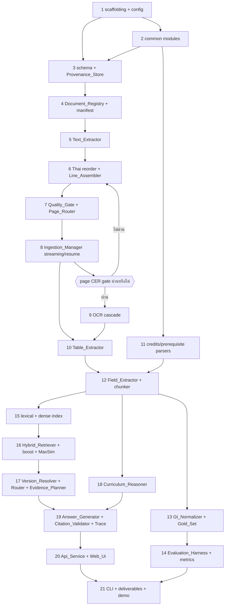

# Implementation Plan

## Overview

แผนนี้เรียงตาม design §12 phase 0-9 โดยเริ่มจากโครง package และ schema แล้วไต่ขึ้นไปตามลำดับ ingestion -> extraction -> evaluation -> retrieval -> reasoning -> answer/API -> deliverables ทุกงานเป็นงานเขียนโค้ดที่ต่อยอดจากไฟล์ที่งานก่อนหน้าสร้างไว้

**Gate ที่ห้ามข้าม:** งานที่ 6 (การจัดลำดับ glyph ภาษาไทย) ต้องผ่านเกณฑ์ page CER บน gold set ก่อนเริ่มงานที่ 9 (OCR cascade) เพราะ metric ปลายทางทุกตัวขึ้นกับคุณภาพข้อความ

**ขอบเขตที่บังคับตลอดแผน:** implementation root คือ `project/` เท่านั้น; `katgpt-rs/` เป็น read-only ห้าม import และห้ามแก้ไข; ห้ามแก้ไฟล์ ground truth ของอาจารย์ในที่เดิม; เครื่องเป้าหมายเป็น Windows + Python 3.11 + CPU-only

## Tasks

- [x] 1. สร้างโครง package และไฟล์ตั้งค่าของโปรเจกต์
  - สร้าง `project/pyproject.toml` ระบุ Python 3.11 และ dependency พร้อมชื่อ license ของทุกรายการ
  - สร้างโครงไดเรกทอรีตาม design §3.4: `katrag/{common,ingest,store,index,query,eval,api,cli}/`, `config/`, `artifacts/`, `third_party/`, `tests/`, `web/` พร้อม `__init__.py` ทุก package
  - สร้าง `third_party/katgpt-rs-MIT-NOTICE.md` ที่มีข้อความ MIT license ครบฉบับ ชื่อ repo ต้นทาง วันที่คัดลอก และผู้ถือ copyright
  - _Requirements: 20.2, 20.5_

- [x] 1.1 เขียนไฟล์ตั้งค่าทั้งสี่ไฟล์
  - สร้าง `config/katrag.toml` ด้วยค่าทุกกลุ่มตาม design §3.6 (`halt`, `ocr`, `preprocess`, `page_quality`, `route.page`, `thai`, `retrieval`, `evidence`, `answer`, `router.question`, `memory`, `evaluation`)
  - สร้าง `config/value_sets.toml` (ชุดค่าปิดของ category/type/extraction_method/provenance_source/edition_status/degree_level และ `category_synonym`)
  - สร้าง `config/engines.toml` (closed engine list 5 รายการ + license + ช่อง sha256 ของ weight) และ `config/domain_lexicon.toml` (lexicon + ชุดอักขระที่ประกาศไว้)
  - _Requirements: 20.2, 8.1, 11.9_

- [x] 1.2 เขียน `katrag/config.py` และ `katrag/errors.py`
  - เขียน `KatragConfig` เป็น frozen dataclass พร้อม loader ที่อ่าน TOML ทั้งสี่ไฟล์ครั้งเดียวต่อ process
  - เขียน validation ที่บังคับช่วงค่า: `max_hops` 1–5, `rerank_depth` 20–40, `phrase_boost_multiplier` 1.00–3.00, `answer_time_budget_seconds` 10–180 และ raise error ที่ระบุชื่อคีย์เมื่อค่าอยู่นอกช่วง
  - เขียน error taxonomy ใน `errors.py` ให้ครอบคลุมชนิด error ที่ design §6 อ้างถึง
  - _Requirements: 13.5, 13.6, 14.3, 17.1_

- [x] 2. เขียนโมดูลพื้นฐานใน `katrag/common/`
- [x] 2.1 เขียน `hashing.py` และ `normalize.py`
  - เขียน `sha256_hex()` ที่คืน hex ตัวพิมพ์เล็ก 64 อักขระ และฟังก์ชัน hash เนื้อหาแบบ streaming สำหรับไฟล์ขนาดใหญ่
  - เขียน `normalize_nfc()`, `squeeze_whitespace()`, `canonical_mark_order()` สำหรับใช้ร่วมกันทั้ง ingestion, retrieval และ evaluation
  - _Requirements: 1.1, 9.6, 18.1_

- [x] 2.2 เขียน `common/types.py` ตาม design §4.1
  - นิยาม dataclass/enum ที่ใช้ร่วมกัน: `CharGlyph`, `PageResult`, `Provenance`, `ComputePath`, `HaltDecision`, `HaltReason`, `HaltVerdict`, `CitationId`, `CurriculumVersion`
  - ทำให้ทุกชนิดเป็น frozen + slots เพื่อบังคับความ deterministic ของการเปรียบเทียบ
  - _Requirements: 9.2, 10.1_

- [x] 2.3 เขียน `common/halter.py` (Gain_Cost_Halter)
  - implement `GainCostHalter.observe()` ตามสูตร `gain = score_latest − best_score_before`, `cost = elapsed_s / budget_s`, halt เมื่อ `gain < cost × tau` และ `iterations_done >= l_min`
  - implement การนับ oscillation ครบ `oscillation_patience` → halt reason `oscillation`
  - implement NaN/±inf guard ที่ถือ `gain = 0.00` แล้ว halt ด้วย reason `nan_guard` โดยคงผลของรอบที่สำเร็จ
  - ใส่หมายเหตุอ้าง MIT notice ว่าเป็นอัลกอริทึมที่ duplicate มาเป็น Python
  - _Requirements: 5.2, 5.3, 5.4, 14.5, 14.7, 14.8, 20.5_

- [x] 2.4 เขียน `common/scratch.py` และ `common/net_guard.py`
  - implement pool ของ buffer ที่ผู้เรียกเป็นเจ้าของ พร้อม context manager `page_slot()` ที่จำกัดจำนวน slot ตาม `max_resident_page_images` และ `release()` ใน `finally`
  - implement net guard ที่ปฏิเสธการเชื่อมต่อไป address ที่ไม่ใช่ loopback และคืน error ที่ระบุว่าละเมิดข้อจำกัด offline
  - _Requirements: 6.1, 6.2, 6.3, 20.1, 20.9_

- [x] 3. สร้าง schema และ Provenance_Store
- [x] 3.1 เขียน `katrag/store/schema.sql`
  - เขียน DDL ทั้งหมดตาม design §5.2 ครบ 19 ตารางฐาน + FTS5 virtual table พร้อม `PRAGMA foreign_keys = ON` และ `journal_mode = WAL`
  - ใส่ `CHECK` ที่บังคับ sha256 เป็น hex 64 อักขระ, `page >= 1`, `x1 > x0`, `y1 > y0` และค่าจากชุดค่าปิด
  - _Requirements: 9.1, 9.2, 9.6, 21.2_

- [x] 3.2 เขียน `store/integrity.py` และ connection factory
  - implement การเปิด connection ที่บังคับ `PRAGMA foreign_keys = ON` ทุกครั้ง และฟังก์ชัน `integrity_check()`
  - implement การจัดการความล้มเหลวของการเปิด/เขียนไฟล์ฐานข้อมูลให้หยุดงานเขียนโดยไม่ commit ข้อมูลบางส่วน และคืน error ที่แยกชนิดได้
  - _Requirements: 9.1, 9.8_

- [x] 3.3 เขียน `store/provenance_store.py` (transactional API)
  - implement เมธอดเขียนข้อมูลหลักสูตรที่บังคับ `provenance_id` NOT NULL และตรวจ provenance ครบทุกฟิลด์ก่อนเขียน
  - implement การปฏิเสธทั้ง transaction เมื่อ provenance ขาดหรือไม่ผ่านการตรวจ พร้อม error ที่ระบุชื่อตาราง ชื่อ field และ provenance attribute ที่ขาด
  - implement การปฏิเสธการเขียน chunk/field ที่ curriculum version ไม่ครบสามค่า
  - implement `is_page_complete()`, `commit_page_complete()` แบบ atomic ที่ `UPDATE page SET status='page_complete'` เป็น statement สุดท้าย และ `record_review_issue()`
  - _Requirements: 9.2, 9.3, 10.1, 10.2, 6.7_

- [x] 3.4 เขียน `store/queries.py` (predefined L1/L2 SQL)
  - implement statement ตาม design §5.5 สำหรับหน่วยกิตของวิชา, ค่า field ของวิชา, รายวิชาในปี/ภาค, ผลรวมหน่วยกิตต่อหมวด, เกณฑ์ของหลักสูตร, provenance ของ citation และ lexical retrieval ที่ push down ตัวกรองเวอร์ชัน
  - _Requirements: 9.4, 9.7, 10.5, 16.2_

- [x] 4. เขียน Document_Registry และ dataset manifest
- [x] 4.1 implement `ingest/registry.py`
  - implement การบันทึก document record (document_id, relative path, sha256, byte size, page count) จากไฟล์ใต้ `project/Information_Technology_Course/`
  - implement การตรวจขอบเขต 14 เอกสาร / 3,689 หน้า และสร้าง `dataset_scope_mismatch` พร้อมจบงานด้วยสถานะไม่สำเร็จเมื่อไม่ตรง
  - implement การตรวจ sha256 ซ้ำ → `duplicate_content`, เลือก canonical document จาก relative path น้อยสุด, ประมวลผลเนื้อหาครั้งเดียวแล้วผูกผลกับทุก document_id ในกลุ่ม
  - _Requirements: 1.1, 1.2, 1.3, 1.4, 1.5, 9.5_

- [x] 4.2 implement การตัดสิน metadata ของเอกสารจากเนื้อหา
  - implement การอ่าน program, curriculum_year (พ.ศ. สี่หลัก), degree_level, edition_status จากข้อความในเอกสาร พร้อมบันทึก document_id/page/bbox ที่ใช้ตัดสิน และ provenance source `document_text`
  - implement fallback ไปค่าจากชื่อไฟล์/โฟลเดอร์ พร้อม provenance source `filename` และ `metadata_unresolved`
  - implement การตรวจความขัดแย้ง → ใช้ค่าจากเนื้อหา + `metadata_conflict` ที่บันทึกทั้งสองค่า
  - _Requirements: 1.6, 1.7, 1.8_

- [x] 4.3 implement dataset manifest writer
  - implement การผลิต `artifacts/dataset_manifest.json` ที่มี entry ต่อทุก document record เรียงตาม relative path ไม่มี timestamp และค่าทุกช่องอ่านจาก Provenance_Store
  - _Requirements: 1.9, 21.3_

- [x] 5. เขียน Text_Extractor
  - implement การดึง per-character record (codepoint, bbox, font name, font size, baseline) ของทุก glyph ด้วย PyMuPDF rawdict ให้เสร็จก่อนเรียกขั้นถัดไปของหน้านั้น
  - implement การบันทึก char_count และ image_count ต่อหน้า
  - implement การจัดการหน้าที่อ่านไม่ได้ → `error_record` ระดับหน้า และไม่บันทึกข้อความบางส่วน แล้วไปหน้าถัดไป
  - implement การจัดการไฟล์ที่เปิดไม่ได้ → `error_record` ระดับเอกสาร แล้วไปเอกสารถัดไป
  - implement การบันทึกหน้าที่ `char_count = 0` โดยไม่ถือเป็น error
  - _Requirements: 2.1, 2.2, 2.4, 2.5, 2.6_

- [x] 6. เขียน Thai_Glyph_Reorderer และ Line_Assembler
- [x] 6.1 implement `ingest/thai_reorder.py`
  - implement การจัดลำดับภายใน cluster: base → below vowel (U+0E38–U+0E3A) → above vowel (U+0E31, U+0E34–U+0E37, U+0E47) → tone (U+0E48–U+0E4B) → sign (U+0E4C–U+0E4E) พร้อม tie-break ตามลำดับที่ปรากฏใน input
  - implement การผูก zero-width mark (กว้าง ≤ 0.5 pt) กับ base ที่ใกล้ที่สุดภายใน baseline tolerance 20% และหน้าต่างแนวนอน 1.5 เท่าของ font size โดยเลือกตัวซ้ายเมื่อระยะเท่ากัน
  - implement การลบ whitespace ที่อยู่ระหว่างอักขระไทยกับ combining mark เท่านั้น
  - implement การบันทึก `thai_reorder_unresolved` โดยคงตำแหน่ง glyph เดิมเมื่อหา base ไม่ได้
  - _Requirements: 3.1, 3.2, 3.3, 3.4, 3.9_

- [x] 6.2 implement `ingest/line_assembler.py`
  - implement การจัดกลุ่มบรรทัดด้วย baseline tolerance 30% ของ font size ที่ใหญ่สุดในกลุ่ม, เรียง glyph ตาม X, เรียงบรรทัดตาม Y พร้อม tie-break ตามลำดับ input
  - implement การตรวจ multiset ของ codepoint ที่ไม่ใช่ whitespace ให้เท่ากับ input และบันทึก `glyph_count_mismatch` โดยคงข้อความของหน้าไว้เมื่อไม่เท่า
  - _Requirements: 3.6, 3.7, 3.10_

- [x] 6.3 เขียน property test ของการจัดลำดับข้อความไทย
  - เขียน generator ของลำดับ glyph สุ่ม (พยัญชนะ + mark 0–3 ตัว + bbox กว้างศูนย์ + whitespace แทรก) ใน `tests/property/`
  - เขียน property: determinism 3 ครั้ง และ idempotence เมื่อเรียกซ้ำบนผลของตัวเอง
  - เขียน property: จำนวนตำแหน่งที่ตรง pattern `[\u0e00-\u0e7f]\s+[\u0e30-\u0e4e]` เท่ากับศูนย์ และ whitespace ตำแหน่งอื่นไม่ถูกลบ
  - เขียน property: multiset ของ codepoint ที่ไม่ใช่ whitespace คงเดิมหลังประกอบบรรทัด
  - _Requirements: 3.3, 3.4, 3.5, 3.7, 3.10_

- [x] 7. เขียน Page_Quality_Gate และ Ocr_Page_Router
- [x] 7.1 implement `ingest/quality_gate.py`
  - implement การคำนวณตัวชี้วัดสี่ตัว (extracted_char_count, out_of_charset_ratio, image_area_ratio, domain_lexicon_match_count) และ `page_quality_score` ในช่วง 0.00–1.00 ด้วยน้ำหนักจากไฟล์ตั้งค่า
  - implement การบันทึกตัวชี้วัดทั้งสี่และคะแนนลง store ทุกหน้า แบบ deterministic
  - implement กฎ OCR candidate: `char_count < 120` และมีภาพ → candidate เหตุผล `low_text_with_image`; ไม่มีภาพ → ไม่เป็น candidate + `low_content_page`
  - implement โควตา 979 หน้า และ `ocr_budget_exhausted` เมื่อครบ
  - _Requirements: 4.1, 4.2, 4.3, 4.4, 4.5, 4.6_

- [x] 7.2 implement `ingest/page_router.py`
  - implement การกำหนด compute path ค่าเดียวต่อหน้า: `fast` เมื่อ image_area_ratio ≤ 0.30, `deep` เมื่อ char_count = 0 หรือ image_area_ratio ≥ 0.60, `standard` ในกรณีที่เหลือ
  - implement การบันทึก compute path ตัวชี้วัดที่ใช้ตัดสิน และรหัสเหตุผลลง store
  - _Requirements: 4.7, 4.8_

- [x] 8. เขียน Ingestion_Manager แบบ streaming และ resume
  - implement per-page pull pipeline ตาม design §3.5 ที่ไม่สร้าง list ของหน้า และใช้ช่วงหน้าจาก `document.page_count` เท่านั้น
  - implement การจำกัด page image ที่ถืออยู่พร้อมกันไม่เกิน 2 หน้า และการคืนหน่วยความจำก่อนเริ่มหน้าถัดไป
  - implement การวัด RSS ทุกหน้า, RSS drift gate เทียบ baseline หลังหน้าที่ 50 ไม่เกิน 5% และการหยุดอย่างปลอดภัยที่ 6 GB พร้อม `memory_limit_exceeded`
  - implement resume ที่ข้ามหน้าที่มีสถานะ `page_complete` แล้ว
  - implement การรายงานจำนวนหน้า OCR candidate, หน้าที่เข้า OCR จริง, สัดส่วน และจำนวนแยกตาม compute path ลง evaluation report
  - _Requirements: 6.1, 6.2, 6.3, 6.4, 6.5, 6.6, 6.8, 2.3, 4.9_

- [x] 8.1 เขียน property test ของหน่วยความจำและ resume
  - เขียน property: จำนวน page slot ที่ถืออยู่พร้อมกัน ≤ 2 ตลอดลำดับหน้าความยาวสุ่ม
  - เขียน property: หลังการขัดจังหวะทุกรูปแบบ การรันใหม่ไม่เรียก OCR ซ้ำสำหรับหน้าที่ `page_complete` แล้ว
  - _Requirements: 6.1, 6.3, 6.8_

- [x] 9. ติดตั้งและต่อ OCR cascade (Tesseract 5 → Typhoon-OCR-1.5-2B)
- [x] 9.1 ทดลอง PaddleOCR / Tesseract / Typhoon OCR 1.5 2B บนหน้าสแกนจริง
  - ทดสอบ `paddleocr==2.8.1` กับภาษาไทยจริง — พบว่าไม่รองรับ (`AssertionError`) เพราะ PP-OCRv5 ที่มีโมเดลไทยต้องใช้ `paddleocr>=3.0` ซึ่งดาวน์โหลด weight เองตอน runtime → ตัด PaddleOCR ออกจาก cascade ทั้งหมด
  - ทดสอบ Tesseract 5 (มีอยู่แล้วบนเครื่อง พร้อม `tha`+`eng` traineddata) และ Typhoon-OCR-1.5-2B (4bit NF4, ดาวน์โหลดจาก Hugging Face ครั้งเดียว) บน 8 หน้า OCR candidate จริงที่สุ่มข้าม 5 เอกสาร
  - วัดผลจริง: Tesseract เฉลี่ย 3.0 s/หน้า (979 หน้า ≈ 49 นาที), Typhoon เฉลี่ย 126.1 s/หน้า (979 หน้า ≈ 34.3 ชั่วโมง) บน RTX 2050; Typhoon แม่นกว่าชัดเจนทุกหน้าที่ทดสอบ (โครงสร้างตาราง, การสะกดคำ) แต่ hallucinate ชื่อสถาบัน 3/8 หน้า และวนซ้ำข้อความจนกิน 568 วินาทีในหน้าที่ไม่มีข้อความมาก (นอก candidate sample)
  - บันทึกผลเต็มไว้ที่ `docs/results/task_09_ocr_cascade.md` และแก้ requirements.md (R5.1, R5.1.1–5.1.3, R20.2, R20.7), design.md (§4.9), `config/engines.toml`, `config/katrag.toml`, `config/value_sets.toml`, schema `ocr_stage_result.engine` ให้ตรงกับ cascade ใหม่
  - _Requirements: 5.1, 18.3, 18.4, 20.1, 20.2, 20.3, 20.7_

- [x] 9.2 เพิ่ม OCR dependency และ preflight check
  - เพิ่ม `pytesseract`, `torch`, `torchvision`, `transformers`, `accelerate`, `bitsandbytes`, `qwen-vl-utils` เข้า dependency พร้อม license (ทำแล้วใน `pyproject.toml`) และบันทึก sha256 ของ weight ใน `config/engines.toml`
  - implement `preflight` ที่ตรวจ artifact และ sha256 แล้วหยุดการเริ่มระบบภายใน 10 วินาทีพร้อมรายการที่ขาด โดยไม่ดาวน์โหลดไฟล์ใด
  - implement การตรวจ CUDA availability ตอน preflight — ไม่มี CUDA ต้องไม่ถือเป็น artifact ที่ขาด (stage 2 เป็น optional ตาม R5.1.1) แต่ต้องบันทึกสถานะไว้ให้ evaluation report อ่านได้
  - _Requirements: 20.2, 20.6, 20.7, 20.8_

- [x] 9.3 implement stage adapters และ crop cache
  - implement `stage_tesseract.py` และ `stage_typhoon.py` ที่คืนผลรูปแบบเดียวกัน (ข้อความ, bbox, confidence, engine, elapsed_ms)
  - implement `stage_typhoon.py` ให้ตรวจชื่อสถาบันกับ `ocr.typhoon.known_institution_name` (คะแนน 0.00 เมื่อไม่ตรง + `hallucinated_institution_name`) และจำกัด `max_new_tokens`/`repetition_penalty`/`no_repeat_ngram_size` ตามค่าตั้งค่า
  - implement `crop_cache.py` เป็น LRU ที่ key ด้วย sha256 ของภาพ crop + stage + ลำดับ preprocessing และจำกัด 2,000 รายการต่อเอกสาร พร้อมล้างเมื่อเปลี่ยนเอกสาร
  - **แก้บั๊ก Tesseract ช่องว่างแทรกกลางคำไทย** — ใช้ `image_to_string` เป็น text หลัก, `image_to_data` เฉพาะ bbox
  - **แก้บั๊ก hallucination false positive regex** — จับเฉพาะอักขระไทยติดกัน ยกเว้น "สถาบันฯ"
  - **ablation repetition_penalty** — ปรับเป็น 1.1 + no_repeat_ngram_size=0 (ป้องกันรหัสวิชาผิด)
  - **enforce deadline ร่วมใน Tesseract** — ใช้ absolute deadline สำหรับ 2 subprocess calls (ก่อนหน้า worst-case 2×timeout)
  - **enforce cooperative timeout ใน Typhoon** — เพิ่ม `StoppingCriteria` ตรวจ wall-clock deadline ทุก ~16 tokens + ตรวจหลัง generate
  - _Requirements: 5.1, 5.1.2, 5.1.3, 5.6, 5.11_

- [x] 9.3.1 แก้ปัญหา timeout architecture (per-engine timeout + selective escalation)
  - แยก `region_timeout_seconds` เดิม (10s เดียวสำหรับทุก engine — ใช้ไม่ได้จริงกับ Typhoon ที่ 100-300s/region) เป็น `[ocr.stage_timeout]` per-engine: Tesseract=15s, Typhoon=300s
  - เพิ่ม `[ocr.escalation]`: budget 4 ชั่วโมง/run, circuit-breaker 3 failures, skip เมื่อ stage1 quality ≥ 0.85
  - เพิ่ม `StageTimeoutConfig`, `EscalationConfig`, `EscalationTracker` ใน `config.py`
  - implement `cascade.py` — orchestrate stages, GPU gate, per-engine timeout, selective escalation, crop cache, error handling, circuit-breaker
  - อัปเดต R5.6 → R5.6+6.1+6.2+6.3, design §4.9, config schema ทั้งหมด
  - _Requirements: 5.1, 5.1.1, 5.6, 5.6.1, 5.6.2, 5.6.3_

- [x] 9.4 implement `preprocessor.py` แบบมีเงื่อนไขและตรวจผล
  - implement การปรับภาพเฉพาะเมื่อ skew > 1.0°, DPI < 300 หรือ contrast < 0.30 และส่งภาพต้นฉบับเมื่อไม่เข้าเงื่อนไข
  - implement การบันทึกชื่อขั้นตอนการปรับภาพตามลำดับ (บันทึกรายการว่างเมื่อไม่มี)
  - implement การเปรียบเทียบคะแนนก่อน/หลังปรับภาพ และเลือกผลก่อนปรับภาพเมื่อคะแนนเท่ากัน
  - ใช้ Hough lines สำหรับ skew estimation, A4-heuristic สำหรับ DPI, std-based contrast scoring, CLAHE สำหรับ enhancement
  - _Requirements: 5.7, 5.8, 5.9_

- [x] 9.5 implement `adjudicator.py` (spatial voting)
  - implement การจับคู่ผลข้าม engine ด้วย IoU ≥ 0.50 และเลือกด้วยคะแนนความเชื่อมั่น โดยเลือก stage ลำดับต้นกว่าเมื่อคะแนนต่างกันไม่เกิน 0.01
  - implement การบันทึกผลของทุก engine พร้อมผลที่เลือกลง store
  - implement `compute_iou()` helper
  - _Requirements: 5.10_

- [x] 9.6 implement `cascade.py` ต่อกับ halter
  - implement ลำดับ stage คงที่ไม่เกิน 2 stage ต่อ region (stage 1 = Tesseract 5, stage 2 = Typhoon-OCR-1.5-2B) และการเรียก `GainCostHalter` หลังจบทุก stage
  - implement การข้าม stage 2 โดยอัตโนมัติเมื่อไม่มี CUDA (R5.1.1) — ผลของ stage 1 เป็นผลสุดท้ายในกรณีนี้ ไม่ถือเป็น error
  - implement การหยุดตามคำตัดสิน halt แล้วใช้ผลคะแนนสูงสุด พร้อมบันทึกจำนวน stage, gain, cost และเหตุผลการหยุด
  - implement การจัดการ engine error/timeout per-engine (Tesseract 15s, Typhoon 300s) → ยกเลิก stage, `error_record`, ใช้ผลที่สำเร็จ หรือทำเครื่องหมาย `ocr_failed` แล้วไป region ถัดไป
  - integrate `EscalationTracker` — budget, circuit-breaker, quality-skip
  - integrate `Preprocessor` (optional injection) + `RegionAdjudicator` (optional injection)
  - _Requirements: 5.1, 5.1.1, 5.2, 5.5, 5.6, 5.6.1, 5.6.2, 5.6.3, 5.7, 5.8, 5.10_

- [x] 9.7 เขียน property test ของ halter
  - เขียน property: ลำดับค่า (gain, cost) สุ่มรวม NaN และ ±inf ทำให้ลูป escalation จบภายในจำนวน stage ที่กำหนด และ NaN ให้เหตุผล `nan_guard` โดย gain ถือเป็น 0.00
  - เพิ่ม property: oscillation detection, l_min prevents early halt, NaN in elapsed/budget
  - ทดสอบผ่าน 200 examples/property × 6 properties ไม่มี failure
  - _Requirements: 5.4, 14.8_

- [ ] 10. เขียน Table_Extractor
  - implement การตรวจตาราง (header ≥ 1 แถว, คอลัมน์ ≥ 2, แถวข้อมูล ≥ 1) และผลิต cell record ที่มี row/column index เริ่มจาก 1, ข้อความ, bbox, document_id และเลขหน้า
  - implement การบันทึกเซลล์ว่างเป็น cell record ที่ข้อความว่าง เพื่อให้จำนวน cell ต่อแถวเท่ากับจำนวนคอลัมน์ของ header
  - implement การระบุปี (1–8) และภาคการศึกษา (1–3) ของตารางแผนการศึกษา พร้อม page และ bbox ของข้อความที่ใช้ระบุ
  - implement `table_context_unresolved` เมื่อระบุไม่ได้หรือขัดแย้ง โดยคง cell record ทั้งตาราง
  - implement `table_shape_mismatch` เมื่อจำนวน cell ต่อแถวไม่ตรง header โดยคง cell record ทั้งตาราง
  - implement การบันทึก row span / column span ที่ตำแหน่ง index น้อยสุดของช่วง และไม่สร้าง cell ซ้ำในช่วงเดียวกัน
  - _Requirements: 7.1, 7.2, 7.3, 7.4, 7.5, 7.6_

- [x] 11. เขียน parser ของ field ประกอบ
- [ ] 11.1 implement `fields/credits.py`
  - implement `Credits_Parser` ที่แปลง `total(lecture-lab-self_study)` เป็นโครงสร้างจำนวนเต็มช่วง 0–30 แบบ deterministic
  - implement `Credits_Printer` และรับประกัน round-trip กับ parser
  - implement การคืน error ที่ระบุ index อักขระแรกที่ผิด และบังคับให้ผู้เรียกบันทึกค่าว่าง + สตริงต้นฉบับ + `credits_parse_error` โดยไม่บันทึกตัวเลขบางส่วน
  - _Requirements: 8.2, 8.3, 8.4_

- [ ] 11.2 implement `fields/prerequisite.py`
  - implement `Prerequisite_Parser` ที่รองรับ and/or และเงื่อนไขว่าง ภายในขอบเขต 500 อักขระ, รหัสวิชา ≤ 20 รายการ, ซ้อน ≤ 3 ระดับ
  - implement `Prerequisite_Printer` แบบ canonical และรับประกัน round-trip
  - implement การคืน error ที่ระบุ index อักขระแรกที่ผิด และ `prerequisite_parse_error`
  - _Requirements: 8.5, 8.6, 8.9_

- [ ] 11.3 เขียน property test ของ parser
  - เขียน property round-trip ของ credits และ prerequisite จาก generator ที่สุ่มค่าในขอบเขตที่กำหนด
  - เขียน property: เมื่อ parser คืน error ค่า field เป็นค่าว่างพร้อมสตริงต้นฉบับ และไม่มีค่าบางส่วนถูกบันทึก
  - _Requirements: 8.3, 8.4, 8.6, 8.9_

- [ ] 12. เขียน Field_Extractor และ chunker
- [ ] 12.1 implement `fields/extractor.py`
  - implement การผลิต course record ที่มี field ครบ 11 field ตามชนิดและช่วงค่าที่กำหนด โดย category/type มาจากชุดค่าปิดในไฟล์ตั้งค่า
  - implement การบันทึก provenance ต่อทุก field (document_id, page, bbox, span เริ่ม/สิ้นสุด, extraction_method) ครบทุกฟิลด์
  - implement `field_unresolved` เมื่อหาต้นทางไม่ได้หรือได้ค่าขัดกัน โดยคง course record และบันทึก field นั้นเป็นค่าว่าง
  - _Requirements: 8.1, 8.7, 8.10_

- [ ] 12.2 implement `ingest/chunker.py`
  - implement การสร้าง chunk แบบรู้หัวข้อ พร้อม content sha256 และการ stamp curriculum version ครบสามค่าให้ทุก chunk
  - _Requirements: 9.6, 10.1_

- [ ] 13. เขียน Gt_Normalizer และ Gold_Set
- [ ] 13.1 implement `eval/gt_normalizer.py`
  - implement การเปิดไฟล์ ground truth ของอาจารย์แบบอ่านอย่างเดียว และเขียนผล normalize ลง `artifacts/gt_normalized/` เท่านั้น
  - implement การกรองแถวคำแนะนำที่หลุดเข้ามา, การแยกเซลล์รหัสทางเลือกเป็นกลุ่ม, การ coerce ชนิด year/semester, การแยก bucket ที่ปี/ภาคเป็น 0, การ map ชื่อหมวดที่เป็นคำพ้อง, การ normalize prerequisite ที่ระบุว่าไม่มี และการ parse สตริงหน่วยกิต
  - implement การจับคู่แบบ multiset สำหรับรหัสที่ซ้ำภายในไฟล์เดียว
  - _Requirements: 11.1, 11.9_

- [ ] 13.2 implement `eval/gold_set.py`
  - implement loader/validator ของ gold set ที่บังคับให้มีข้อความอ้างอิงระดับหน้า, ตารางอ้างอิงระดับ cell, ชุดคำถาม L1–L4 พร้อมคำตอบอ้างอิง เวอร์ชันที่ถูกต้องและหน้าหลักฐาน, คำถามที่คำตอบต่างกันระหว่าง old/current และผู้จัดทำ/วันที่/วิธีตรวจทาน
  - implement การตรวจว่า gold set ครอบคลุมทั้ง 14 เอกสาร
  - _Requirements: 12.1, 12.2, 12.3, 12.4, 12.5, 12.6_

- [~] 14. เขียน Evaluation_Harness และ metrics
- [ ] 14.1 implement `eval/metrics.py`
  - implement page CER แบบ edit distance หลัง NFC, table-cell F1, field precision/recall/F1 และ field macro-F1, Recall@k (k = 5, 10, 20), citation page precision/recall, unsupported-claim rate, version-selection accuracy
  - _Requirements: 3.8, 7.7, 8.8, 13.9, 17.7, 10.9_

- [~] 14.2 implement `eval/harness.py`
  - implement การจับคู่ด้วยกุญแจ `(document_id, page)` และ `(document_id, page, field_name)` เท่านั้น พร้อมการเทียบหลัง NFC และตัด whitespace หัวท้าย
  - implement การปฏิเสธ metric ที่ขอบเขตหน้าไม่ตรง โดยคืน error ที่ระบุทั้งสองฝ่ายและยังคำนวณ metric ตัวอื่นต่อ
  - implement การผลิต evaluation report ที่มีค่า metric ทศนิยม 4 ตำแหน่ง, จำนวนตัวอย่าง, ชนิดแหล่งอ้างอิง, commit id และ timestamp
  - implement กฎสถานะ `measured`/`estimate` ที่ต้องมีตัวอย่าง ≥ 30, การระบุเงื่อนไขเปลี่ยนสถานะ, `metric_sample_insufficient` และการห้ามระบุ `pass`
  - implement การตรวจ reproducibility ที่คืน error และคงรายงานเดิมเมื่อรันซ้ำได้ค่าต่างกัน
  - _Requirements: 18.1, 18.2, 18.3, 18.4, 18.5, 18.6, 18.7, 18.8, 18.9_

- [ ] 14.3 เขียน property test ของ metric และ manifest
  - เขียน property: ค่า metric อยู่ในช่วง 0–1, การสลับลำดับ input ไม่เปลี่ยนค่า, field ที่ไม่ถูกบันทึกนับเป็น false negative
  - เขียน property: ผลิต dataset manifest ซ้ำจากชุดไฟล์เดิมได้เนื้อหาเหมือนเดิม
  - _Requirements: 18.1, 8.8, 1.9_

- [ ] 15. เขียนดัชนีค้นคืน
- [ ] 15.1 implement `index/lexical.py`
  - implement การสร้างดัชนี FTS5 BM25 จากทุก chunk ให้จำนวน entry เท่ากับจำนวน chunk และทุก entry อ้าง chunk id กับ curriculum version ได้
  - implement `index_build_incomplete` เมื่อสร้างดัชนีบาง chunk ไม่สำเร็จ โดยคงดัชนีของ chunk ที่สำเร็จไว้
  - _Requirements: 13.1, 13.12_

- [ ] 15.2 implement `index/embedder.py` และ `index/dense.py`
  - implement การสร้าง embedding ด้วย bge-m3 ที่รันบนเครื่อง (onnxruntime CPU) ให้จำนวน embedding เท่ากับจำนวน chunk และมิติเท่ากันทุกตัว
  - implement การค้นแบบสแกนครบทุก chunk โดยไม่ใช้ ANN และการวัด p95 latency เทียบงบ 3.0 วินาที
  - _Requirements: 13.2, 13.4, 13.12_

- [ ] 16. เขียน Hybrid_Retriever, Phrase_Booster และ MaxSim_Reranker
- [~] 16.1 implement `query/hybrid_retriever.py`
  - implement การรวมอันดับ 100 อันดับแรกจากทั้งสองดัชนีด้วยสูตรและพารามิเตอร์จากไฟล์ตั้งค่า และคืนไม่เกิน 50 รายการ พร้อม tie-break ด้วย chunk id
  - implement การกรอง curriculum version ก่อน scoring ให้จำนวน chunk นอกชุดที่ส่งต่อเท่ากับศูนย์
  - implement การปฏิเสธคำถามที่ว่างหรือยาวเกิน 1,000 อักขระ โดยไม่เรียกดัชนีใด และการคืนผลว่างพร้อมสถานะเมื่อไม่พบ chunk
  - _Requirements: 13.3, 13.10, 13.11, 10.5_

- [~] 16.2 implement `common/phrase_boost.py` และ `common/maxsim.py`
  - implement การคูณคะแนนของ chunk ที่มีคำตรงกับ domain lexicon ด้วยตัวคูณจากไฟล์ตั้งค่า โดยเทียบหลัง normalize และไม่เพิ่ม/ลบ chunk ออกจากชุดผลลัพธ์
  - implement packed MaxSim ที่จัดอันดับใหม่เฉพาะอันดับ 1 ถึง `rerank_depth` และคงลำดับเดิมของส่วนที่ต่ำกว่าไว้ต่อท้าย พร้อม feature flag ที่ปิดเป็นค่าตั้งต้นและสถานะ `pending_ablation`
  - ใส่หมายเหตุอ้าง MIT notice สำหรับอัลกอริทึมที่ duplicate มา
  - _Requirements: 13.5, 13.6, 13.7, 13.8, 20.5_

- [ ] 16.3 เขียน property test ของ retrieval
  - เขียน property: คำถามเดียวกันบนดัชนีเดิมได้ลำดับผลลัพธ์เดิมทุกครั้ง
  - เขียน property: phrase boost ไม่เปลี่ยนสมาชิกของชุดผลลัพธ์ และ rerank ไม่เปลี่ยนสมาชิก เปลี่ยนเฉพาะลำดับส่วนหัว
  - เขียน property: จำนวน chunk นอกชุดเวอร์ชันที่ส่งต่อเท่ากับศูนย์
  - _Requirements: 13.3, 13.5, 13.6, 10.5_

- [ ] 17. เขียน Version_Resolver, Question_Router และ Evidence_Planner
- [ ] 17.1 implement `query/version_resolver.py`
  - implement การคืนชุด curriculum version โดยให้พารามิเตอร์ของผู้ใช้ชนะค่าที่ตีความจากข้อความ, ผลลัพธ์ deterministic และบันทึกแหล่งที่ใช้ตัดสินลง trace
  - implement การคืนคำถามยืนยันเมื่อได้มากกว่าหนึ่งค่า โดยไม่เรียก Answer_Generator และคงข้อความคำถามไว้
  - implement การตอบว่าไม่พบหลักฐานเมื่อกรองแล้วไม่มี chunk เหลือ โดยไม่ขยายไปเวอร์ชันอื่น
  - _Requirements: 10.3, 10.4, 10.6_

- [ ] 17.2 implement `query/question_router.py`
  - implement การจำแนก L1–L4 ภายใน 200 มิลลิวินาที พร้อมบันทึกระดับ, confidence, รหัสกฎที่ใช้ตัดสิน, เส้นทางและเวลาที่ใช้
  - implement การเลือกเส้นทาง structured สำหรับ L1/L2 ที่ไม่เรียก Evidence_Planner และคืนผลภายใน 1,000 มิลลิวินาที
  - implement การเรียก Evidence_Planner สำหรับ L3/L4 ไม่เกิน 2 curriculum version ต่อคำขอ
  - implement `router_fallback` ไป L3 เมื่อ confidence < 0.50 หรือช้าเกินงบ และ `route_escalated` ไม่เกิน 1 ครั้งต่อคำขอเมื่อ L1/L2 คืนผลว่าง
  - implement การปฏิเสธคำถามที่ยาว 0 หรือเกิน 500 อักขระ พร้อม `question_input_invalid`
  - _Requirements: 16.1, 16.2, 16.3, 16.4, 16.6, 16.7_

- [ ] 17.3 implement `query/evidence_planner.py`
  - implement การสร้าง evidence graph แบบ DAG ที่ node ≤ 60 ต่อคำขอ, ≤ 10 node ต่อ hop, hop ≤ `max_hops` และทุก node มี provenance ครบ
  - implement การไม่เพิ่ม node ที่ขาด provenance พร้อมบันทึก `missing_provenance` และการปฏิเสธ edge ที่ทำให้เกิด cycle พร้อม `cycle_rejected`
  - implement การเรียก halter หลังทุก hop และเหตุผลการหยุด `max_hops_reached`, `no_new_evidence`, `nan_guard`, `time_budget_exceeded`
  - implement การกรอง node นอกชุดเวอร์ชันพร้อมบันทึก `version_filtered` และจำนวนที่ถูกกรอง
  - implement การบันทึกรายละเอียดต่อ hop ลง trace (ลำดับ hop, คำค้น, node ที่เพิ่ม, gain, cost, คำตัดสิน, เหตุผล, เวลา)
  - _Requirements: 14.1, 14.2, 14.3, 14.4, 14.5, 14.6, 14.7, 14.8, 14.9, 14.10, 14.11, 14.12_

- [ ] 17.4 เขียน property test ของ evidence graph และ routing
  - เขียน property: กราฟไม่มี cycle และอยู่ในเพดาน node/hop ทุกคำขอ
  - เขียน property: ทุก node สังกัดชุดเวอร์ชันของคำขอ
  - เขียน property: ระดับที่จำแนกไม่ลดลงเมื่อเพิ่ม signal เข้าไปในคำถาม
  - _Requirements: 14.1, 14.3, 14.10, 14.11, 16.1_

- [ ] 18. เขียน Curriculum_Reasoner
  - implement การคำนวณสายวิชาก่อนจากกราฟ prerequisite แบบ deterministic และการตรวจ cycle ที่คืน error ระบุรายวิชาพร้อม `prerequisite_cycle`
  - implement การรวมหน่วยกิตต่อหมวดและต่อหลักสูตรจากค่า total ของ Credits_Parser
  - implement การประเมินเกณฑ์สำเร็จการศึกษาจากกฎใน store พร้อมคืน citation ID ของทุกกฎที่ใช้
  - _Requirements: 15.1, 15.2, 15.3, 15.4_

- [ ] 18.1 เขียน property test ของ reasoner
  - เขียน property: กราฟ prerequisite ต่อหนึ่งเวอร์ชันเป็น DAG และ input ที่มี cycle ทำให้เกิด error พร้อม review issue โดยไม่ loop
  - เขียน property: ผลรวมหน่วยกิตต่อหมวดเท่ากับยอดรวม และการนับกลุ่มทางเลือกไม่นับซ้ำ
  - _Requirements: 15.1, 15.2, 15.3_

- [ ] 19. เขียน Answer_Generator, Citation_Validator และ Trace_Recorder
- [ ] 19.1 implement `query/citation.py` (การออก citation ID)
  - implement การออก citation ID ต่อ evidence unit และการแปลง citation ID กลับเป็น document_id, เลขหน้าและหัวข้อของ chunk
  - _Requirements: 17.6, 19.1_

- [ ] 19.2 implement `query/answer_generator.py`
  - implement การเรียก Qwen3 4B GGUF Q4 ผ่าน llama.cpp บนเครื่อง โดยไม่ส่งข้อมูลออกนอกเครื่อง และคืนผลภายใน `answer_time_budget`
  - implement การประกอบ prompt ที่มีเฉพาะ evidence unit ที่มี citation ID แล้ว ไม่เกิน 60 รายการ พร้อมกำกับเวอร์ชันครบทุกค่า
  - implement การแยกคำตอบเป็นส่วนต่อหนึ่งเวอร์ชันสำหรับคำถาม L4 ที่เปรียบเทียบข้ามเวอร์ชัน
  - implement การห้ามคำนวณค่าตัวเลข/เกณฑ์/ความสัมพันธ์วิชาก่อนขึ้นใหม่ โดยใช้ค่าจาก Curriculum_Reasoner เท่านั้น
  - implement การยกเลิกเมื่อเกินงบเวลาหรือโมเดลล้มเหลว โดยไม่คืนคำตอบบางส่วน
  - _Requirements: 17.1, 17.2, 17.9, 10.7, 15.5_

- [ ] 19.3 implement Citation_Validator
  - implement การแยกคำตอบเป็นหน่วยข้อความตามเครื่องหมายจบประโยคหรือรายการหัวข้อย่อย และตรวจ citation ID ทุกตัวว่าตรงทุกอักขระกับรายการที่ส่งเข้า prompt
  - implement การลบหน่วยข้อความที่อ้าง citation ID ที่ไม่รู้จัก โดยคงหน่วยที่ผ่านไว้ไม่แก้ข้อความ และคืนจำนวนที่ถูกลบ
  - implement การทำเครื่องหมาย unsupported claim สำหรับหน่วยข้อความเชิงข้อเท็จจริงที่ไม่มี citation
  - implement การปฏิเสธคำตอบทั้งฉบับเมื่อมี citation ข้ามเวอร์ชัน พร้อม error และการบันทึกลง trace
  - implement การแทนค่าด้วยผลจาก reasoner เมื่อค่าตัวเลขในคำตอบไม่ตรง
  - _Requirements: 17.3, 17.4, 17.5, 10.8, 15.6_

- [ ] 19.4 implement `query/trace.py` และ `query/answer_cache.py`
  - implement การบันทึก query_trace หนึ่งรายการต่อ request_id ที่มีทุก field ไม่เป็น null และคืนค่าเดิมทุกครั้งเมื่อเรียกซ้ำด้วย request_id เดียวกัน
  - implement การบันทึกจำนวนการเรียก Ocr_Cascade, Preprocessor, Region_Adjudicator ต่อคำขอ (ต้องเป็นศูนย์)
  - implement การบันทึกจำนวน citation ID ที่ส่งเข้า/ผ่าน, จำนวนหน่วยที่ถูกลบ, จำนวน unsupported claim และเวลาสร้างคำตอบ
  - implement answer cache ที่ต้องตรงทุกค่า (คำถาม normalize, ชุดเวอร์ชัน, content hash ของ chunk) โดยไม่ใช้ค่าความคล้ายแบบประมาณ
  - _Requirements: 19.6, 19.7, 4.10, 17.10, 10.10_

- [ ] 19.5 เขียน property test ของ citation และ cache
  - เขียน property: ทุก citation ID ในคำตอบที่ส่งถึงผู้ใช้ตรงกับรายการที่ส่งเข้า prompt
  - เขียน property: cache hit เกิดขึ้นได้เฉพาะเมื่อกุญแจตรงทุกค่า และไม่มีเส้นทางที่ใช้ threshold
  - เขียน property: จำนวนการเรียก OCR บนเส้นทางคำถามเท่ากับศูนย์
  - _Requirements: 17.3, 17.4, 10.10, 4.10_

- [ ] 20. เขียน Api_Service และ Web_Ui
- [~] 20.1 implement `api/schemas.py` และ `api/service.py`
  - implement endpoint ครบสี่รายการ (ส่งคำถาม, รายการเอกสารพร้อมเวอร์ชัน, หน้าเอกสารตาม citation ID พร้อม bbox, query_trace ตาม request_id) โดยรับคำถาม 1–2,000 อักขระ และคืนรายการเอกสารไม่เกิน 500 รายการ
  - implement การผูก listener ที่ 127.0.0.1 เป็นค่าตั้งต้น
  - implement การคืนสถานะ 422 พร้อมรายชื่อ field ที่ผิดทุก field โดยไม่เรียก router หรือ generator
  - implement การคืน error เมื่อ identifier ไม่มีอยู่ และการยุติคำขอที่เกิน 120 วินาทีพร้อมบันทึก trace
  - _Requirements: 19.1, 19.2, 19.3, 19.8, 19.9_

- [ ] 20.2 implement `web/` (Web_Ui)
  - implement หน้าผลลัพธ์ที่แสดงคำตอบ, รายการ citation ทุกรายการพร้อมชื่อเอกสาร/เลขหน้า/citation ID, curriculum version ที่ใช้ตอบ และสถานะการตรวจพร้อมจำนวนที่ถูกลบ/unsupported
  - implement การแสดงภาพหน้าเอกสารพร้อม bbox overlay ภายใน 3 วินาทีเมื่อผู้ใช้เลือก citation
  - implement ตัวบ่งชี้สถานะกำลังประมวลผลที่ไม่ส่งคำถามซ้ำ
  - _Requirements: 19.4, 19.5, 19.10_

- [ ] 21. เขียน CLI, สิ่งส่งมอบ และสคริปต์สาธิต
- [ ] 21.1 implement `cli/__main__.py`
  - implement คำสั่งย่อย `preflight`, `ingest`, `index`, `evaluate`, `serve`, `demo` ที่ประกอบ component ทั้งหมดเข้าด้วยกัน
  - implement การบังคับ offline invariant ตอนเริ่มทุกคำสั่ง
  - _Requirements: 20.1, 20.3, 20.7_

- [ ] 21.2 เขียน README และเอกสาร ER diagram
  - เขียน README สี่ส่วน (ติดตั้ง dependency และโมเดลบน Python 3.11, รัน ingestion, รัน evaluation, เปิด Api_Service) โดยทุกคำสั่งคัดลอกไปรันได้ พร้อมค่าที่คาดหมายของ artifact และคำเตือนว่าห้าม expose service ออกเน็ตเวิร์ก
  - เขียน `artifacts/er_diagram.md` ที่จำนวนตาราง ชื่อตาราง ชื่อ field และความสัมพันธ์ foreign key พร้อม cardinality ตรงกับ schema ที่ใช้งาน
  - _Requirements: 21.1, 21.2, 19.2_

- [ ] 21.3 implement `cli/demo.py`
  - implement สคริปต์คำสั่งเดียวที่ทำงานครบตั้งแต่อ่าน PDF, ingestion, การค้นคืน จนถึงคำตอบพร้อม citation และจบภายใน 30 นาที
  - implement การแสดงคำถามตัวอย่างอย่างน้อยหนึ่งข้อต่อระดับครบทั้งสี่ระดับ พร้อมระดับที่จำแนกได้, คำตอบ และ citation ที่ผ่าน validator
  - implement การตรวจสิ่งส่งมอบครบห้ารายการก่อนเริ่มขั้นถัดไป และการคืนสถานะไม่สำเร็จพร้อมชื่อขั้นที่ล้มเหลว
  - _Requirements: 21.3, 21.4, 21.5, 21.6, 21.7_

- [ ] 21.4 เขียน property test ของ offline invariant และ demo
  - เขียน property: จำนวน outbound request ไป address ที่ไม่ใช่ loopback เท่ากับศูนย์ในทุกเส้นทาง
  - เขียน test: จำนวน import ของโมดูลใต้ `katgpt-rs/` ในซอร์สทั้งหมดเท่ากับศูนย์ และไม่มีการเขียนไฟล์ใน `katgpt-rs/`
  - เขียน property: รันสคริปต์สาธิตซ้ำได้ระดับคำถาม ชุดเวอร์ชัน และชุด citation ID เท่าเดิม
  - _Requirements: 20.1, 20.4, 21.8_

## Task Dependency Graph



```json
{
  "waves": [
    { "wave": 1, "tasks": ["1", "1.1", "1.2"] },
    { "wave": 2, "tasks": ["2", "2.1", "2.2", "2.3", "2.4"] },
    { "wave": 3, "tasks": ["3", "3.1", "3.2", "3.3", "3.4"] },
    { "wave": 4, "tasks": ["4", "4.1", "4.2", "4.3"] },
    { "wave": 5, "tasks": ["5", "11", "11.1", "11.2", "11.3"] },
    { "wave": 6, "tasks": ["6", "6.1", "6.2", "6.3"] },
    { "wave": 7, "tasks": ["7", "7.1", "7.2"] },
    { "wave": 8, "tasks": ["8", "8.1"] },
    { "wave": 9, "tasks": ["9", "9.1", "9.2", "9.3", "9.4", "9.5", "9.6", "9.7", "9.8"] },
    { "wave": 10, "tasks": ["10"] },
    { "wave": 11, "tasks": ["12", "12.1", "12.2"] },
    { "wave": 12, "tasks": ["13", "13.1", "13.2", "15", "15.1", "15.2", "18", "18.1"] },
    { "wave": 13, "tasks": ["14", "14.1", "14.2", "14.3", "16", "16.1", "16.2", "16.3"] },
    { "wave": 14, "tasks": ["17", "17.1", "17.2", "17.3", "17.4"] },
    { "wave": 15, "tasks": ["19", "19.1", "19.2", "19.3", "19.4", "19.5"] },
    { "wave": 16, "tasks": ["20", "20.1", "20.2"] },
    { "wave": 17, "tasks": ["21", "21.1", "21.2", "21.3", "21.4"] }
  ]
}
```

**เส้นทางวิกฤต:** 1 → 3 → 4 → 5 → 6 → 8 → gate → 10 → 12 → 15 → 16 → 17 → 19 → 20 → 21

**งานที่ทำขนานกันได้:** งานที่ 11 (parser) ทำได้ทันทีหลังงานที่ 2; งานที่ 13–14 (evaluation) ทำขนานกับงานที่ 15–16 (index) ได้; งานที่ 18 (reasoner) ทำขนานกับงานที่ 17 ได้เมื่องานที่ 12 เสร็จ

## Notes

- **การติดตั้ง dependency:** งานที่ 1–8 ทำได้ด้วยไลบรารีที่มีอยู่แล้วบนเครื่อง (fitz, numpy, cv2, PIL, fontTools) การติดตั้ง OCR engine และ onnxruntime อยู่ในงานที่ 9.1 เท่านั้น เพื่อไม่ให้การติดตั้งบล็อกงานช่วงต้น
- **การอ้างอิงข้อกำหนด:** เลข `_Requirements: X.Y_` อ้างหมายเลขข้อและหมายเลขเกณฑ์ยอมรับใน `requirements.md`
- **Property test:** งานทดสอบเชิงคุณสมบัติกระจายอยู่ในงานที่ 6.3, 8.1, 9.6, 11.3, 14.3, 16.3, 17.4, 18.1, 19.5 และ 21.4 ตรงกับ design §9 ซึ่งมี 28 property
- **การจัดการความล้มเหลว:** พฤติกรรม error ทุกข้อในงานเหล่านี้อ้าง design §6 (E1–E50) โดยยึดกฎว่าความล้มเหลวต้องกลายเป็น `review_issue`, `error_record` หรือ field ใน `query_trace` ไม่ใช่ fallback เงียบ
- **ตัวเลขที่ยังเป็น estimate:** เกณฑ์ page CER ≤ 0.05, table-cell F1 ≥ 0.90, Recall@10 ≥ 0.90, version-selection ≥ 0.98 และ peak RSS ≤ 6 GB จะเปลี่ยนสถานะเป็น measured ได้เมื่อ gold set มีตัวอย่างครบตามเกณฑ์ในงานที่ 14
