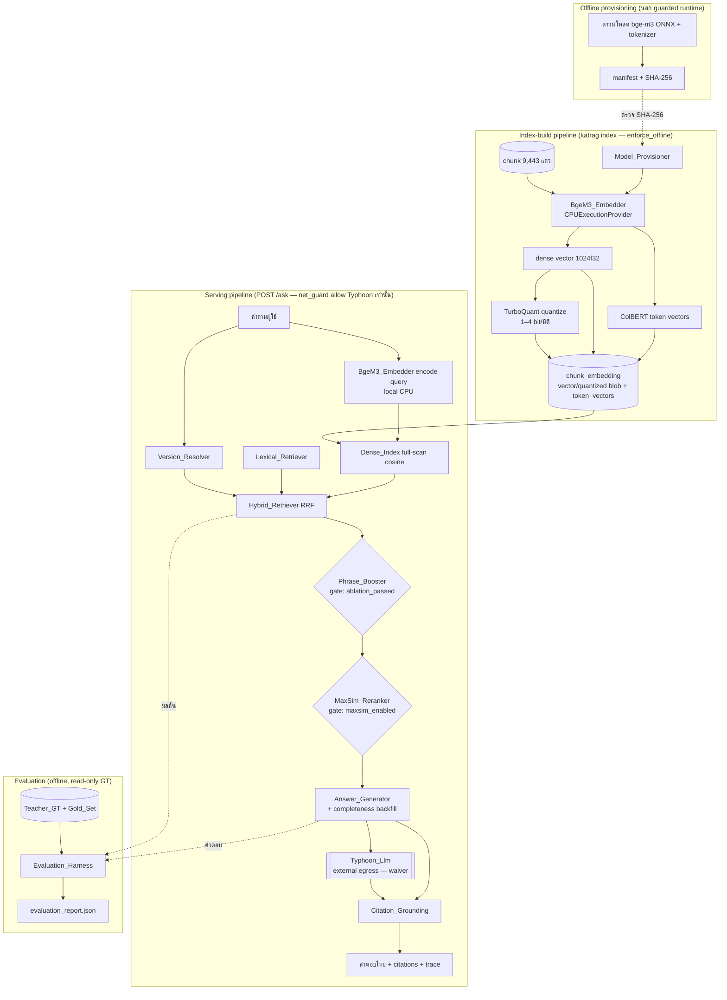

# Design Document — semantic-rag-katgpt

## Overview

เอกสารออกแบบนี้ต่อยอดจาก **KatRAG-lite** (spec `curriculum-ocr-rag`) เพื่อเปิดใช้งาน **การค้นเชิงความหมาย (semantic retrieval)** บนเส้นทางให้บริการจริง (`POST /ask`) พร้อมนำแนวคิดจาก `katgpt-rs` มาใช้ **อย่างมีหลักฐาน** และยกคุณภาพ harness ของ Typhoon LLM

### ข้อค้นพบสำคัญจากการสำรวจโค้ดฐานและ katgpt-rs (ต้องสะท้อนในดีไซน์)

1. **katgpt-rs ไม่มีโมเดลแปลงข้อความ→เวกเตอร์ (modelless).** ไฟล์วิจัยของ katgpt เอง (`katgpt-rs/.research/143_Latent_Terms_SAE_BM25_Retrieval.md`) ระบุชัดว่าเทคนิคการค้นเหล่านั้นจะใช้ได้ "ก็ต่อเมื่อ codebase สร้างชั้น document retrieval/RAG ขึ้นมา — ซึ่ง focus ปัจจุบันไม่มี retrieval component". **ข้อสรุป: การสร้าง semantic embedding จากข้อความหลักสูตรภาษาไทยยังต้องใช้โมเดล embedding อยู่ katgpt แทนที่ส่วนนี้ไม่ได้** ดังนั้นดีไซน์คง `BgeM3_Embedder` ไว้เป็นแหล่ง embedding

2. **katgpt-rs ให้ primitive สามอย่างที่ทำงาน "รอบ ๆ" embedding** ซึ่งดีไซน์นี้ผนวกเข้ามา:
   - **MaxSim late-interaction scoring** (`.research/045`) — ถูก port มาเป็น Python แล้วที่ `katrag/common/maxsim.py` (feature flag ปิดอยู่ รอ ablation) ต้องใช้ **per-token (multi-vector) embedding**; bge-m3 ผลิต ColBERT-style multi-vector ได้
   - **TurboQuant online vector quantization** (`.research/020`) — **ยังไม่ถูก port** เป็น data-oblivious (ไม่ต้อง train/calibrate), online, บีบเวกเตอร์ unit-norm ให้เหลือ 1–4 บิต/มิติ ด้วย distortion ใกล้ค่าเหมาะที่สุด (random orthogonal rotation → Beta ต่อมิติ → Lloyd-Max scalar quantization; มี QJL 1-bit residual สำหรับ inner-product ที่ unbiased) ใช้บีบ embedding float32 มิติ 1024 เพื่อลดขนาด `Chunk_Embedding_Store` และเร่ง full-scan cosine ต้อง **port ใหม่เป็น Python** ที่ `katrag/common/turboquant.py` (ห้าม import จาก `katgpt-rs/` ตาม R20.4/R20.5) พร้อมเพิ่มรายการใน third_party notice ตามแบบเดียวกับ `maxsim.py`/`phrase_boost.py`
   - **phrase_boost** (`.research/147` Parakeet) — ถูก port แล้วที่ `katrag/common/phrase_boost.py`

3. **โมเดล embedding ต้อง pluggable.** `Embedder` protocol มีอยู่แล้วที่ `katrag/index/embedder.py` (พร้อม `BgeM3Embedder` + `StubEmbedder`) ดีไซน์คงความสามารถสลับโมเดลได้ เพื่อให้เปลี่ยนไปใช้โมเดลเล็กกว่าได้หากไม่อยากดาวน์โหลด ONNX ~2GB แนะนำ bge-m3 เป็นค่าตั้งต้นเพราะรองรับทั้ง dense single-vector (สำหรับแขน dense / RRF) และ ColBERT multi-vector (จำเป็นต่อการเปิด MaxSim)

### ขอบเขต

ครอบคลุมสามเสา (A ค้นเชิงความหมายใช้งานจริง, B พิสูจน์ผล katgpt primitives, C harness ของ Typhoon) ภายใต้หลักการบังคับ: Teacher_Ground_Truth ใช้วัดผลเท่านั้น, ห้ามแหล่งข้อมูลภายนอก, คง lexical retriever เดิม, คง offline (net_guard) ยกเว้น Typhoon LLM ที่มี waiver, คำตอบเป็นภาษาไทย

## Architecture

### องค์ประกอบและความรับผิดชอบ

| องค์ประกอบ | ไฟล์ | สถานะ | บทบาทในฟีเจอร์นี้ |
|-----------|------|-------|-------------------|
| Model_Provisioner | `katrag/index/model_provisioner.py` (ใหม่) | ต้องสร้าง | จัดหา/ตรวจ SHA-256 ของ `.onnx` + `tokenizer.json` |
| Embedder (protocol) | `katrag/index/embedder.py` | มีอยู่ | interface `encode()` + `dim`; pluggable |
| BgeM3_Embedder | `katrag/index/embedder.py` | มีอยู่ (ต้องเพิ่ม multi-vector) | dense 1024 มิติ + ColBERT token vectors |
| Chunk_Embedding_Store | `katrag/store/schema.sql` `chunk_embedding` + `provenance_store.py` (ต้องเพิ่ม writer/reader) | ตารางมี, ยัง 0 แถว | เก็บ vector (float32 หรือ TurboQuant blob) ต่อ chunk |
| TurboQuant | `katrag/common/turboquant.py` (ใหม่) | ต้อง port | บีบ/คลาย unit-norm vectors 1–4 บิต/มิติ |
| Dense_Index | `katrag/index/dense.py` | มีอยู่ | exact full-scan cosine |
| Lexical_Retriever | `katrag/query/retriever.py` | มีอยู่ | แขน lexical (คงไว้) |
| Hybrid_Retriever | `katrag/query/hybrid_retriever.py` | มีอยู่ | RRF fusion |
| MaxSim_Reranker | `katrag/common/maxsim.py` | มีอยู่ (flag OFF) | rerank ตาม ablation |
| Phrase_Booster | `katrag/common/phrase_boost.py` | มีอยู่ (flag OFF) | boost ตาม ablation |
| Answer_Generator | `katrag/query/answer_generator.py` | มีอยู่ (ต้องเสริม backfill) | ประกอบ context + เรียก Typhoon |
| Citation_Grounding | `katrag/query/citation.py`, `citation_validator.py` | มีอยู่ | ออก citation ID + ตรวจ unsupported claim |
| Evaluation_Harness | `katrag/eval/harness.py`, `metrics.py` | มีอยู่ (ต้องเสริม ablation/แยกสาเหตุ) | วัด recall/completeness + ablation |

### แผนภาพองค์ประกอบและกระแสข้อมูล



### เส้นทาง query-time vs offline build

- **Offline build (`katrag index`):** encode ทุก chunk หนึ่งครั้ง เขียนลง store → ครั้งต่อไปโหลดจาก store ไม่ encode ซ้ำ (R2.5) รันภายใต้ `enforce_offline()` (ไม่มี egress ใด ๆ)
- **Query-time (`katrag serve` → `/ask`):** encode เฉพาะคำถามเดียวในเครื่อง (CPU) → full-scan cosine → RRF → (gate) boost/rerank → ประกอบคำตอบ → เรียก Typhoon (egress เดียวที่อนุญาต)

## Components and Interfaces

### A. Model_Provisioner (ใหม่ — R1)

```python
@dataclass(frozen=True)
class ModelArtifact:
    filename: str          # "model.onnx" | "tokenizer.json"
    expected_sha256: str   # hex ตัวพิมพ์เล็ก 64 อักขระ

@dataclass(frozen=True)
class ModelManifest:
    model_dir: Path
    artifacts: tuple[ModelArtifact, ...]

class ModelProvisioner:
    def verify(self) -> ModelManifest | ModelArtifactError:
        """ตรวจว่าไฟล์ครบและ SHA-256 ตรง manifest;
        ขาดไฟล์ -> error ระบุ path+ชื่อไฟล์ (R1.3);
        แฮชไม่ตรง -> error 'model_artifact_mismatch' ระบุ expected/actual (R1.4)."""
    def ensure_ready(self) -> Path:
        """คืน model_dir เมื่อพร้อม มิฉะนั้น raise -> ระบบไม่เริ่มสร้าง embedding (R1.3)."""
```

- การดาวน์โหลดจริงเป็น **ขั้นตอน provisioning แยกต่างหาก** ที่รันนอก guarded runtime (G) ตัว provisioner ในโปรแกรมทำหน้าที่ **ตรวจสอบ** เท่านั้น ไม่เปิด socket
- path ของ model_dir + ค่า SHA-256 ที่คาดหวังอ่านจากไฟล์ตั้งค่า (เพิ่มส่วน `[embedding]` — ดู Data Models)

### B. BgeM3_Embedder — เพิ่มความสามารถ multi-vector (R1.2, R1.5)

`BgeM3Embedder` ปัจจุบันคืน dense (mean-pooled + L2 normalize) อยู่แล้ว เพิ่มเมธอดสำหรับ ColBERT token vectors เพื่อรองรับ MaxSim:

```python
class BgeM3Embedder:  # เพิ่มเมธอด
    def encode(self, texts) -> np.ndarray: ...               # (n, 1024) dense — เดิม
    def encode_tokens(self, texts) -> list[np.ndarray]: ...  # ต่อ text: (num_tokens, 1024) L2-normalized
```

- ใช้ `CPUExecutionProvider` เท่านั้น (R1.5) — โค้ดปัจจุบันบังคับไว้แล้ว
- `dim == 1024` (R1.2) — อ่านจาก model metadata
- คง `Embedder` protocol; `encode_tokens` เป็น optional capability ตรวจด้วย `hasattr`/`Protocol` แยก (`MultiVectorEmbedder`) เพื่อคง pluggability

### C. Retrieval — การต่อเข้าเส้นทางบริการ (R3, R4)

**สถานะปัจจุบัน:** `service.py` เรียก `retriever.search()` (lexical เท่านั้น) โดยตรง ดีไซน์เปลี่ยนเป็นประกอบ `Hybrid_Retriever`

**Adapter สำหรับ LexicalSearcher protocol:** `retriever.search(conn, question, limit)` มีลายเซ็นต่างจาก `LexicalSearcher.__call__(query_text, *, version_filter, top_k)` จึงต้องมี adapter (คง retriever.py เดิมไม่แตะ — R3.2):

```python
def make_lexical_searcher(conn) -> LexicalSearcher:
    def _search(query_text, *, version_filter=None, top_k=100):
        hits = retriever.search(conn, query_text, limit=top_k)  # โค้ดเดิม
        # แปลง RetrievedChunk -> LexicalHit (chunk_id = content_sha256), กรอง version_filter
        return [to_lexical_hit(h) for h in hits if _in_version(h, version_filter)]
    return _search
```

**DenseSearcher:** ห่อ `DenseIndex.search(query_text, embedder, version_filter=, top_k=)` ให้เข้ากับ `DenseSearcher` protocol โดยตรง

**Wiring ใน service:** ประกอบ `hybrid_retriever.retrieve(query_text, lexical_searcher=, dense_searcher=, version_filter=, config=config.retrieval)` — คืน `HybridRetrievalResponse` (มี RRF `fused_score`, สถานะ empty_query/query_too_long/no_results)

**ลำดับใน serving pipeline:**
1. ตรวจคำถาม (ว่าง/ยาวเกิน `retriever_max_question_chars`=1000 → ปฏิเสธ ไม่เรียกดัชนี, R3.5)
2. Version_Resolver เลือก version → ใช้เป็น `version_filter` (R3.4)
3. Hybrid_Retriever RRF (R3.1, R3.3)
4. Phrase_Booster (เฉพาะเมื่อ ablation ผ่าน — R6)
5. MaxSim_Reranker (เฉพาะเมื่อ `maxsim_enabled` — R5)
6. Answer_Generator + Citation_Grounding
7. เขียน query_trace: เส้นทาง hybrid + จำนวนผลจากแขน lexical และ dense (R3.7)

### D. katgpt integration — TurboQuant (ใหม่ — R2, R4, D)

`katrag/common/turboquant.py` port แนวคิดจาก `.research/020` เป็น NumPy (ไม่ import จาก katgpt-rs):

```python
# --- codebook (data-oblivious, precompute ต่อ (dim, bits)) ---
def beta_lloyd_max_codebook(dim: int, bits: int) -> np.ndarray: ...   # 2^bits centroids บน Beta dist
def random_orthogonal_rotation(dim: int, seed: int) -> np.ndarray: ... # QR ของ Gaussian, deterministic จาก seed

@dataclass(frozen=True)
class TurboQuantParams:
    dim: int; bits: int; seed: int
    rotation: np.ndarray          # (dim, dim)
    codebook: np.ndarray          # (2^bits,)

def quantize(vec: np.ndarray, p: TurboQuantParams) -> QuantizedVector:
    """unit-norm vec -> (packed indices b-bit/มิติ, norm float32).
    ขั้นตอน: y = rotation @ vec ; ต่อมิติหา centroid ใกล้สุด (searchsorted)."""

def dequantize(q: QuantizedVector, p: TurboQuantParams) -> np.ndarray:
    """lookup centroids -> rotation.T @ y_hat -> rescale ด้วย norm."""

def inner_product(query: np.ndarray, q: QuantizedVector, p: TurboQuantParams) -> float:
    """(ออปชัน) unbiased IP ด้วย MSE (b-1 บิต) + QJL 1-bit residual sketch."""
```

- **จุดที่ใช้บีบ:** ตอน index build หลัง encode → เก็บ quantized blob ลง `chunk_embedding` ตอน serve full-scan: **dequantize เป็น float32 แล้ว scan** (ดีฟอลต์ ปลอดภัยที่สุด) หรือใช้ `inner_product` ในสเปซ quantized (ออปชันเปิดภายหลัง)
- **โหมดเก็บ:** เลือกได้ด้วย config `[embedding].storage` ∈ {`float32`, `turboquant`}; ค่าตั้งต้น `float32` (ไม่มี distortion) TurboQuant เป็นทางเลือกลดขนาด store/เร่ง scan โดยยอมรับ distortion ที่มีขอบเขต (Theorem 1: `D_mse ≤ (√(3π)/2)·4^{-b}`)
- **third_party:** เพิ่มแถว `katrag/common/turboquant.py → crates/... TurboQuant` ใน `third_party/katgpt-rs-MIT-NOTICE.md` และใส่ header MIT + อ้าง notice ในไฟล์ (แบบเดียวกับ maxsim.py)

### D. katgpt integration — MaxSim & Phrase gating

- **MaxSim_Reranker** (`maxsim.rerank_maxsim`): รับ `scored_chunks` เรียงแล้ว + `query_tokens` + `doc_tokens_map` (จาก `token_vectors` ใน store) rerank เฉพาะอันดับ 1..`rerank_depth`, คงหางเดิม, `len(output)==len(input)` (R5.3) เปิดเมื่อ `maxsim_enabled=true` (R5.1) โค้ดคืน input เดิมทันทีเมื่อ flag ปิด
- **Phrase_Booster** (`phrase_boost.apply_phrase_boost`): คูณคะแนน chunk ที่พบ term จาก `domain_lexicon.toml`, ตัวคูณต่อ chunk ∈ [1.00, `max_total_multiplier`], คงจำนวน chunk (R6.1, R6.2) เปิดเมื่อ ablation ผ่าน (R6.4)

### E. Typhoon Harness — Answer_Generator (R7, R8)

เสริม `answer_generator.py` (คงสัญญา `GenerationResult`, เพิ่มการ backfill):

```python
def detect_enumeration(question: str) -> bool: ...   # ตรวจ enumeration question (คีย์เวิร์ด "ทุกวิชา/รายวิชา/มีอะไรบ้าง" + course-code signal)

def extract_units_from_evidence(evidence: list[EvidenceWithCitation]) -> list[CourseUnit]:
    """สกัดหน่วยข้อมูล (รหัส/ชื่อ/หน่วยกิต/ชั้นปี-ภาค) จากหลักฐาน ด้วย regex course_code + credits (จาก domain_lexicon patterns)."""

def completeness_backfill(llm_answer: str, evidence_units: list[CourseUnit]) -> str:
    """R7.3 (deterministic): ถ้าหน่วยใน evidence > หน่วยที่ LLM ระบุ -> เติมหน่วยที่ขาด
    โดยไม่ลบหน่วยที่ LLM ระบุไว้ และทุกหน่วยที่เติมต้องมาจาก evidence เท่านั้น."""
```

- **ประกอบ context:** ≤ `max_evidence_units`(60) หน่วย แต่ละหน่วยมีเลขอ้างอิง/หัวข้อ/version/หน้า (R7.1) — โครง prompt ปัจจุบันจัดกลุ่มตาม version อยู่แล้ว
- **enumeration prompt:** สั่ง Typhoon ระบุ **ทุกหน่วยที่พบในหลักฐาน** พร้อมรหัส/ชื่อ/หน่วยกิต/ชั้นปี-ภาค (R7.2)
- **completeness backfill (R7.3):** logic deterministic — เทียบเซ็ตหน่วยจาก evidence กับที่ปรากฏในคำตอบ LLM แล้วเติมส่วนที่ขาดจาก evidence เท่านั้น (ไม่แต่งเพิ่ม, ไม่ลบของเดิม)
- **fallback (R7.5):** LLM ว่าง/error → ประกอบคำตอบไทยจากหลักฐานตรง ๆ + บันทึกเหตุผลลง trace
- **time budget (R7.6):** ยุติภายใน `answer_time_budget_seconds` — `AnswerGenerator.generate(time_budget=)` มีอยู่แล้ว

### F. Evaluation_Harness — ablation & แยกสาเหตุ (R5, R6, R9, R11)

เสริม `harness.py`:
- **Recall@k** (k∈{5,10,20}) + **answer completeness** ต่อคำถาม ในรายงานเดียว (R9.1) — `metrics.recall_at_k` มีอยู่แล้ว
- **แยกสาเหตุ (R9.2, R9.3):** recall ≥ เกณฑ์ แต่ completeness < เกณฑ์ → `llm_limited`; recall < เกณฑ์ → `retrieval_limited`
- **ablation runners:** เปิด/ปิด MaxSim, เปิด/ปิด Phrase_Booster, hybrid vs lexical-only บนชุดเดียวกัน (R5.2, R6.3, R11.1) รายงานค่าทั้งสองพร้อม samples
- **สถานะ measured/estimate:** ใช้ `_determine_status`/`_determine_pass_fail` เดิม (samples ≥ 30 = measured; estimate ห้าม pass; บันทึก `metric_sample_insufficient`) — R9.4, R9.5
- **determinism:** `check_reproducibility` เดิม (ค่าเท่าเดิมทศนิยม 4 ตำแหน่ง, timestamp ต่างได้) — R9.6

### API surface (คงเดิม)

- `POST /ask` → เปลี่ยน internal เป็น hybrid; response schema เดิม (answer, citations, versions_resolved, ...)
- `GET /pages/{citation_id}` → 404 เมื่อไม่พบ (R8.2)
- `GET /traces/{request_id}` → query_trace

## Data Models

### ตาราง `chunk_embedding` (มีอยู่แล้วใน schema — ใช้ได้เลย)

```sql
CREATE TABLE chunk_embedding (
  chunk_id      INTEGER PRIMARY KEY REFERENCES chunk(chunk_id) ON DELETE CASCADE,
  model_name    TEXT    NOT NULL,     -- เช่น "bge-m3"
  dim           INTEGER NOT NULL CHECK (dim > 0),  -- 1024
  vector        BLOB    NOT NULL,     -- float32 little-endian (dim*4 ไบต์) หรือ TurboQuant packed
  token_vectors BLOB,                 -- ColBERT multi-vector (สำหรับ MaxSim) — nullable
  token_count   INTEGER,              -- จำนวน token vectors
  built_at      TEXT    NOT NULL
);
```

**การ map chunk id:** ตาราง PK เป็น `chunk.chunk_id` (int) แต่ Hybrid/Dense ใช้ `content_sha256` เป็น key ภายนอก — join ผ่าน `chunk.content_sha256` ได้ (คอลัมน์มีอยู่, UNIQUE(content_sha256, version_id)) เพื่อให้ R2.2 (chunk id อ้างกลับต้นทางได้) เป็นจริง

**รูปแบบ `vector` blob:**
- โหมด `float32`: `np.float32` little-endian ตรง ๆ (`dim*4` ไบต์)
- โหมด `turboquant`: โครง `[header: dim,bits,seed][packed indices][norm: f32]`; codebook/rotation สร้างซ้ำได้จาก `(dim, bits, seed)` (data-oblivious) — เก็บ `seed`/`bits`/`storage` metadata ใน `model_name` หรือ sidecar `[embedding]` config เพื่อให้ decode ได้ deterministic

### ส่วนตั้งค่าใหม่ `[embedding]` ใน `config/katrag.toml`

```toml
[embedding]
model_name = "bge-m3"
model_dir = "models/bge-m3-onnx"        # path ของ .onnx + tokenizer.json
onnx_filename = "model.onnx"
tokenizer_filename = "tokenizer.json"
onnx_sha256 = "<64-hex>"                 # ตรวจโดย Model_Provisioner (R1.1, R1.4)
tokenizer_sha256 = "<64-hex>"
embedding_dim = 1024                     # R1.2
storage = "float32"                      # หรือ "turboquant"
turboquant_bits = 4                      # 1-4 (ใช้เมื่อ storage="turboquant")
turboquant_seed = 20250728               # deterministic rotation/codebook
enable_token_vectors = false             # เปิดเมื่อจะทดสอบ MaxSim ablation
```

โหลดเป็น `EmbeddingConfig` (frozen) ใน `config.py` แบบเดียวกับ section อื่น; ตรวจช่วง `turboquant_bits ∈ [1,4]`, `embedding_dim > 0`, และรูปแบบ SHA-256

### การ persist และ rebuild แบบ deterministic

- เก็บใน `artifacts/katrag.sqlite3` (ไฟล์เดียวของโปรเจกต์)
- `katrag index` เขียน `chunk_embedding` หนึ่งแถวต่อ chunk ที่ encode สำเร็จ → จำนวนแถว = จำนวน chunk สำเร็จ (R2.1)
- rebuild บนคลังเนื้อหาเดิม: bge-m3 ONNX เป็น deterministic (CPU, ไม่มี dropout), TurboQuant ใช้ seed คงที่ → embedding เท่าเดิมทุกค่า, จำนวนแถวเท่าเดิม (R2.4)
- โหลดตอน serve: อ่านจาก store ไม่ re-encode chunk (R2.5)

### query_trace (ตาราง 18 เดิม — ใช้ฟิลด์ที่มี)

บันทึก `route_selected="hybrid"`, `retrieved_json` เก็บจำนวนผลแขน lexical/dense (R3.7), `unsupported_claim_count` (R8.3), `halt_reason` fallback (R7.5)

## Correctness Properties

*Property คือคุณลักษณะหรือพฤติกรรมที่ต้องเป็นจริงเสมอในทุกการทำงานที่ถูกต้องของระบบ — เป็นข้อความเชิงรูปนัยว่าระบบควรทำอะไร Property เป็นสะพานเชื่อมระหว่างข้อกำหนดที่มนุษย์อ่านได้กับการรับประกันความถูกต้องที่เครื่องตรวจสอบได้*

หมายเหตุการทำ property reflection: ได้ยุบเกณฑ์ที่ทับซ้อนกันแล้ว — 6.1 กับ 6.2 (bound ตัวคูณ) รวมเป็น Property 10, 9.2 กับ 9.3 (การจำแนกสาเหตุ) รวมเป็น Property 15, 2.1 กับ 2.2 (invariant ของการ build) รวมเป็น Property 4, และ round-trip float32 รวมกับขอบเขต TurboQuant เป็น Property 19

### Property 1: RRF fusion ถูกต้องและ deterministic

*For any* คู่รายการผลค้น lexical และ dense (ลำดับใด ๆ, id ซ้อนทับกันเท่าใดก็ได้) การรวมด้วย Reciprocal Rank Fusion ต้องคืนผลลัพธ์จำนวนไม่เกิน `fusion_output_max`, คะแนนของแต่ละ chunk ต้องเท่ากับผลรวม `lexical_weight/(rrf_k+rank_lex) + dense_weight/(rrf_k+rank_dense)` ตามอันดับที่ปรากฏ, และลำดับสุดท้ายต้อง deterministic (เรียงตามคะแนนมากไปน้อย, tie-break ด้วย chunk_id จากน้อยไปมาก)

**Validates: Requirements 3.3**

### Property 2: version filter ไม่มีการรั่ว (zero-leak)

*For any* คลัง chunk ที่คละหลาย curriculum version และ version set ที่เลือกใด ๆ จำนวน chunk ในผลลัพธ์ที่อยู่นอก version set ที่เลือกต้องเท่ากับศูนย์ (การกรองเกิดก่อนการให้คะแนน)

**Validates: Requirements 3.4**

### Property 3: การปฏิเสธคำถามที่ไม่ถูกต้องโดยไม่แตะดัชนี

*For any* คำถามที่ว่างหลังตัด whitespace หรือมีความยาวเกิน `retriever_max_question_chars` ระบบต้องปฏิเสธด้วยเหตุผล `empty_query` หรือ `query_too_long` และต้องไม่เรียก lexical searcher หรือ dense searcher เลย

**Validates: Requirements 3.5**

### Property 4: invariant ของการสร้างดัชนี embedding

*For any* ชุด chunk ที่ encode สำเร็จ จำนวนแถวใน `chunk_embedding` ต้องเท่ากับจำนวน chunk ที่ encode สำเร็จ และทุกแถวต้องมี vector มิติเท่ากับ `embedding_dim` (1024) และมี `content_sha256` ที่อ้างกลับไปยัง chunk ต้นทางได้

**Validates: Requirements 2.1, 2.2**

### Property 5: การแยกความล้มเหลวของการ encode และการนับที่ถูกต้อง

*For any* ชุด chunk ที่มีบางตัว encode ล้มเหลว ระบบต้องข้ามเฉพาะตัวที่ล้มเหลวและประมวลผล chunk ที่เหลือครบทุกตัว และต้องบันทึก review_issue ชนิด `index_build_incomplete` โดยที่ `failed_count + indexed_count == total_attempted` และรายการ `failed_sha256` ตรงกับ chunk ที่ล้มเหลวจริง

**Validates: Requirements 2.3**

### Property 6: embedding เป็น deterministic เมื่อ rebuild

*For any* ชุด chunk ที่เนื้อหาไม่เปลี่ยน การสร้างดัชนีสองครั้งต้องได้ embedding vector เท่ากันทุกค่า (bit-for-bit สำหรับโหมด float32; เท่ากันทุกค่าเมื่อ TurboQuant ใช้ seed คงที่) และจำนวนแถวเท่าเดิม

**Validates: Requirements 2.4**

### Property 7: การปฏิเสธ Model_Artifacts ที่แฮชไม่ตรง

*For any* ไฟล์ artifact ที่มี SHA-256 ไม่ตรงกับค่าใน manifest Model_Provisioner ต้องคืน error ชนิด `model_artifact_mismatch` ที่ระบุชื่อไฟล์/ค่าที่คาดหวัง/ค่าที่พบ และต้องไม่ใช้ไฟล์นั้นสร้าง embedding

**Validates: Requirements 1.4**

### Property 8: ปิด MaxSim แล้วเป็น identity

*For any* รายการผลลัพธ์ที่จัดอันดับแล้ว เมื่อ `maxsim_enabled` เป็น `false` ผลลัพธ์ของ MaxSim_Reranker ต้องเท่ากับ input ทุกประการ (ลำดับและสมาชิกไม่เปลี่ยน)

**Validates: Requirements 5.1**

### Property 9: invariant ของการ rerank ด้วย MaxSim

*For any* รายการผลลัพธ์ที่จัดอันดับแล้วและค่า `rerank_depth` ใด ๆ เมื่อ `maxsim_enabled` เป็น `true` ผลลัพธ์ต้องมีจำนวนเท่ากับ input, เป็น permutation ของ chunk id ชุดเดียวกัน (ไม่เพิ่ม/ไม่ลบ) และรายการที่อยู่หลังตำแหน่ง `rerank_depth` ต้องคงลำดับเดิมต่อท้าย

**Validates: Requirements 5.3**

### Property 10: invariant ของ Phrase_Booster

*For any* ชุดผลค้นและ domain lexicon ใด ๆ ผลลัพธ์ของ Phrase_Booster ต้องมีจำนวน chunk เท่ากับ input (ชุด chunk id เดิม) และตัวคูณที่ใช้ต่อ chunk ต้องอยู่ในช่วง 1.00 ถึง `max_total_multiplier` (การเทียบ term ทำหลัง NFC + ยุบ whitespace ซ้อน)

**Validates: Requirements 6.1, 6.2**

### Property 11: การประกอบ context อยู่ในขอบเขตและมีข้อมูลครบ

*For any* ชุดผลค้นใด ๆ context ที่ Answer_Generator ประกอบต้องมีจำนวนหน่วยหลักฐานไม่เกิน `max_evidence_units` และทุกหน่วยที่รวมต้องมีหมายเลขอ้างอิง (citation ID), หัวข้อ, curriculum version และเลขหน้าครบ

**Validates: Requirements 7.1**

### Property 12: completeness backfill ครอบคลุมหลักฐานโดยไม่ตกหล่นและไม่แต่งเพิ่ม

*For any* ชุดหน่วยข้อมูลในหลักฐานของ enumeration question และคำตอบของ LLM ที่ระบุหน่วยเพียงบางส่วน หลังการ backfill แบบ deterministic เซ็ตของหน่วยข้อมูลที่ปรากฏในคำตอบต้องเป็น superset ของหน่วยข้อมูลทั้งหมดในหลักฐาน, ต้องเป็น subset ของหน่วยข้อมูลในหลักฐาน (ไม่มีหน่วยที่ไม่ได้มาจากหลักฐาน) และต้องไม่ลบหน่วยที่ LLM ระบุไว้แล้ว

**Validates: Requirements 7.3**

### Property 13: การออก citation ID ไม่ซ้ำและ resolve กลับได้

*For any* ชุดหน่วยหลักฐานที่ส่งเข้า context ทุกหน่วยต้องได้รับ citation ID ที่ไม่ซ้ำกัน และ citation ID แต่ละตัวต้อง resolve กลับไปยัง document identifier และเลขหน้าของหลักฐานนั้นได้

**Validates: Requirements 8.1**

### Property 14: การนับ unsupported claim ถูกต้อง

*For any* คำตอบและชุด citation ID ที่ระบบออกให้ จำนวน unsupported claim ที่บันทึกต้องเท่ากับจำนวนข้อความเชิงข้อเท็จจริงในคำตอบที่ไม่มี citation ID ที่ระบบออกให้รองรับ

**Validates: Requirements 8.3**

### Property 15: การจำแนกสาเหตุความผิดพลาด

*For any* คู่ค่า (retrieval recall, answer completeness) ของคำถามหนึ่ง การจำแนกสาเหตุต้องเป็น `retrieval_limited` เมื่อ recall < เกณฑ์ Recall@10 และเป็น `llm_limited` เมื่อ recall ≥ เกณฑ์ Recall@10 แต่ completeness < เกณฑ์ answer completeness

**Validates: Requirements 9.2, 9.3**

### Property 16: กฎสถานะ measured/estimate ของ metric

*For any* จำนวนตัวอย่างของ metric ใด ๆ ถ้าจำนวนตัวอย่างน้อยกว่า `min_samples_for_measured` (30) สถานะต้องเป็น `estimate`, ผลเทียบเกณฑ์ต้องไม่เป็น `pass`, และต้องมี review_issue ชนิด `metric_sample_insufficient`

**Validates: Requirements 9.5**

### Property 17: Evaluation_Harness เป็น deterministic

*For any* ชุด input เดิม การรัน Evaluation_Harness ซ้ำต้องให้ค่า metric ทุกตัวเท่าเดิมทุกหลักที่รายงาน (ทศนิยม 4 ตำแหน่ง) โดยอนุญาตให้ timestamp และเวลาประมวลผลต่างกันได้

**Validates: Requirements 9.6**

### Property 18: ไม่มีการรั่วของ Teacher_Ground_Truth ในเส้นทางบริการ

*For any* คำถามที่ประมวลผลใน Serving_Pipeline ต้องไม่มีการอ่านไฟล์ใด ๆ ภายใต้ `data/teacher_gt/` เป็นแหล่งของคำตอบ และหากมีองค์ประกอบใดในเส้นทางบริการพยายามอ่าน `data/teacher_gt/` ระหว่างสร้างคำตอบ ระบบต้องถือเป็นข้อผิดพลาดและบันทึก review_issue ชนิด `ground_truth_leak` เสมอ

**Validates: Requirements 10.1, 10.4**

### Property 19: ขอบเขต distortion ของ TurboQuant และ round-trip ของ float32

*For any* เวกเตอร์ unit-norm มิติ `d` ใด ๆ: (ก) เมื่อ `storage="turboquant"` ที่ `b` บิต ค่า reconstruction error กำลังสองเฉลี่ยของ `dequantize(quantize(v))` ต้องไม่เกินขอบเขต `(√(3π)/2)·4^{-b}` (Theorem 1) และการประมาณ inner product (โหมด QJL) ต้อง unbiased ในขอบเขตของ Theorem 2; (ข) เมื่อ `storage="float32"` การ serialize แล้ว deserialize เวกเตอร์ต้องได้ค่าเท่ากันทุกค่า (round-trip identity)

**Validates: Requirements 2.4**

## Error Handling

| สถานการณ์ | การจัดการ | requirement |
|-----------|-----------|-------------|
| ไฟล์ model artifact ขาด | Model_Provisioner คืน error ระบุ path + ชื่อไฟล์ที่ขาด; ระบบไม่เริ่มสร้าง embedding | R1.3 |
| SHA-256 ไม่ตรง manifest | คืน error `model_artifact_mismatch` (expected/actual); ไม่ใช้ไฟล์ | R1.4 |
| encode chunk ล้มเหลวตอน build | ข้าม chunk, ทำต่อ, บันทึก `index_build_incomplete` (counts + failed_sha256) | R2.3 |
| คำถามว่าง/ยาวเกิน | ปฏิเสธด้วย `empty_query`/`query_too_long` ไม่เรียกดัชนี | R3.5 |
| Hybrid ไม่พบ chunk | คืนคำตอบไทย "ไม่พบข้อมูล" + บันทึก trace (`no_results`) | R3.6 |
| dense p95 เกินงบ | log คำเตือน (p95 + งบ) แต่ยังคืนผล — `LatencyTracker` มีอยู่แล้ว | R4.3 |
| Typhoon ว่าง/error | fallback ไทยจากหลักฐาน + บันทึกเหตุผลลง trace (ไม่คืน partial) | R7.5 |
| เกิน answer_time_budget | ยุติและคืนภายในงบ; ไม่คืน partial | R7.6 |
| ข้อความไม่มี citation | ทำเครื่องหมาย unsupported + นับลง trace | R8.3 |
| citation ID ไม่มี | `GET /pages/{id}` คืน 404 | R8.2 |
| samples < 30 | metric = `estimate`, ไม่ pass, review_issue `metric_sample_insufficient` | R9.5 |
| serving อ่าน teacher_gt | error + review_issue `ground_truth_leak` | R10.4 |
| hybrid recall < lexical | review_issue `hybrid_regression` (ค่าทั้งสอง + samples) | R11.3 |
| พยายาม egress นอก loopback (ยกเว้น Typhoon) | net_guard บล็อก + ยก error | R4.4 |

หลักการ: ความล้มเหลวระดับ chunk/คำถามเดียวต้องไม่ล้มทั้ง batch/บริการ; ทุก error path บันทึก trace/review_issue เพื่อการตรวจสอบย้อนหลัง

## Testing Strategy

### แนวทางคู่ (Dual approach)

- **Property-based tests** (Hypothesis — มีใช้แล้วใน `tests/property/`): ตรวจ Property 1–19 ครอบคลุมพื้นที่ input กว้าง
- **Unit tests** (`tests/unit/`): ตัวอย่างเฉพาะ, การ wiring, edge case, error path (เช่น 1.1, 1.3, 3.1, 3.6, 5.4, 7.2, 7.5, 8.2, 11.x)
- **Integration/smoke tests** (`tests/integration/`): net_guard offline invariant (1.5, 4.1, 4.4), การโหลด store โดยไม่ re-encode (2.5), full-scan ไม่มี ANN (4.2), dim==1024 (1.2)

### PBT applicability

ฟีเจอร์นี้ **เหมาะกับ PBT** เพราะมีฟังก์ชันบริสุทธิ์/ตรรกะที่มีความถูกต้องเชิงสากลจำนวนมาก (RRF fusion, version filter, quantization, rerank/boost invariants, การจำแนกสาเหตุ, กฎสถานะ metric) ส่วนที่ **ไม่เหมาะกับ PBT** และใช้ตัวอย่าง/integration แทน: การ wiring FastAPI, การเรียก Typhoon LLM ภายนอก, การจัดหาไฟล์โมเดล, net_guard, การวัด latency

### การตั้งค่า property test

- อย่างน้อย **100 iterations** ต่อ property test
- ติด tag อ้างกลับดีไซน์ในคอมเมนต์: **Feature: semantic-rag-katgpt, Property {number}: {property_text}**
- ใช้ไลบรารี PBT ที่มีอยู่ (Hypothesis) — ไม่ implement PBT เอง
- แต่ละ property implement ด้วย property-based test **หนึ่งตัว**

**การจับคู่ property → ไฟล์ทดสอบ (แนะนำ):**

| Property | ไฟล์ทดสอบ |
|----------|-----------|
| P1, P2, P3 | `tests/property/test_retrieval_properties.py` (เสริม) |
| P4, P5, P6 | `tests/property/test_dense_index_properties.py` (ใหม่) |
| P7 | `tests/unit/test_model_provisioner.py` + property บน bad hashes |
| P8, P9 | `tests/unit/test_maxsim.py` (เสริม property) |
| P10 | `tests/unit/test_phrase_boost.py` (เสริม property) |
| P11, P12 | `tests/property/test_answer_generator_properties.py` (ใหม่) |
| P13, P14 | `tests/property/test_citation_properties.py` (ใหม่) |
| P15, P16, P17 | `tests/property/test_metric_properties.py` (เสริม) |
| P18 | `tests/property/test_offline_invariant.py` (เสริม) |
| P19 | `tests/property/test_turboquant_properties.py` (ใหม่) |

### หมายเหตุสถานะเกณฑ์ตัวเลข

ทุกเกณฑ์ตัวเลข (Recall@10 ≥ 0.90, completeness ≥ 0.90, citation precision/recall, unsupported rate, ablation margin) คงสถานะ **estimate** จนกว่าจะมีตัวอย่าง ≥ `min_samples_for_measured` (30) บน Gold_Set ตามกฎ measured/estimate ของ Evaluation_Harness (Property 16)

## Offline Invariant (G)

- **การ embed ในเครื่อง:** onnxruntime `CPUExecutionProvider` เท่านั้น ทั้ง build และ query-time (R1.5, R4.1) — ไม่เปิด socket ปลายทางไม่ใช่ loopback
- **net_guard mode serve:** อนุญาต egress เฉพาะการเรียก Typhoon LLM ภายใต้ waiver ที่มีอยู่ (`cmd_serve` ตั้ง `set_allow_external(True)` — ข้อยกเว้นเดียวต่อ R20.1) บล็อก external อื่นทั้งหมด รวมช่วง embed คำถาม (R4.4)
- **การจัดหาโมเดลเป็นขั้นตอน provisioning แยก:** การดาวน์โหลด bge-m3 เกิด **นอก** guarded runtime; ภายในโปรแกรมมีเพียง Model_Provisioner ที่ **ตรวจ SHA-256** ของไฟล์ที่วางไว้ (R1.1, R1.4) — ไม่มีการดาวน์โหลดใน `katrag index`/`katrag serve` ที่รันภายใต้ `enforce_offline()`
- waiver R20.1 ที่ผู้ใช้ยอมรับ ใช้กับ **การเรียก Typhoon LLM เท่านั้น** ส่วนอื่นของ pipeline ยัง offline เข้ม

## หมายเหตุการ integrate katgpt-rs (สรุป)

- **ไม่มี import จาก `katgpt-rs/`** และปฏิบัติ `katgpt-rs/` เป็น read-only (R20.4, R20.5) — TurboQuant/MaxSim/phrase_boost เป็นการ **เขียนใหม่เป็น Python** จากแนวคิด
- `katrag/common/turboquant.py` (ใหม่) ต้องเพิ่มแถวใน `third_party/katgpt-rs-MIT-NOTICE.md` (อ้าง `.research/020` + crate ต้นทาง) และใส่ header MIT + ชี้ไปยัง notice แบบเดียวกับ `maxsim.py`/`phrase_boost.py`
- katgpt **เสริม** rอบ embedding เท่านั้น (บีบเวกเตอร์, late-interaction rerank, phrase boost) — **ไม่ทดแทน** ความจำเป็นของโมเดล embedding (ยืนยันโดย `.research/143`)
